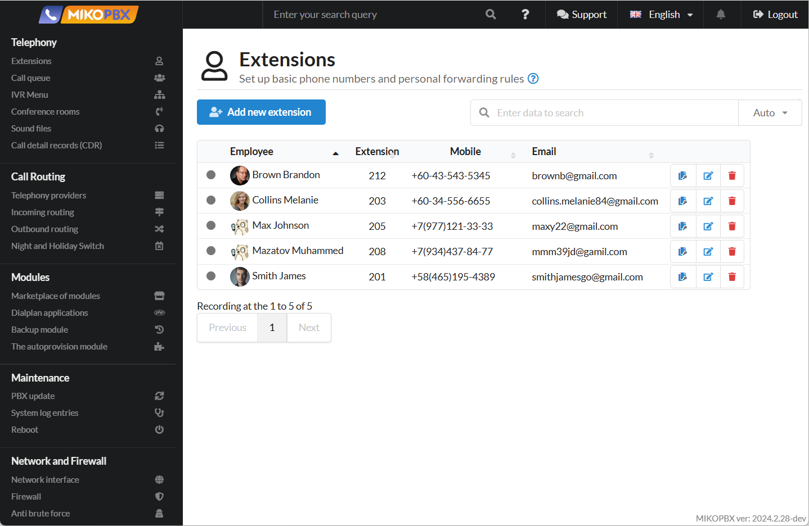

# MikoPBX Manual

## Foreword

Welcome to the MikoPBX documentation resource! Here you can find step-by-step instructions related to interacting with the MikoPBX PBX system. For your convenience, the documentation is organized into sections—just like in the web interface—making it very easy to navigate.

Thank you for choosing **MikoPBX**! :heart:

## What is MikoPBX?

**MikoPBX** is a **free** telephony server with its own operating system and a simple, user-friendly web interface. It works with virtually any telephony technology in the world.

<figure><figcaption>
MikoPBX Interface
</figcaption></figure>

MikoPBX is a fully modular interface for Asterisk, written in PHP and JavaScript. This means that you can implement absolutely any additional Asterisk telephony functionality within MikoPBX. Moreover, if you develop a useful module, you can place it in the public repository and make it available to all MikoPBX users. Additionally, MikoPBX has very low hardware requirements:

| Simultaneous Calls |  Minimally Recommended Configuration  |
| :----------------: | :-----------------------------------: |
|       5 - 10       |        1 GHz x86-64, 512 MB RAM       |
|      Up to 25      |         3 GHz x86-64, 1 GB RAM        |
|       Over 25      | 2 CPUs 3 GHz x86-64, 2 GB RAM or more |

## Where to Start?

To get started, you should install MikoPBX using any method convenient for you. Below are installation options. By clicking on their names, you can access detailed articles:

* Installation [on a standalone computer](setup/bare-metal.md).
* Installation [in a virtual machine](setup/hypervisor/).
* Installation [using cloud services](setup/cloud/).
* Installation in a [Docker container](setup/docker/).

After installation, you can begin exploring your PBX system. The "**User Guide**" documentation will help you with this, providing detailed information about specific sections:

* [Telephony](manual/telephony/).
* [Call Routing](manual/routing/).
* [Modules](manual/modules/).
* [Maintenance](manual/maintenance/).
* [Network and Firewall](manual/connectivity/).
* [System](manual/system/).

For additional help with getting started quickly, you can refer to [this article](master/quick-start.md).

## Modules

If you have familiarized yourself with the basic setup and operation of MikoPBX, you can expand its functionality using modules.

Modules allow you to add extra features to your system. You can learn more about them step by step:

1. [Registration in the MikoPBX Marketplace](manual/modules/licensing.md) – here you'll find a detailed description of the registration process and its specifics.
2. [Module Management](manual/modules/pbx-extension-modules.md) – this section provides a detailed explanation of how to install and manage modules.
3. [Documentation on Specific Modules](modules/miko/) – in this section, you'll find detailed descriptions of each module, as well as steps for configuring and using them.

## FAQ Section

In this section, you can find answers to your questions and solutions that will help you expand the functionality of basic features. This section, like the main documentation, is divided into categories for easy navigation.

If you have a question that isn't covered here, you can seek assistance in the [Telegram Community](https://t.me/mikopbx), where MikoPBX users help each other resolve issues and needs related to the PBX system.
