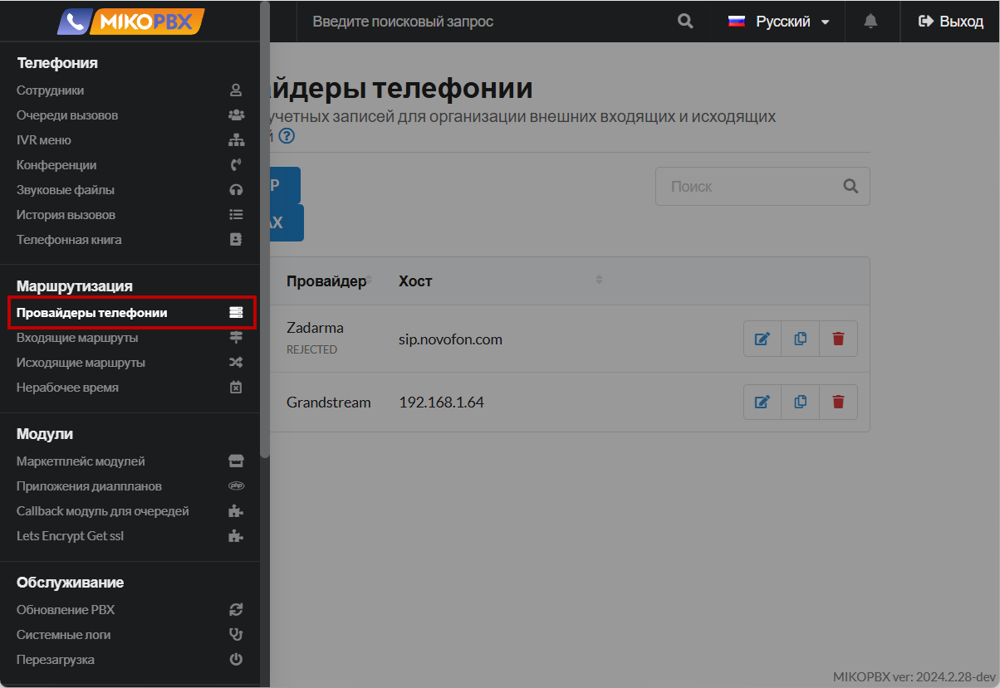
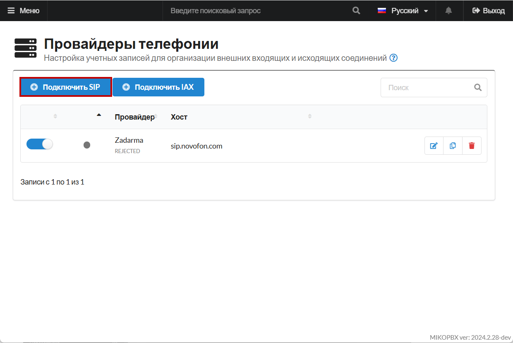

# Имитация внешних звонков

Полезным инструментом для настройки АТС MikoPBX будет имитация входящих и исходящих внешних звонков, чтобы не подключать реального провайдера, тем самым сэкономив.

## Создание нового SIP-провайдера на АТС

1. Перейдите в раздел "**Маршрутизация**" -> "**Провайдеры телефонии**":

<figure><figcaption>
Раздел "Провайдеры телефонии"
</figcaption></figure>

2. Подключите нового SIP-провайдера:

<figure><figcaption>
Подключение нового SIP-провайдера
</figcaption></figure>

3.
