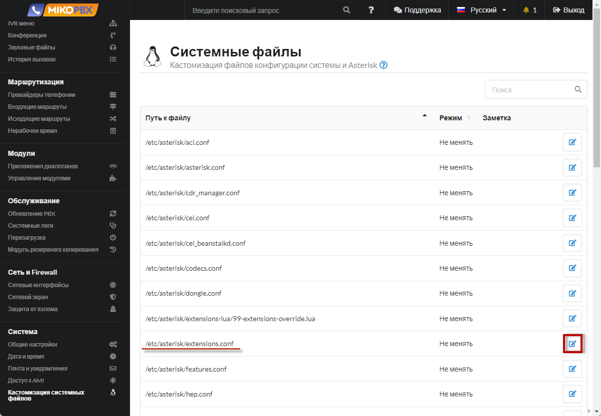
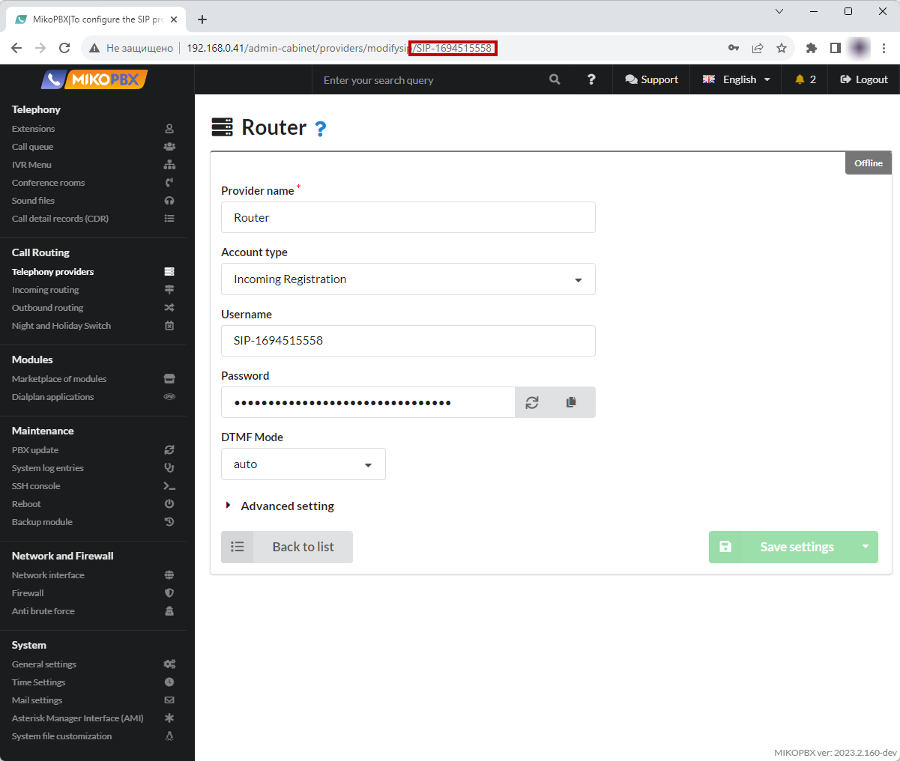

# Черные и белые списки

## Продвинутый вариант

1. Создайте новое **«Приложение диалплан»**
2. Укажите произвольное название, к примеру **Blacklist**
3. Выберите «**Тип кода**» - «**PHP AGI Скрипт**»
4. Укажите короткий номер для приложения, к примеру 99
5.  На вкладке «**Программный код**» вставьте:

    ```php
    <?php
    require_once('Globals.php');
    use MikoPBX\Core\Asterisk\AGI;

    $agi        = new AGI();
    $isTransfer = !empty($agi->get_variable('ISTRANSFER', true));
    $number     = substr($agi->request['agi_callerid'], -10);
    $cliNumber  = isset($argv[2]) && !empty($argv[2]) ? substr($argv[2], -10) : $number;
    $actionFlag = $isTransfer ? 1 : (isset($argv[1]) ? intval($argv[1]) : null);

    $agi->verbose('Action flag: ' . $actionFlag . ', Phone number: ' . $cliNumber, 1);
    $filename = '/storage/usbdisk1/mikopbx/custom_modules/blacklist.txt';
    if(file_exists($filename)){
        $blacklist = file($filename, FILE_IGNORE_NEW_LINES | FILE_SKIP_EMPTY_LINES);
        $isInBlacklist = in_array($cliNumber, $blacklist);
    }else{
        $isInBlacklist = false;
    }

    if (is_null($actionFlag) || is_null($cliNumber)) {
        if($isInBlacklist){
            $agi->verbose('The number was found in the blacklist. The call will be completed');
            $agi->hangup();
        }
        exit(0);
    }

    if ($actionFlag === 1) {
        if (!$isInBlacklist) {
            $agi->verbose('Adding number to black list (fileWriteContent): ' . $cliNumber, 1);
            $blacklist[] = $cliNumber;
            \MikoPBX\Core\System\Util::fileWriteContent($filename, implode(PHP_EOL, $blacklist) . PHP_EOL);
        } else {
            $agi->verbose('Number already exists in the black list: ' . $cliNumber, 1);
        }
        $filename = '/storage/usbdisk1/mikopbx/custom_modules/blacklist_add.wav';
        if(file_exists("$filename")){
            $agi->exec('Playback', \MikoPBX\Core\System\Util::trimExtensionForFile($filename));
        }
    } elseif ($actionFlag === 0) {
        if ($isInBlacklist) {
            $agi->verbose('Removing number from black list (fileWriteContent): ' . $cliNumber, 1);
            $blacklist = array_filter($blacklist, function($blacklistedNumber) use ($cliNumber) {
                return $blacklistedNumber !== $cliNumber;
            });
            \MikoPBX\Core\System\Util::fileWriteContent($filename, implode(PHP_EOL, $blacklist) . PHP_EOL);
        } else {
            $agi->verbose('Number not found in black list: ' . $cliNumber, 1);
        }
        $filename = '/storage/usbdisk1/mikopbx/custom_modules/blacklist_remove.wav';
        if(file_exists("$filename")){
            $agi->exec('Playback', \MikoPBX\Core\System\Util::trimExtensionForFile($filename));
        }
    } else {
        $agi->verbose('Invalid action flag: ' . $actionFlag . '. Use 1 to add, 0 to remove.', 1);
        exit(1);
    }
    $agi->verbose('Operation completed successfully.', 1);
    ```
6. Сохраните изменения и скопируйте идентификатор приложения из адресной строки браузера, в этом примере "`DIALPLAN-APP-1C34052A"`.&#x20;
7. Перейдите в раздел **Система** → **Кастомизация системных файлов**, откройте для редактирования файл **extensions.conf**
8.  Выберите режим **«Добавлять в конец файла»**, внизу в черное поле для редактирования вставьте следующие строки:

    ```php
    [internal-transfer](+)
    exten => _99,1,Set(__ISTRANSFER=transfer_)
     	same => n,Goto(internal,${EXTEN},1)
     
    [applications](+)
    exten => _1*X.,1,AGI(DIALPLAN-APP-1C34052A.php,1,${EXTEN:3})
    exten => _0*X.,1,AGI(DIALPLAN-APP-1C34052A.php,0,${EXTEN:3})	
     	
    [add-trim-prefix-clid-custom]
    exten => _[0-9*#+a-zA-Z][0-9*#+a-zA-Z]!,1,NoOp(start check blacklist)
    	same => n,AGI(DIALPLAN-APP-1C34052A.php)
    	same => n,Return()
    ```

    , где «**`DIALPLAN-APP-1C34052A`**» - это идентификатор приложения, найти можно в адресной строке браузера при редактирвоании приложения
9. Сохраните изменения!



Черный список телефонов будет храниться в файле:\
«**`/storage/usbdisk1/mikopbx/custom_modules/balcklist.txt`**»

Также можно на АТС загрузить файлы оповещения о добавлении в черный список:

`/storage/usbdisk1/mikopbx/custom_modules/blacklist_add.wav`

`/storage/usbdisk1/mikopbx/custom_modules/blacklist_remove.wav`\
\
Для добавления номера в черный список просто **выполните переадресацию на номер 99** (слепую, без консультаци&#x438;**)**\
\
**Наберите** `1*74950000300` **для добавления номера в черный список**\
**Наберите** `0*74950000300` для удаления номера из черного списка



## Упрощенная реализация

**Подойдет для старых версий MikoPBX**

1. Перейдите в раздел **Система** → **Кастомизация системных файлов**.

<figure><figcaption><p>Раздел "Кастомизация системных файлов"</p></figcaption></figure>

2. Откройте для редактирования конфигурационный файл **extensions.conf**.

<figure><figcaption><p>Редактирование конфигурационного файла "Extensions.conf" </p></figcaption></figure>

3. Установите режим "Добавлять в конец файла" и вставьте следующий код:

```php
[add-trim-prefix-clid-custom]
exten => _X!,1,NoOp(...)
    ; Черный список номеров. Вызов будет завершен. 
    same => n,ExecIf($["${CALLERID(num)}" == "72942293042"]?Hangup())
    same => n,ExecIf($["${CALLERID(num)}" == "72942293043"]?Hangup())
    same => n,ExecIf($["${CALLERID(num)}" == "72942293044"]?Hangup())
    same => n,return
```

<figure><figcaption><p>Код для файла "extnsions.conf"</p></figcaption></figure>

Белый список номеров иногда требуется описать для конкретных провайдеров:

```php
[ID-ПРОВАЙДЕРА-incoming-custom]
exten => _X!,1,NoOp(...)
    ; Белый список номеров. 
    same => n,ExecIf($["${CALLERID(num)}" == "72942291111"]?return)
    same => n,ExecIf($["${CALLERID(num)}" == "72942291112"]?return)
    same => n,ExecIf($["${CALLERID(num)}" == "72942291113"]?return)
    same => n,Hangup()
```

<figure><figcaption></figcaption></figure>

* **ID-ПРОВАЙДЕРА** - значение, которое вы можете найти в адресной строке в момент конфигурации провайдера

<figure><figcaption><p>Как найти ID провайдера:</p></figcaption></figure>

