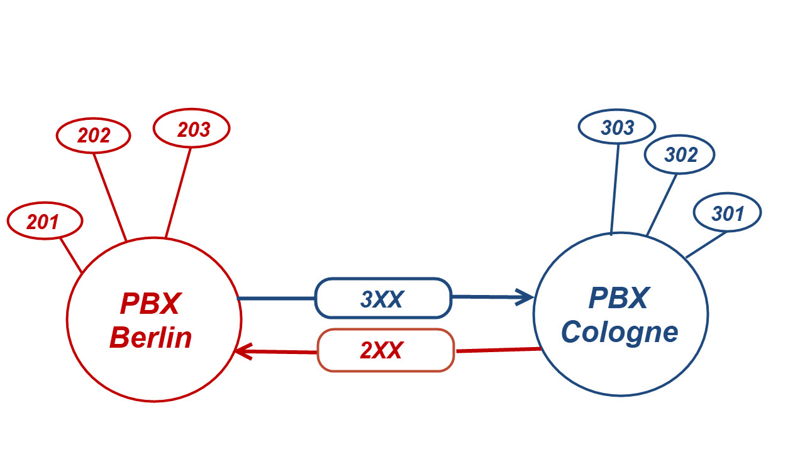
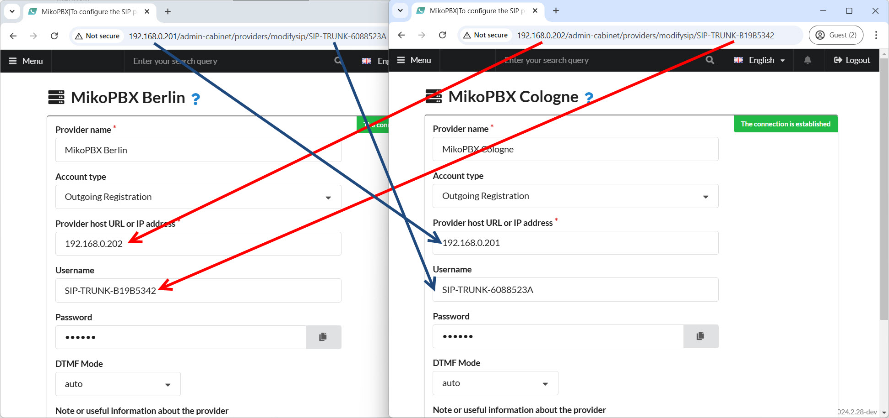
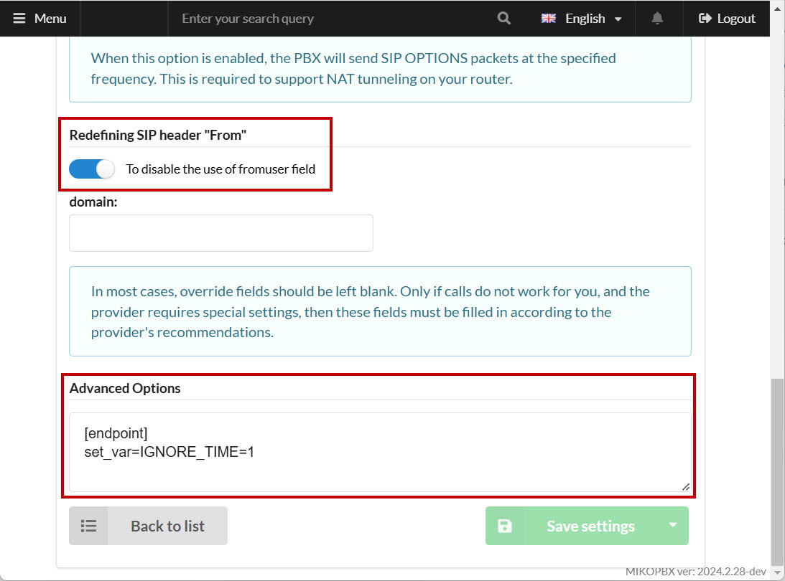
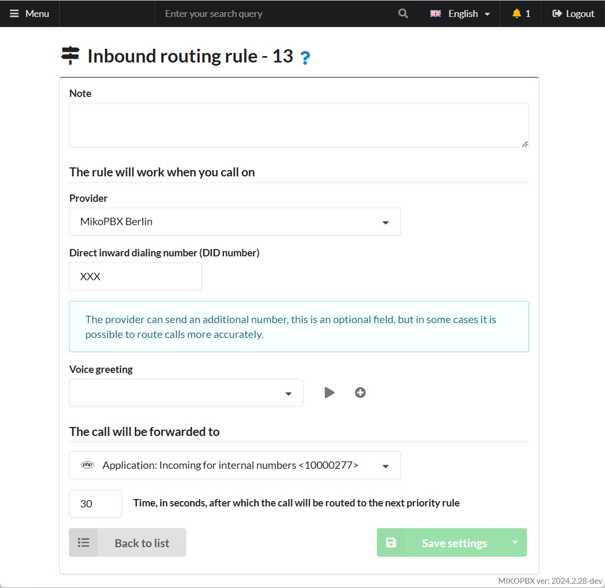
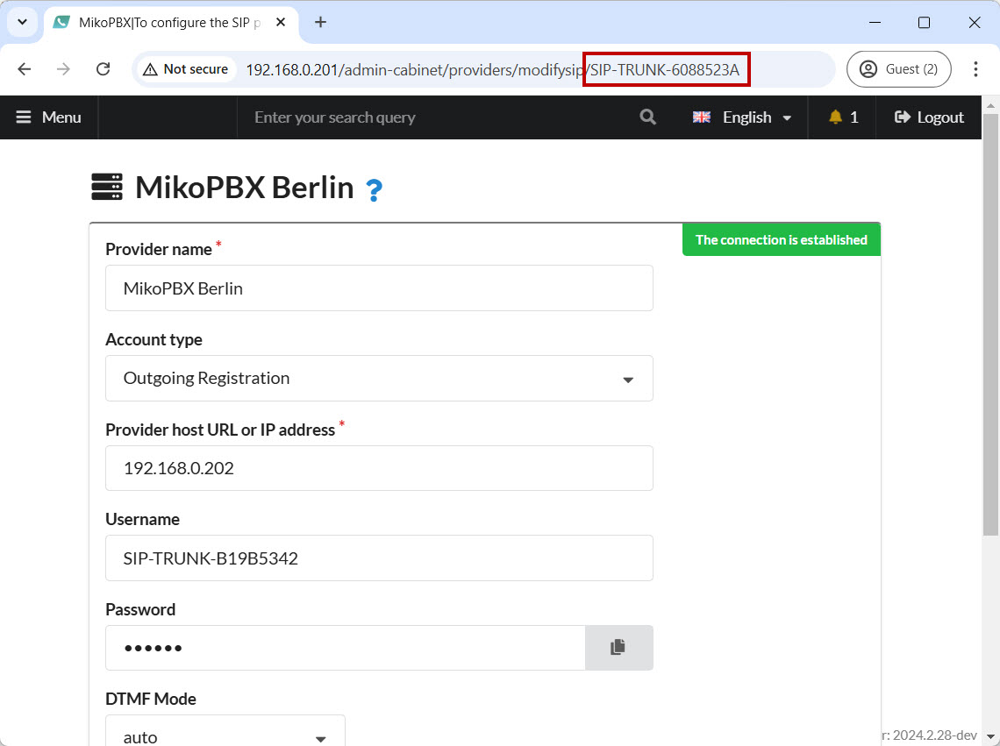
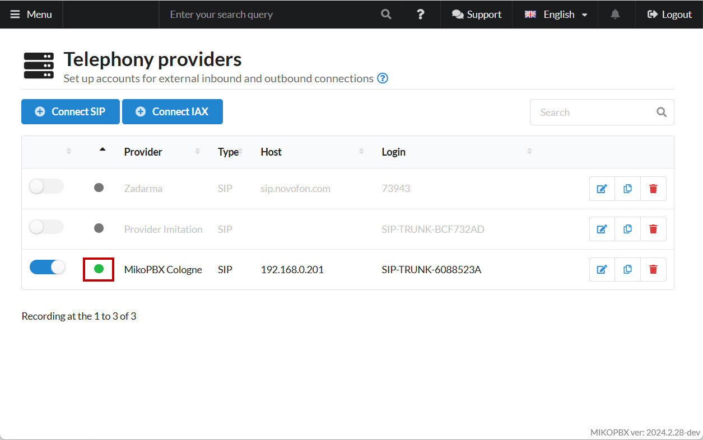
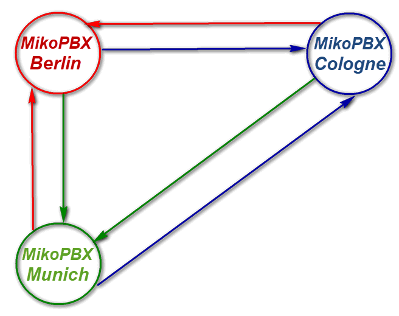

# Merging two MikoPBX

## Task Description

In this example, a call center company has two offices: in **Berlin** and in **Cologne**. Each office uses a separate **MikoPBX** system:

* **PBX Berlin** - _192.168.0.202_ - all internal employee numbers are assigned using the pattern **2XX (e.g., 201, 202, 203, ...)**
* **PBX Cologne** - _192.168.0.201_ - all internal employee numbers are assigned using the pattern **3XX (e.g., 301, 302, 303, ...)**


For the purposes of this example, local IP addresses are used.


The goal is to **merge** these two PBX systems to create a **unified internal numbering plan**: employees in the Berlin office should be able to dial employees in the Cologne office using short numbers and vice versa.

A schematic representation of call routing is shown in the figure below.

<figure><figcaption><p>Routing diagram</p></figcaption></figure>

## Telephony Providers

1. For each PBX, you need to add a provider account. To create it, navigate to "**Routing"** → "**Telephony Providers"**.

<figure><figcaption><p>"Telephony Providers" section</p></figcaption></figure>

2. Create providers and fill in the connection parameters as follows:

<figure><figcaption><p>Provider settings for merging</p></figcaption></figure>


**The provider ID will appear in the address bar only after saving the provider**. Temporarily, in the "**Username**" field, enter a derived value. After saving the provider, you can correct it.


3. In "**Advanced Setting**" → "**Redefining SIP header "From"**," check the box "**Disable using the fromuser field**." This needs to be done for both providers.

<figure><figcaption><p>Advanced setting</p></figcaption></figure>

4. In "**Advanced Setting**" → "**Advanced Options**," add the following:

```php
[endpoint]
set_var=IGNORE_TIME=1 
```

This option disables the "**Non-working Hours**" feature for all incoming calls through this provider.

## Outbound Routing

Navigate to "**Routing**" → "**Outbound Routing**." Configure the outgoing routes as shown in the screenshot below:

<figure><figcaption><p>Outbound Routing Settings</p></figcaption></figure>

## Incoming Routing

1. For each PBX, add the **same dialplan application** that will redirect calls to internal numbers. In the "**Modules**" → "**Dialplan Applications**" section, add a new application with the following parameters:
   * "**Name**" - any name
   * "**Extension to Call the Application**" - any unique number
   * "**Code Type**" -  Dialplan Asterisk

<figure><figcaption><p>Dialplan settings</p></figcaption></figure>

2. Go to the "**Programme Code**" tab and add the following code to handle calls:

```php
1, GoTo(internal,${FROM_DID},1)
n, Hangup()
```

3. Create an incoming route for each PBX. Navigate to "**Routing**" → "**Incoming Routing**," and add a new rule with the following parameters:

<figure><figcaption><p>Inbound routing rule</p></figcaption></figure>

## Call Forwarding


For security reasons, forwarding to **external** phone numbers is prohibited!


#### **First PBX**

To remove this restriction, add the following code to the end of the "**extensions.conf**" file via the "**System**" → "**Customize System Files**" section:

```php
[internal-transfer](+)
exten => _2XX,1,Set(__ISTRANSFER=transfer_)
     same => n,Goto(outgoing,${EXTEN},1) 
```

This allows forwarding to 2XX numbers.

#### **Second PBX**

On the second PBX, to allow forwarding to 3XX numbers, add the following code to the end of the "**extensions.conf**" file via the "**System**" → "**Customize System Files**" section:

```php
[internal-transfer](+)
exten => _3XX,1,Set(__ISTRANSFER=transfer_)
     same => n,Goto(outgoing,${EXTEN},1) 
```

This allows forwarding to 3XX numbers.

## Subscriber Statuses

In some cases, subscribers on one PBX need to know the statuses of subscribers on the other PBX. For example, when using:

* **BLF on telephone devices**
* **"Telephony Panel for 1C"**

To configure statuses:

1. **On the first PBX**, add the following code to the end of the **extensions.conf** file via the "Customize System Files" section:

```php
[internal-hints]
exten => 301,hint,PJSIP/301
exten => 303,hint,PJSIP/303
exten => 302,hint,PJSIP/302
```

2. **For each PBX**, add the following code to the end of the **pjsip.conf** file via the "Customize System Files" section:

```php
[<ID-Provider-Current-PBX>-devicestate]
type=outbound-publish
server_uri=sip:<ID-Provider-Current-PBX>@<ID-Provider-Other-PBX>:<SIP-Port-Other-PBX>
event=asterisk-devicestate

[<ID-Provider-Current-PBX>]
type=asterisk-publication
devicestate_publish=<ID-Provider-Current-PBX>-devicestate
device_state=yes

[<ID-Provider-Current-PBX>]
type=inbound-publication
event_asterisk-devicestate=<ID-Provider-Current-PBX>
```


Replace the placeholders **\<ID-Provider-Current-PBX>**, **\<ID-Provider-Other-PBX>**, and **\<SIP-Port-Other-PBX>** with your actual values.


3. **On the second PBX**, add the following code to the end of the **extensions.conf** file via the "Customize System Files" section:

```php
[internal-hints]
exten => 201,hint,PJSIP/201
exten => 203,hint,PJSIP/203
exten => 202,hint,PJSIP/202
```

## Resolving Identical Numbers on PBXs

Ideally, each PBX should have its own range of SIP numbers that do not overlap. However, in practice, overlaps can occur. This might lead to issues when calling from one PBX to another: the call may drop.

You can work around this problem. **On each PBX**, add the following code to the end of the **extensions.conf** file via the "**System**" → "**System file customization**" section:

```php
[ID_PROVIDER-outgoing-custom]
; For outgoing calls, add an "_" (underscore) prefix to the caller ID
exten => _X!,1,Set(CALLERID(num)=_${CALLERID(num)})
    same => n,return

[ID_PROVIDER-incoming-custom]
; For incoming calls, remove the prefix for correct caller ID display
exten => _[0-9*#+]!,1,Set(CALLERID(num)=${CALLERID(num):1})
    same => n,return
```

**ID\_PROVIDER** is the identifier of the provider on the current PBX. You can find it in the browser's address bar:

<figure><figcaption><p>Provider ID</p></figcaption></figure>

## Conclusion and Results

By following these steps, we have successfully connected two PBXs! A green indicator next to the provider account confirms the successful connection of the two systems:

For **PBX Berlin** (_192.168.0.202_):

<figure><figcaption><p>Status on MikoPBX station in Berlin office</p></figcaption></figure>

For **PBX Cologne** (_192.168.0.201_):

<figure><figcaption><p>Status on MikoPBX station in Cologne office</p></figcaption></figure>

Similarly, you can connect **three** or even **four** PBX systems! Note that when connecting three PBXs, each PBX must have not one but two providers. This can be schematically represented as:

<figure><figcaption><p>Scheme of merging 3 MikoPBX stations</p></figcaption></figure>
