# Объединение двух MikoPBX

## Описание примера задачи <a href="#obedinenie_dvux_mikopbx" id="obedinenie_dvux_mikopbx"></a>

В нашем случае-примере компания call-центра имеет два офиса: в **Москве** и в **Санкт-Петербурге**.\
В каждом офисе используется отдельная станция **MikoPBX**:

* **АТС Москва** - _192.168.0.202_ - все внутренние номера сотрудников назначены по шаблону **2ХХ (пример - 201, 202, 203, ...)**
* **АТС Петербург** - _192.168.0.201_ - все внутренние номера сотрудников назначены по шаблону **3ХХ (пример - 301, 302, 303, ...)**


Для примера используются локальные IP-адреса.


Необходимо **объединить** эти две АТС, реализовать **единый внутренний план номеров**: сотрудники из офиса в Москве должны иметь возможность по короткому номеру набрать сотрудников из офиса Санкт-Петербурга и наоборот.

Схематично маршрутизация вызовов представлена на рисунке ниже.

<figure><figcaption><p>Схема маршрутизации</p></figcaption></figure>

## Провайдеры телефонии <a href="#provajdery_telefonii" id="provajdery_telefonii"></a>

1. Для каждой АТС необходимо добавить учетную запись провайдера. Для её создания необходимо перейти в **Маршрутизация** → **Провайдеры телефонии**.

<figure>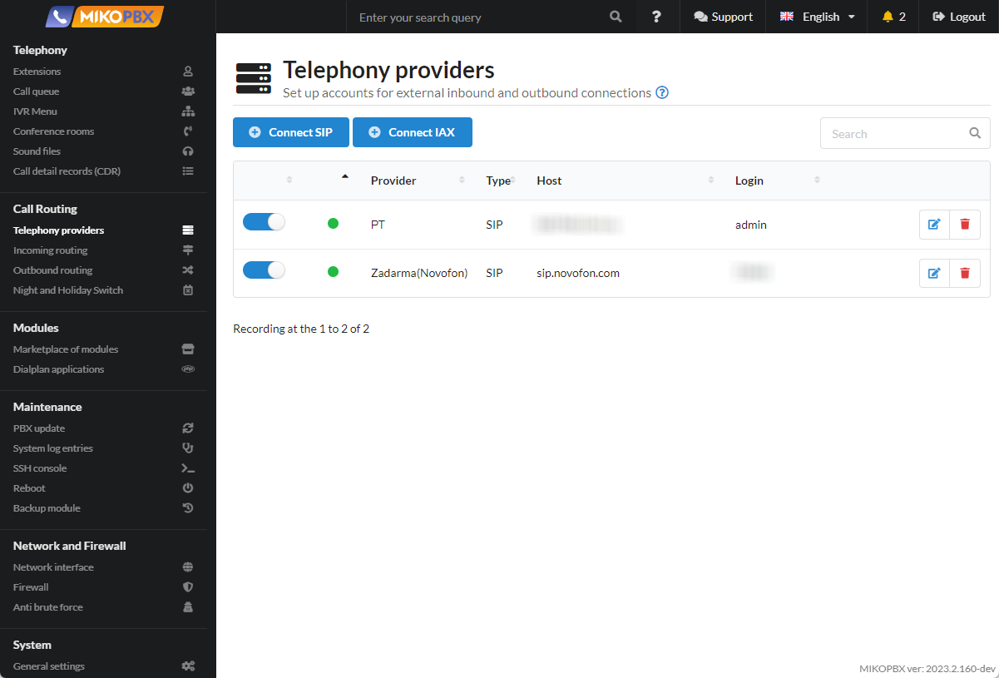<figcaption><p>Раздел "Провайдеры телефонии"</p></figcaption></figure>

2. Создайте провайдеров и заполните параметры подключения следующим образом:&#x20;

<figure>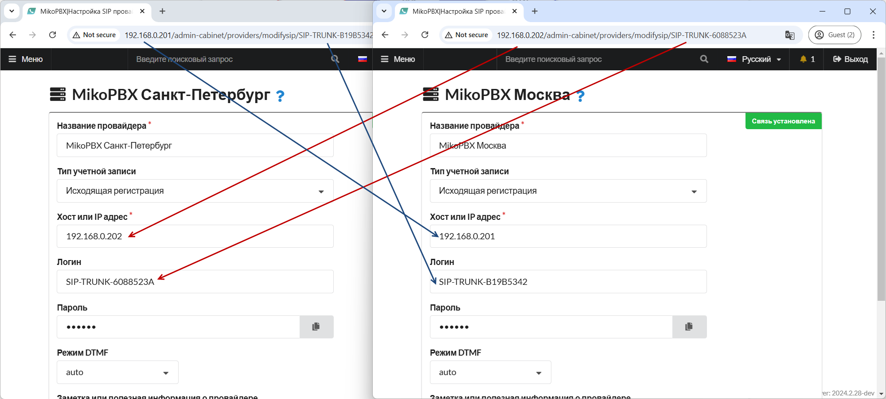<figcaption><p>Настройки провайдеров для объединения</p></figcaption></figure>


**Идентификатор провайдера появится в адресной строке только после записи провайдера**. Временно в поле «**Логин**» укажите производное значение. После записи провайдера можно его скорректировать.


3. В «**Расширенные настройки**» -> «**Переопределение SIP заголовка «From»**» - установите флаг «**Отключить использование поля fromuser**». Сделать это нужно для двух провайдеров.

<figure>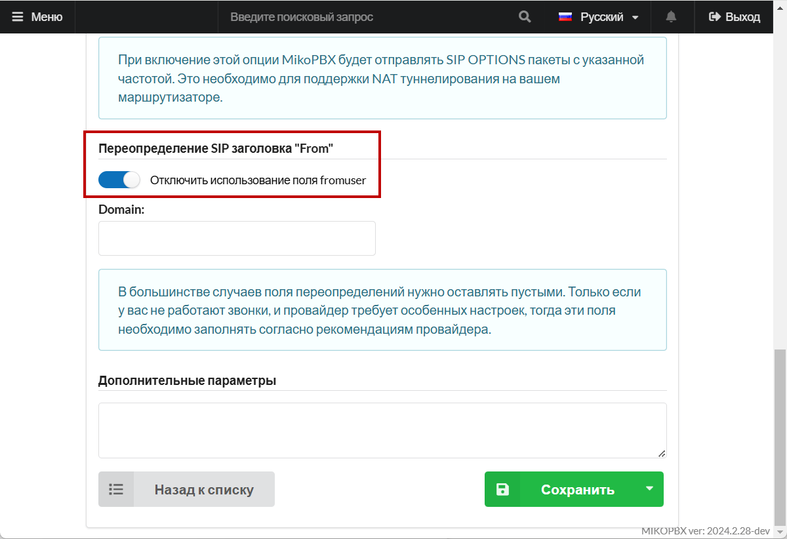<figcaption><p>Отлюкчение использования поля fromuser</p></figcaption></figure>

4. В «**Расширенные настройки**» -> «**Дополнительные параметры**» следует прописать:

```php
[endpoint]
set_var=IGNORE_TIME=1 
```

Эта опция отключит функционал «**Нерабочее время**» для всех входящих через этого провайдера.&#x20;

<figure>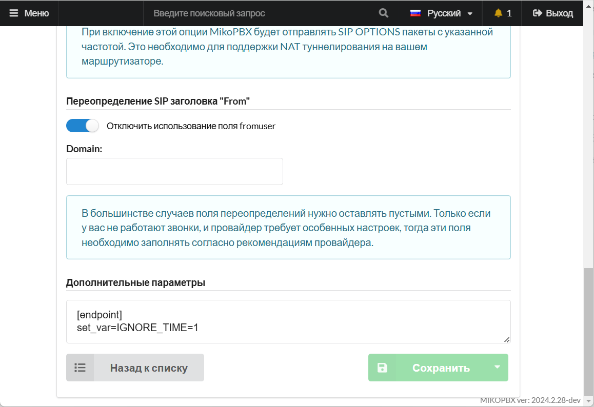<figcaption><p>Дополнительные параметры</p></figcaption></figure>

## Исходящая маршрутизация <a href="#isxodjaschaja_marshrutizacija" id="isxodjaschaja_marshrutizacija"></a>

Необходимо перейти в "**Маршрутизация"** → "**Исходящие маршруты"**. Опишите исходящие маршруты как на скриншоте ниже:&#x20;

<figure>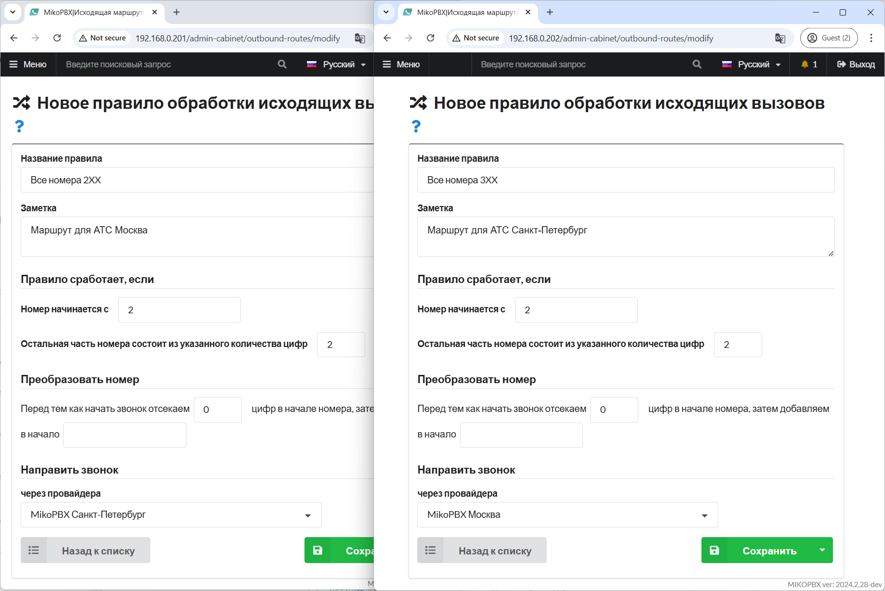<figcaption><p>Настройки исходящей маршрутизации</p></figcaption></figure>

## Входящая маршрутизация <a href="#vxodjaschaja_marshrutizacija" id="vxodjaschaja_marshrutizacija"></a>

1. Добавим **для каждой АТС одинаковое приложение диалплана**, которое будет переадресовывать звонки на внутренние номера . В разделе "**Модули" -> "Приложения диалпланов"** добавим новое приложение со следующими параметрами:

* "**Название**" - произвольное название
* **"Номер для вызова приложения"** -  произвольный уникальный номер
* **"Тип кода"** - Диалплан Asterisk

<figure>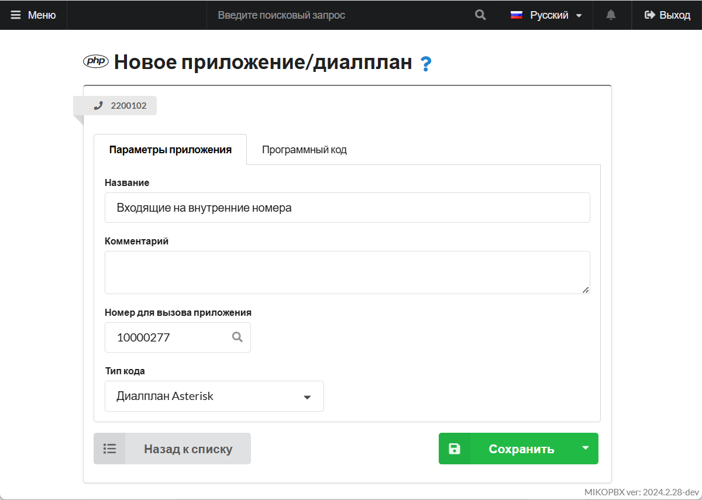<figcaption><p>Параметры диалплана</p></figcaption></figure>

2. Перейдите во вкладку "**Программный код",** добавьте код для обработки звонков:

```php
1, GoTo(internal,${FROM_DID},1)
n, Hangup()
```

3. Создайте входящий маршрут для каждой АТС. Для этого перейдите в раздел "**Маршрутизация" -> "Входящие маршруты"**, добавьте новое правила со следующими параметрами:

<figure>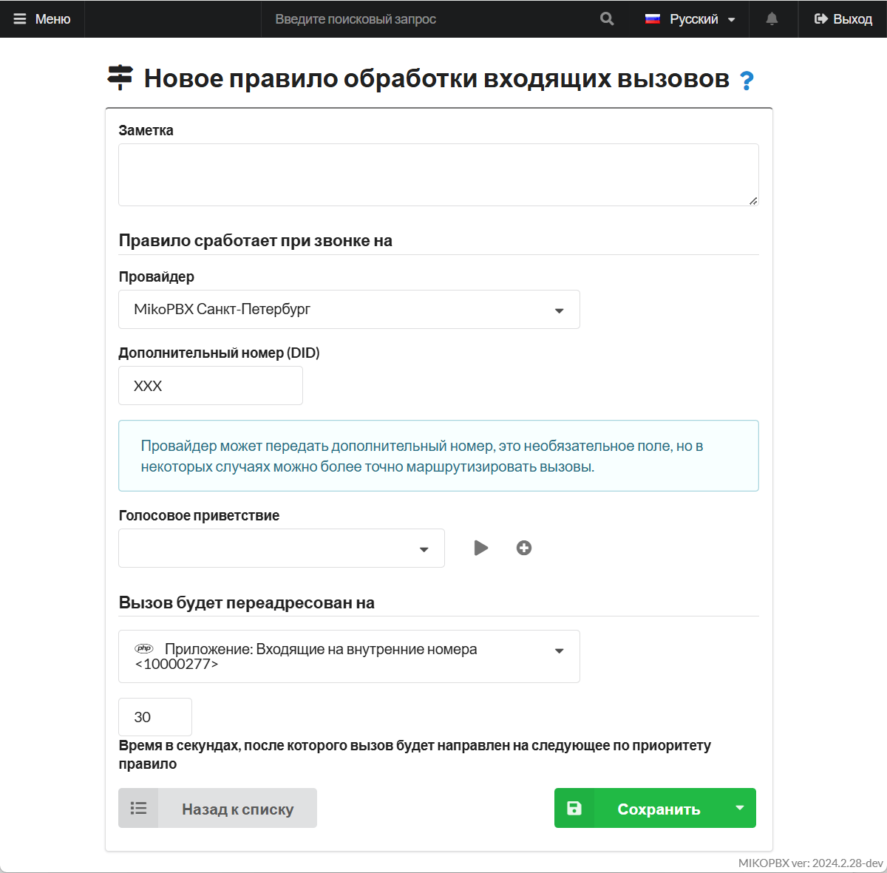<figcaption><p>Параметры для входящей маршрутизации</p></figcaption></figure>

## Переадресация <a href="#pereadresacija" id="pereadresacija"></a>


В целях безопасности, переадресация на «**Внешние**» номера телефонов запрещена!


#### Первая АТС

Для того, чтобы снять данной ограничение, добавьте через раздел "**Система**" -> "**Кастомизация системных файлов"** в конец файла "**extensions.conf"** следующий код:

```php
[internal-transfer](+)
exten => _2XX,1,Set(__ISTRANSFER=transfer_)
     same => n,Goto(outgoing,${EXTEN},1) 
```

Это разрешит переадресацию на 2XX номера.

#### Вторая АТС

На второй АТС, чтобы разрешить переадресацию на 3XX номера добавьте через раздел "**Система**" -> "**Кастомизация системных файлов"** в конец файла "**extensions.conf"** следующий код:

```php
[internal-transfer](+)
exten => _3XX,1,Set(__ISTRANSFER=transfer_)
     same => n,Goto(outgoing,${EXTEN},1) 
```

Это разрешит переадресацию на 3XX номера.

## Статусы абонентов <a href="#statusy_abonentov" id="statusy_abonentov"></a>

В некоторых случаях, абонентам одной АТС потребуется знать статусы абонентов другой станции. К примеру при использовании:

* **BLF на телефонных аппаратах**
* **«Панель телефонии для 1С»**

Для настройки статусов потребуется:

1. Добавьте **на первой АТС** через раздел Кастомизация системных файлов в конец файла **extensions.conf** следующий код:

```php
[internal-hints]
exten => 301,hint,PJSIP/301
exten => 303,hint,PJSIP/303
exten => 302,hint,PJSIP/302
```

2. Для **каждой АТС** добавьте через раздел Кастомизация системных файлов в конец файла **pjsip.conf:**

```php
[<ID-Провайдера-Текщуей-АТС>-devicestate]
type=outbound-publish
server_uri=sip:<ID-Провайдера-Текщуей-АТС>@<ID-Провайдера-Другой-АТС>:<SIP-Порт-Другой-АТС>
event=asterisk-devicestate
 
[<ID-Провайдера-Текщуей-АТС>]
type=asterisk-publication
devicestate_publish=<ID-Провайдера-Текщуей-АТС>-devicestate
device_state=yes

[<ID-Провайдера-Текщуей-АТС>]
type=inbound-publication
event_asterisk-devicestate=<ID-Провайдера-Текщуей-АТС>
```


Замените теги **\<ID-Провайдера-Текщуей-АТС>**, **\<ID-Провайдера-Другой-АТС>**, **\<SIP-Порт-Другой-АТС>** на свои значения


3. Добавьте **на второй АТС** через раздел Кастомизация системных файлов в конец файла **extensions.conf** следующий код:

```php
[internal-hints]
exten => 201,hint,PJSIP/201
exten => 203,hint,PJSIP/203
exten => 202,hint,PJSIP/202
```

## Решение ситуации с одинаковыми номерами на АТС <a href="#odinakovye_nomera_na_ats" id="odinakovye_nomera_na_ats"></a>

В идеале, на каждой АТС должен быть свой диапазон номеров SIP и они не должны пересекаться, однако на практике, возможно и наложение. В этом случае можно столкнуться с проблемой звонка с одной АТС на другую: вызов может обрываться.

Проблему можно обойти. Для этого **на каждой АТС** следует добавить через раздел "**Система**" -> "**Кастомизация системных файлов**" в конец файла **extensions.conf** следующий код:

```php
[ID_PROVIDER-outgoing-custom]
; При исходящем в caller ID добавляем префикс "_" (нижнее подчеркивание)
exten => _X!,1,Set(CALLERID(num)=_${CALLERID(num)})
	same => n,return

[ID_PROVIDER-incoming-custom]
; При входящем удаляем префикс, для корректного отображения callerid
exten => _[0-9*#+]!,1,Set(CALLERID(num)=${CALLERID(num)=:1})
	same => n,return
```

**ID\_PROVIDER** - это идентификатор провайдера текущей АТС, посмотреть его можно в адресной строке браузера:

<figure>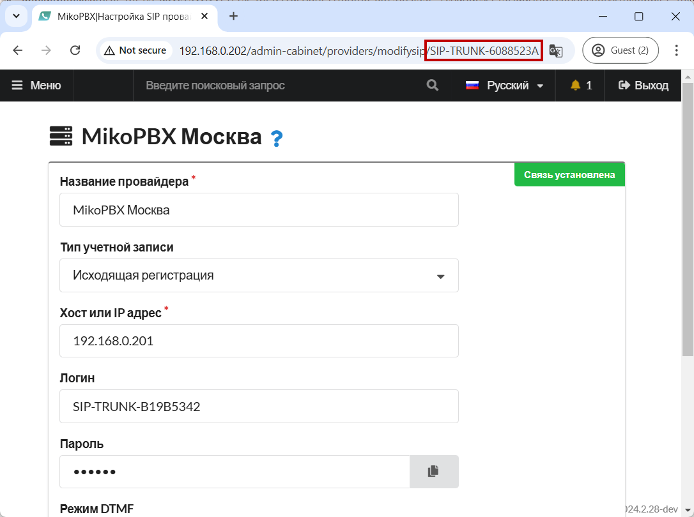<figcaption><p>ProviderID</p></figcaption></figure>

## Итоги. Результаты. <a href="#itogi" id="itogi"></a>

Таким образом мы соединили две АТС! Подтверждением успешного подключения двух станций служит зеленый индикатор напротив учетной записи провайдера:

Для **АТС Москва**(_192.168.0.202_):

<figure>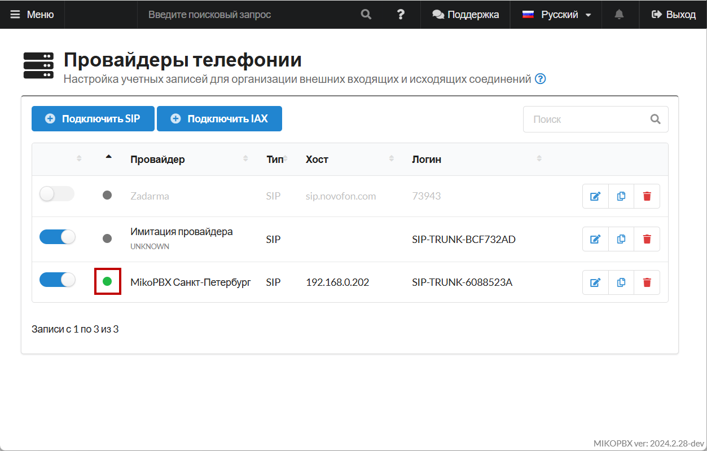<figcaption><p>Статус на станции MikoPBX в офисе Москвы</p></figcaption></figure>

Для **АТС Петербург**(_192.168.0.201)_:

<figure>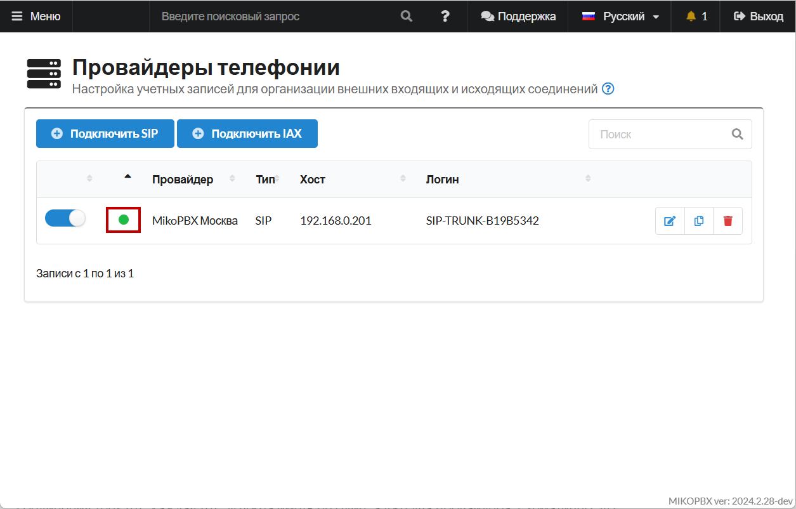<figcaption><p>Статус на станции MikoPBX в офисе Санкт-Петербурга</p></figcaption></figure>

Аналогичным образом можно подключить **три** и даже **четыре** станции! Нужно понимать, что в случае соединения трех АТС каждая АТС должна иметь не один, а уже два провайдера. Схематично это изобразить можно так:

<figure>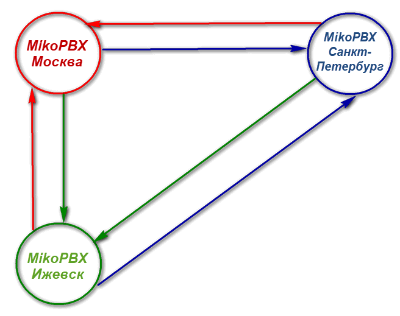<figcaption><p>Схема объединения 3 станций MikoPBX</p></figcaption></figure>
