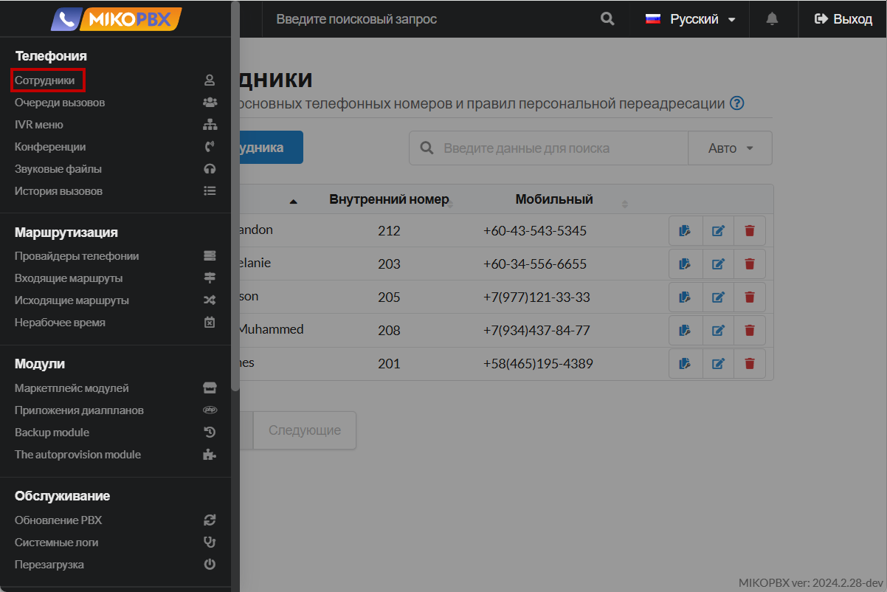
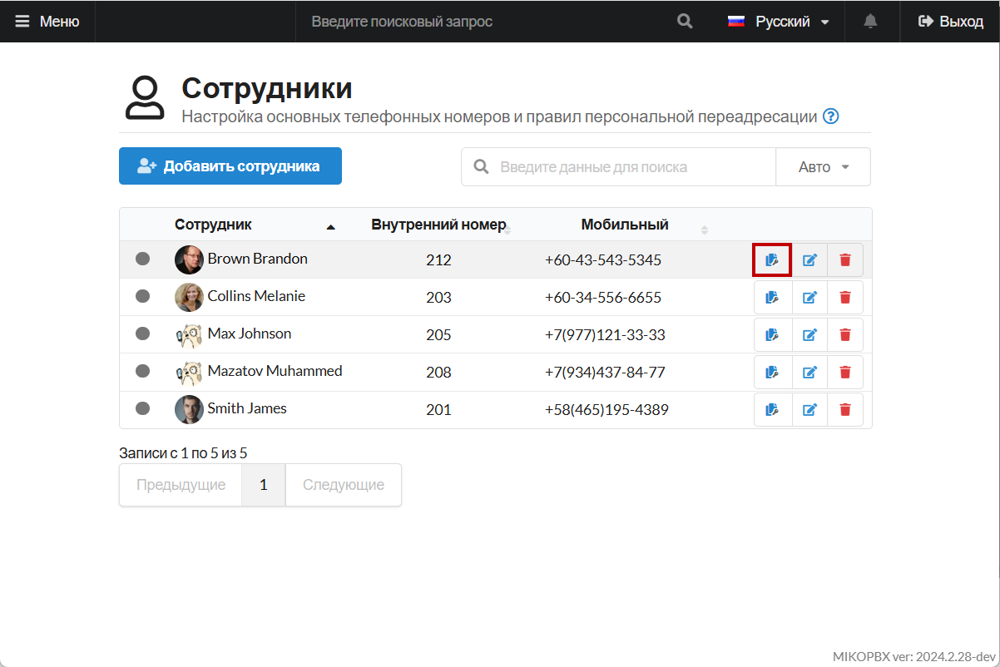
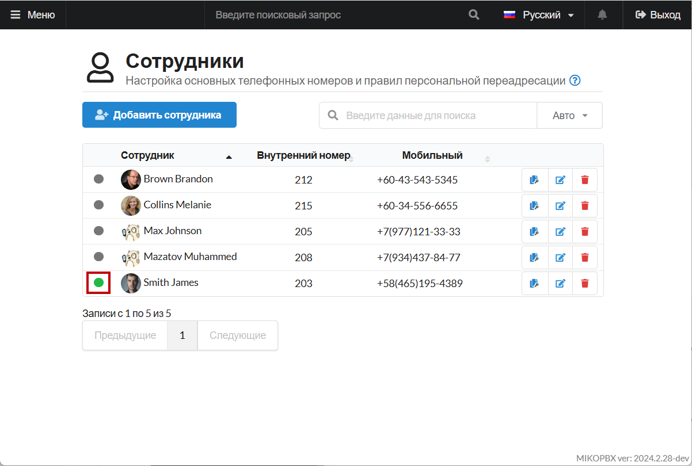

# Snom D120

**Snom D120** - телефон начального уровня, базовая модель от **Snom.** В данной инструкции будет изображён процесс подключения и настройки данного телефона к MikoPBX.


Убедитесь, что в разделе "**Система**" -> "**Общие настройки**" -> "**Аудио/Видео кодеки**", кодек **G.711 A-law** включен.


## Настройки внутри раздела "Сотрудники" 

1. Перейдите в web-интерфейс MikoPBX. В раздел **«Телефония» -> «Сотрудники»:**

<figure><figcaption>
Раздел "Сотрудники" в MikoPBX
</figcaption></figure>

2. Напротив учетной записи сотрудника, которого Вы будете подключать к телефону, скопируйте пароль для SIP:

<figure><figcaption>
Элемент для копирования пароля для SIP
</figcaption></figure>

## Настройка Snom D120 

Подключите телефон к сети ethernet через порт с надписью LAN.

<figure><figcaption>
Схема портов Snom D120
</figcaption></figure>


Если в вашей сети настроен DHCP сервер, то телефон получит IP адрес автоматически. При включении адрес будет отображен на аппарате.


1. Перейдите в браузере по ссылке [http://ip\_адрес\_телефона](http://xn--ip\_\_-73db0aiba9dzamwqr1b/). Авторизуйтесь в web-интерфейсе.
2. Для настройки учетной записи SIP перейдите в меню «**Setup**» -> «**Identity 1**»:

<figure><figcaption>
Раздел «<strong>Setup</strong>» -> «<strong>Identity 1</strong>»
</figcaption></figure>

* «**Identity active**» - установите в значение «**on**».
* «**Displayname**» - произвольное имя, лучше указать латиницей.
* «**Account**» - идентификатор аккаунта - в MikoPBX совпадает с внутренним номером сотрудника.
* «**Password**» - пароль от учетной записи сотрудника (раннее скопированый пароль для SIP)
* «**Registrar**» - адрес вашей MikoPBX.

Нажмите кнопку «**Apply**». Выполните действе «**Re-Register**».

Для проверки перейдите в раздел «**Status**» - «**System Information**». В случае успешной регистрации отобразится:

<figure><figcaption>
Успешная регистрация
</figcaption></figure>

В Web интерфейсе MikoPBX, в списке сотрудников статус-иконка изменит цвет на <mark style="color:green;">**зеленый**</mark>**:**

<figure><figcaption>
Индикатор подключения 
</figcaption></figure>

## Дополнительные настройки 

1. Рекомендуем включить настройку **PnP Config** для использования фунций модуля **"**[**Автоматическая настройка телефонов**](../../modules/miko/module-autoprovision.md)**".**

<figure><figcaption>
Настройка PnP Config
</figcaption></figure>

2. В некоторых случаях, при использовании DHCP может использоваться опция 132 для автоматической настройки терминалов. Возможно потребуется отключить использование этой опции для корректной работы телефонного аппарата:

<figure><figcaption>
Опция 132
</figcaption></figure>
