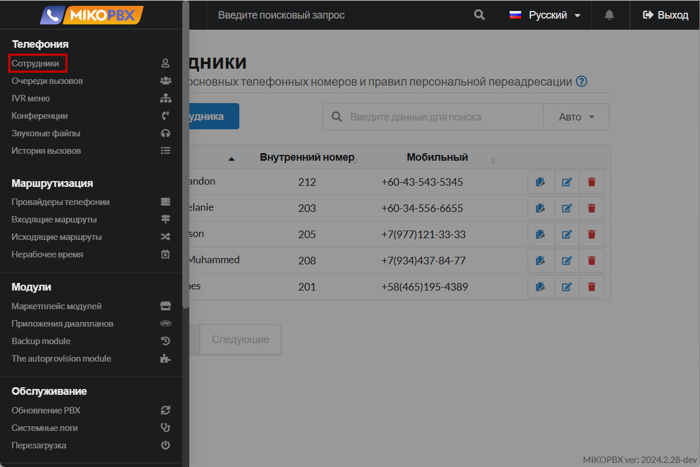
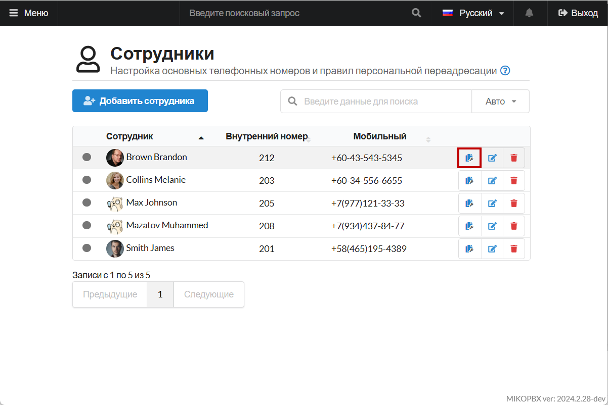

# Yealink T28

VoIP-телефон Yealink SIP-T28P - это корпоративный телефон на 6 учетных записей.


Убедитесь, что в разделе "**Система**" -> "**Общие настройки**" -> "**Аудио/Видео кодеки**", кодек **G.711 A-law** включен.


## Настройки внутри раздела "Сотрудники"

1. Перейдите в web-интерфейс MikoPBX. В раздел **«Телефония» -> «Сотрудники»:**

<figure><figcaption>
Раздел "Сотрудники" в MikoPBX
</figcaption></figure>

2. Напротив учетной записи сотрудника, которого Вы будете подключать к телефону, скопируйте пароль для SIP:

<figure><figcaption>
Элемент для копирования пароля для SIP
</figcaption></figure>

## Настройка Yealink T28

1. Подключите телефон к сети ethernet, используя порт с надписью "**internet".**


Если в вашей сети настроен DHCP сервер, то телефон получит IP адрес автоматически.


2. Нажмите на клавишу "OK" на, чтобы узнать IP-адрес телефона, по которому к нему будет произодиться подключение из браузера. Далее адрес будет отображен на экране телефона.
3. Перейдите по ссылке <mark style="color:blue;">http://ip\_адрес\_телефона</mark> в вашем браузере.


Стандартные данные для первой авторизации:

Username: admin

Login: admin


<figure><figcaption>
Окно авторизации
</figcaption></figure>

4. Далее выполните настройку SIP-аккаунта в Вашем телефоне:

* «**Имя регистрации**», «**Имя пользователя**» - внутренний номер подключаемой учетной записи сотрудника.
* «**Пароль**» - пароль учетной записи Вашего сотрудника (Пароль для SIP)
* **«Адрес SIP сервера»** - IP-адрес MikoPBX

Нажмите "**Сохранить**"

<figure><figcaption>
Параметры аккаунта
</figcaption></figure>

5. На вкладке **Расширенные** установите **Caller ID Source**, чтобы при переадресации отображался **корректный callerid**. В этой настройке мы указываем телефону, из каких SIP заголовков брать callerid и в каком приоритете.

<figure><figcaption>
Параметр "Caller ID Source"
</figcaption></figure>

6. У Yealink SIP-T28 есть особенность - это кнопки «расширения», дополнительный набор кнопок со световой индикацией **BLF**. BLF кнопки показывают статус сотрудников и при нажатии на данную кнопку сработает **безконсультативная переадресация**. На рисунке ниже представлен пример настройки отслеживания статуса для 317 номера.

<figure><figcaption>
Настройка параметров
</figcaption></figure>

7. В разделе «**Функции**» настройте параметр в «**Интерком**» -> "**Приоритет интеркома**":

<figure><figcaption>
Настройка параметров
</figcaption></figure>

После успешного подключения телефона, в интерфейсе MikoPBX индикатор состояния подключения загорится <mark style="color:green;">зелёным</mark>:

<figure><figcaption>
Индикатор состояния в MikoPBX
</figcaption></figure>
