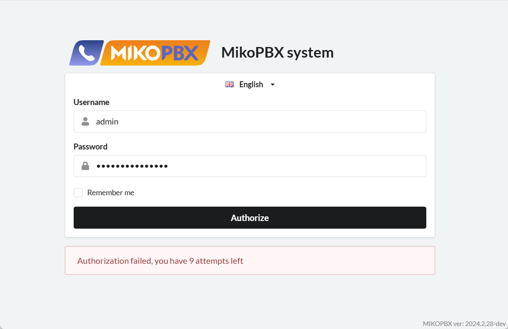

# Сброс данных от WEB-интерфейса

Может возникнуть ситуация, когда Вы забыли логин или пароль от web-интерфейса MikoPBX. В данной инструкции вы найдете действие для их сброса.

<figure><figcaption>
Ошибка авторизации в WEB-интерфейс
</figcaption></figure>

## Решение

1. Перейдите в консоль MikoPBX.

<figure><figcaption>
Консоль MikoPBX
</figcaption></figure>

2. Перейдите в раздел "**\[7] Reset password for the web interface**".
3. Введите "y" для подтверждения сброса логина и пароля.

<figure><figcaption>
Подтверждение сброса пароля
</figcaption></figure>

4. Авторизуйтесь в web-интерфейс по стандартным данным:


Стандартные данные для входа в web-интерфейс:

Логин: admin

Пароль: admin


Измените данные для входа после первой авторизации.

<figure><figcaption>
Изменение данных для входа
</figcaption></figure>
