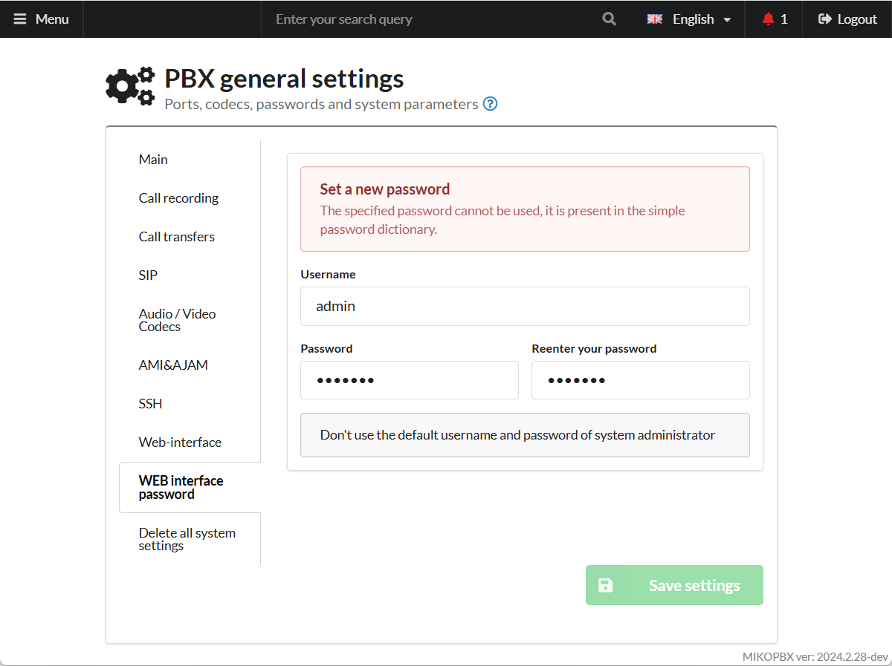

# Resetting WEB Interface Credentials

You may encounter a situation where you have forgotten the username or password for the MikoPBX web interface. This guide explains how to reset them.

<figure><figcaption>
Authorization failed
</figcaption></figure>

## Solution

1. Go to the MikoPBX console.

<figure><figcaption>
MikoPBX Console
</figcaption></figure>

2. Select the option "**\[7] Reset password for the web interface**".
3. Type **y** to confirm resetting the login and password.

<figure><figcaption>
Password reset confirmation
</figcaption></figure>

4. Log in to the web interface using the default credentials:


**Default web interface credentials:**

* **Username**: admin
* **Password**: admin


After the first login, you will be prompted to change the credentials.

<figure><figcaption>
Changing your login information
</figcaption></figure>
