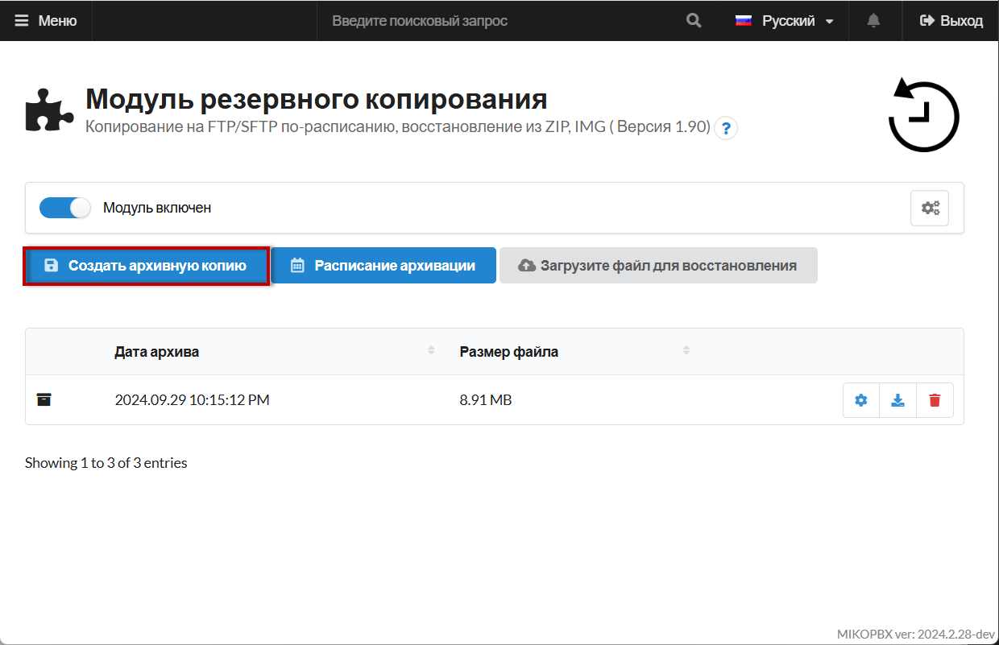
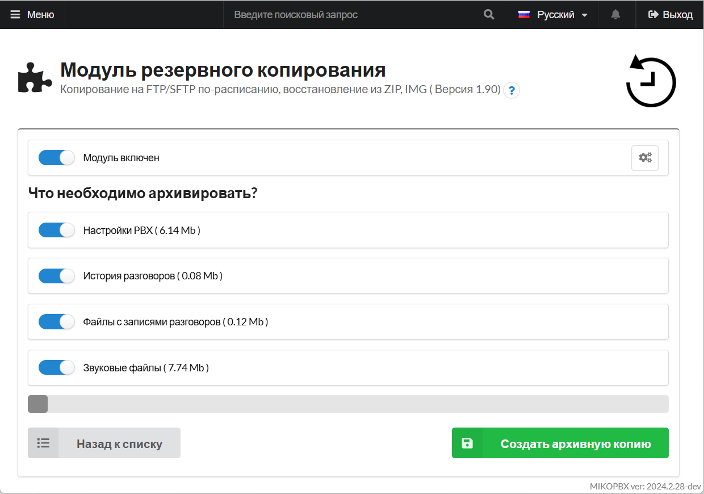
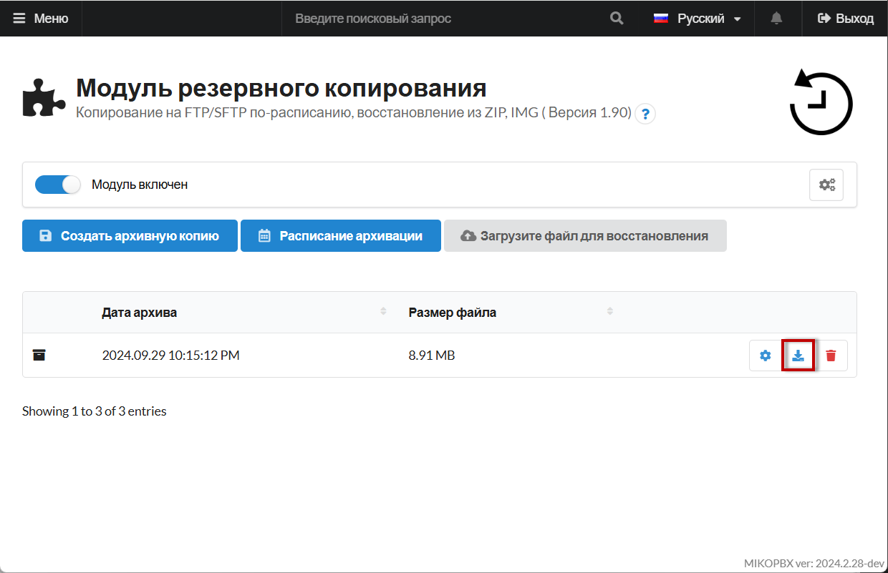
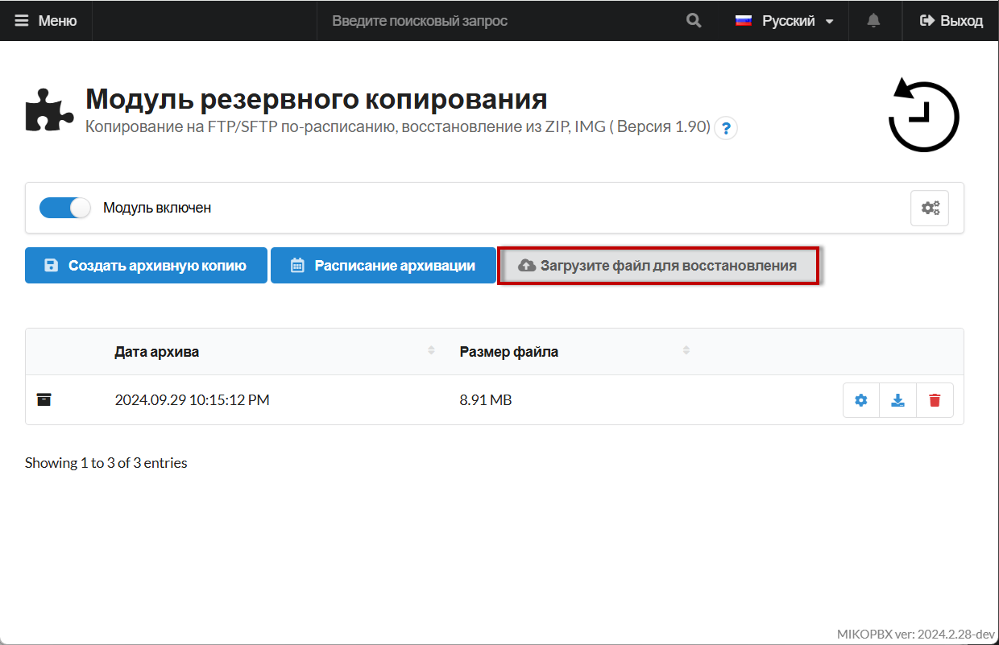

# Перенос с помощью резервного копирования

Данный способ заключается в создании резервной копии текущей конфигурации MikoPBX, её переносе и восстановлении на новом сервере. Он прост в реализации, подходит для небольших систем. Этот метод удобен для пользователей с минимальным техническим опытом.

1. Для начала нужно выполнить резервное копирование Вашей прошлой системы. Подробнее прочитать про это Вы можете в [данной статье](../../../modules/miko/module-backup.md).

<figure><figcaption>
Создание новой резервной копии
</figcaption></figure>

2. Выберите данные, которые Вы хотите перенести, дождитесь окончания процесса.

<figure><figcaption>
Опции архивирования
</figcaption></figure>

3. Выполните загрузку Вашего архива, нажав на соответствующий элемент в разделе "**Модуль резервного копирования**":

<figure><figcaption>
Кнопка для загрузки архива
</figcaption></figure>

4. На новом хосте (сервере) Вашей MikoPBX выполните восстановление из архива, нажав на элемент "**Загрузите файл для восстановления**"

<figure><figcaption>
"Загрузите файл для восстановления"
</figcaption></figure>

После этого Ваша система будет восстановлена из архива. Данный способ идеально подходит для переноса небольшого объёма данных.&#x20;
