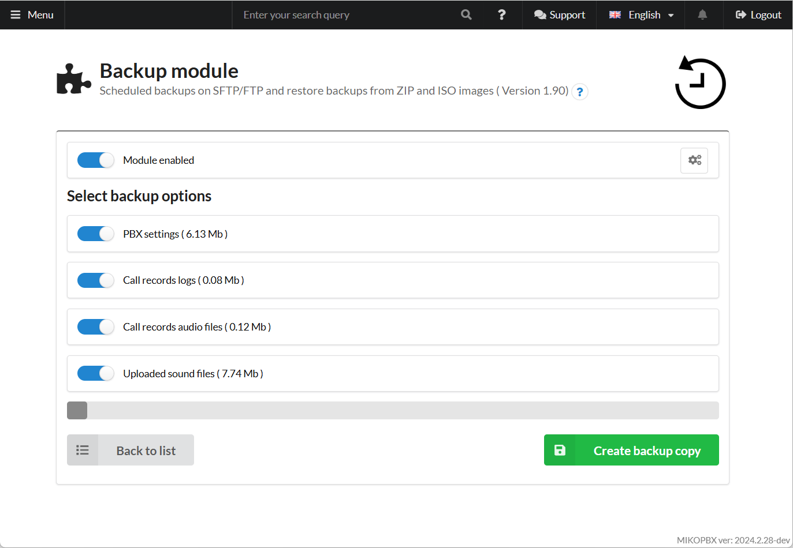
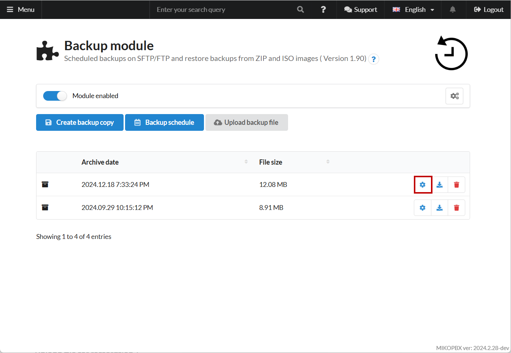
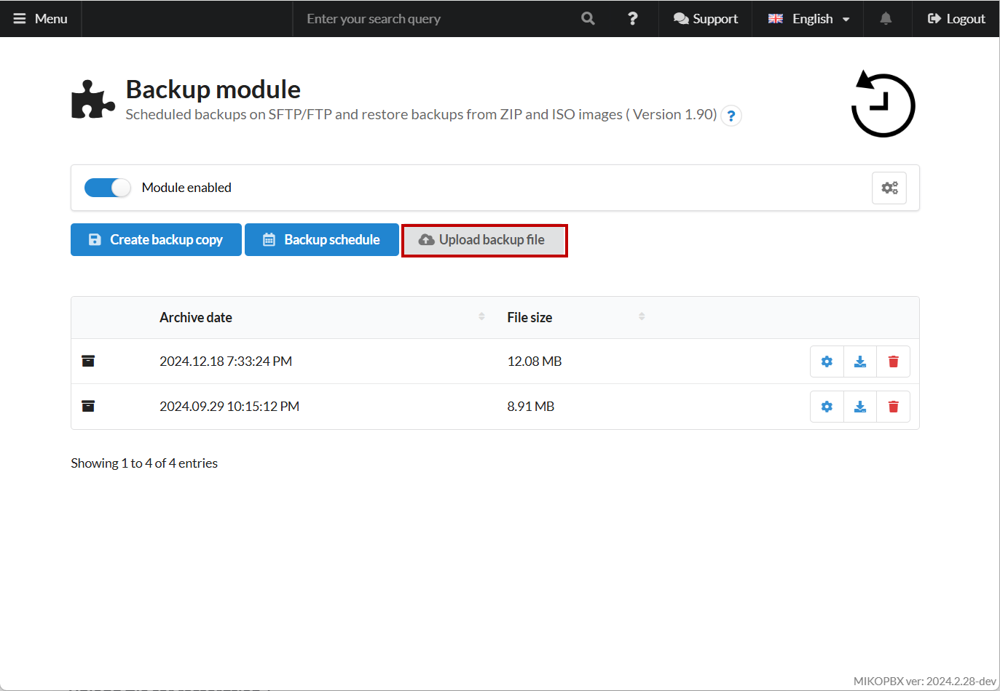

# Transfer Using Backup

This method involves creating a backup of your current MikoPBX configuration, transferring it, and restoring it on the new server. It’s simple to implement and suitable for small systems. This approach is convenient for users with minimal technical experience.

1. First, create a backup of your previous system. You can find detailed instructions in [this article](../../../modules/miko/module-quality-assessment.md).

<figure><figcaption>
Creating a new backup copy
</figcaption></figure>

2. Select the data you want to transfer and wait for the process to complete.

<figure><figcaption>
Selecting data for backup copy
</figcaption></figure>

3. Download your archive by clicking the corresponding button in the **"Backup Module"** section:

<figure><figcaption>
Button to download archive
</figcaption></figure>

4. On the new host (server) with your MikoPBX installation, restore from the archive by clicking **"Upload backup file"**:

<figure><figcaption>
"<strong>Upload backup file</strong>" button
</figcaption></figure>

After this, your system will be restored from the archive. This method is ideal for transferring small amounts of data.
