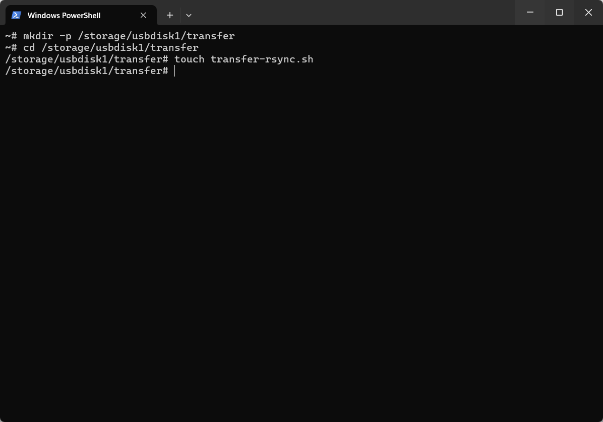
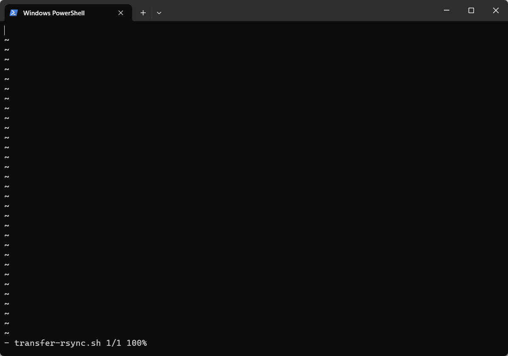
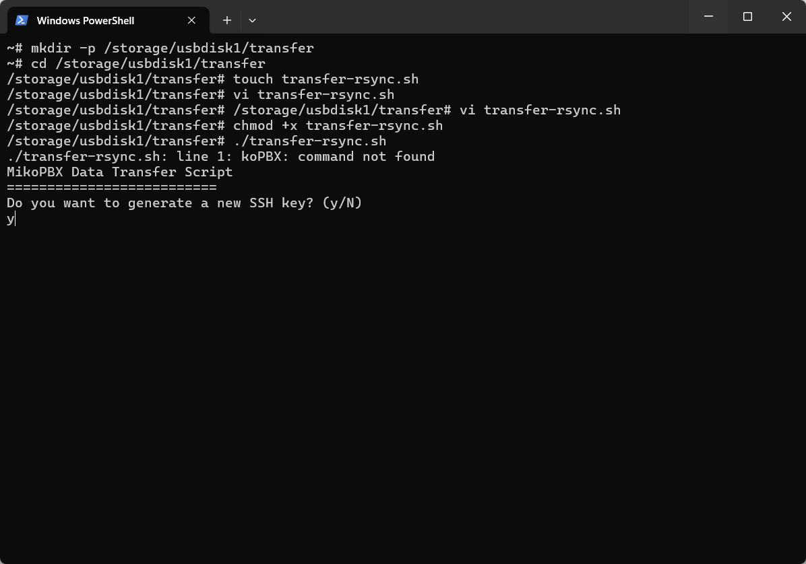
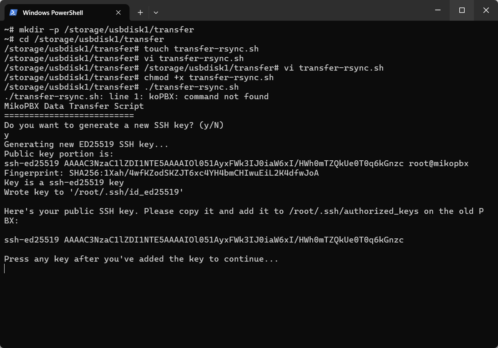

# Перенос с помощью rsync

В данной статье будет разобран вариант переноса данных на новый хост с помощью rsync. Данный вариант - перенос с использованием генерируемого ключа для ssh-авторизации (предпочтительный). Этот способ является самым надёжным из представленных в разделе, поэтому и является рекомендуемым к использованию.

## Создание файла для хранения скрипта и наполнение его содержимым <a href="#variant_3" id="variant_3"></a>

1. Для начала нам необходимо установить SSH соединение с **новой** MikoPBX. Прочитать как сделать это, можно в [этой статье](../../troubleshooting/connecting-to-a-pbx-using-an-ssh-client/).&#x20;

<figure><figcaption><p>Успешное SSH соединение с новой MikoPBX</p></figcaption></figure>

2. Далее переходим в консоль (**\[9] Console**). Первым делом необходимо создать директорию для хранения файла со скриптом. Используйте следующую команду:

```
mkdir -p /storage/usbdisk1/transfer
```

3. Перейдите в созданную директорию:

```
cd /storage/usbdisk1/transfer
```

4. Создадим файл "**transfer-rsync.sh**"  для хранения скрипта:

```
touch transfer-rsync.sh
```

<figure><figcaption><p>Выполнение команд для создания файла</p></figcaption></figure>

5. Далее переходим к редактированию созданного файла. Для этого введём команду:

```
vi transfer-rsync.sh
```

Откроется окно редактирования файла:

<figure><figcaption><p>Окно редактирования файла</p></figcaption></figure>

6. Вставьте следующий скрипт:

В нем необходимо заменить `root@PBX-ADDRESS-OR-IP` на ваши параметры (root на имя для ssh авторизации на **старой MikoPBX**, PBX-ADDRESS-OR-IP на IP-адрес **старой MikoPBX)**

```php
#!/bin/bash
#
# MikoPBX - free phone system for small business
# Copyright © 2017-2024 Alexey Portnov and Nikolay Beketov
#
# This program is free software: you can redistribute it and/or modify
# it under the terms of the GNU General Public License as published by
# the Free Software Foundation; either version 3 of the License, or
# (at your option) any later version.
#
# This program is distributed in the hope that it will be useful,
# but WITHOUT ANY WARRANTY; without even the implied warranty of
# MERCHANTABILITY or FITNESS FOR A PARTICULAR PURPOSE.  See the
# GNU General Public License for more details.
#
# You should have received a copy of the GNU General Public License along with this program.
# If not, see <>.
#

# Configuration
SSH_PORT=22
PBX_HOST='root@PBX-ADDRESS-OR-IP'
CONF_DB_FILE='/cf/conf/mikopbx.db'
STORAGE_PBX_DIR='/storage/usbdisk1/mikopbx'
SSH_KEY_PATH="$HOME/.ssh/id_ed25519"
SYNC_APP='rsync'

# Check if rsync is available, otherwise use scp
type "$SYNC_APP" > /dev/null 2> /dev/null
if [ "$?" = '1' ]; then
    SYNC_APP='scp'
    echo "rsync not found, using scp instead"
fi

# Function to perform data transfer
perform_data_transfer() {
    # Create necessary directories
    mkdir -p "$STORAGE_PBX_DIR/tmp"
    mkdir -p "$STORAGE_PBX_DIR/astlogs/asterisk"
    mkdir -p "$STORAGE_PBX_DIR/media"
    mkdir -p "$STORAGE_PBX_DIR/custom_modules"
    mkdir -p "$STORAGE_PBX_DIR/astspool/monitor"
    
    echo -e "\nStarting data transfer process...\n"
    
    # Main database transfer
    echo "1. Transferring main database..."
    ssh -p "$SSH_PORT" "$PBX_HOST" "sqlite3 $CONF_DB_FILE .dump > $STORAGE_PBX_DIR/tmp/mikopbx.db.dmp"
    "$SYNC_APP" "$PBX_HOST":"$STORAGE_PBX_DIR/tmp/mikopbx.db.dmp" "$STORAGE_PBX_DIR/tmp/mikopbx.db.dmp"
    sqlite3 "$STORAGE_PBX_DIR/tmp/mikopbx.db" < "$STORAGE_PBX_DIR/tmp/mikopbx.db.dmp"
    mv "$STORAGE_PBX_DIR/tmp/mikopbx.db" "$CONF_DB_FILE"
    rm -f "$STORAGE_PBX_DIR/tmp/mikopbx.db.dmp"
    ssh -p "$SSH_PORT" "$PBX_HOST" "rm -f $STORAGE_PBX_DIR/tmp/mikopbx.db.dmp"
    
    # Disable providers
    echo "2. Disabling providers..."
    sqlite3 "$CONF_DB_FILE" "UPDATE m_Sip SET disabled='1' WHERE type='friend'"
    
    # Copy media files
    echo "3. Copying media files..."
    "$SYNC_APP" -r "$PBX_HOST":"$STORAGE_PBX_DIR"/media/* "$STORAGE_PBX_DIR"/media/
    
    # Copy custom modules
    echo "4. Copying custom modules..."
    "$SYNC_APP" -r "$PBX_HOST":"$STORAGE_PBX_DIR"/custom_modules/* "$STORAGE_PBX_DIR"/custom_modules/
    
    # CDR database transfer
    echo "5. Transferring call history..."
    ssh -p "$SSH_PORT" "$PBX_HOST" "sqlite3 $STORAGE_PBX_DIR/astlogs/asterisk/cdr.db .dump > $STORAGE_PBX_DIR/astlogs/asterisk/cdr.db.dmp"
    "$SYNC_APP" -r "$PBX_HOST":"$STORAGE_PBX_DIR"/astlogs/asterisk/cdr.db.dmp "$STORAGE_PBX_DIR"/astlogs/asterisk/cdr.db.dmp
    sqlite3 "$STORAGE_PBX_DIR"/astlogs/asterisk/cdrdb.tmp < "$STORAGE_PBX_DIR"/astlogs/asterisk/cdr.db.dmp
    rm -f "$STORAGE_PBX_DIR"/astlogs/asterisk/cdr.db*
    mv "$STORAGE_PBX_DIR"/astlogs/asterisk/cdrdb.tmp "$STORAGE_PBX_DIR"/astlogs/asterisk/cdr.db
    rm -f "$STORAGE_PBX_DIR"/astlogs/asterisk/cdr.db.dmp
    ssh -p "$SSH_PORT" "$PBX_HOST" "rm -f $STORAGE_PBX_DIR/astlogs/asterisk/cdr.db.dmp"
    
    # Update database structure
    echo "6. Updating database structure..."
    php -r 'require_once "Globals.php"; use MikoPBX\Core\System\Upgrade\UpdateDatabase; $dbUpdater = new UpdateDatabase(); $dbUpdater->updateDatabaseStructure();'
    
    # Copy call recordings
    echo "7. Copying call recordings..."
    "$SYNC_APP" -r "$PBX_HOST":"$STORAGE_PBX_DIR"/astspool/monitor "$STORAGE_PBX_DIR"/astspool/monitor/
    
    echo -e "\nData transfer completed successfully!"
}

# Function to setup SSH environment
setup_ssh_environment() {
    mkdir -p "$HOME/.ssh"
    chmod 700 "$HOME/.ssh"
}

# Function to generate SSH key using dropbearkey and convert to OpenSSH format
generate_ssh_key() {
    echo "Generating new ED25519 SSH key..."
    
    setup_ssh_environment
    
    # Remove existing keys if they exist
    rm -f "$SSH_KEY_PATH" "${SSH_KEY_PATH}.pub"
    
    # Generate temporary keys using dropbearkey
    local temp_key="/tmp/dropbear_temp"
    rm -f "$temp_key" "${temp_key}.pub"
    
    # Generate key using dropbearkey
    dropbearkey -t ed25519 -f "$temp_key" 2>/dev/null
    if [ $? -ne 0 ]; then
        echo "Failed to generate private key"
        exit 1
    fi
    
    # Generate public key without comment
    dropbearkey -y -f "$temp_key" | grep "^ssh-ed25519" | cut -d' ' -f1,2 > "${SSH_KEY_PATH}.pub"
    if [ ! -s "${SSH_KEY_PATH}.pub" ]; then
        echo "Failed to extract public key"
        rm -f "$temp_key" "${temp_key}.pub" "$SSH_KEY_PATH" "${SSH_KEY_PATH}.pub"
        exit 1
    fi
    
    # Convert private key to OpenSSH format
    dropbearconvert dropbear openssh "$temp_key" "$SSH_KEY_PATH"
    if [ $? -ne 0 ]; then
        echo "Failed to convert private key format"
        rm -f "$temp_key" "${temp_key}.pub" "$SSH_KEY_PATH" "${SSH_KEY_PATH}.pub"
        exit 1
    fi
    
    # Clean up temporary files
    rm -f "$temp_key" "${temp_key}.pub"
    
    # Set correct permissions
    chmod 600 "$SSH_KEY_PATH"
    chmod 644 "${SSH_KEY_PATH}.pub"
    
    echo -e "\nHere's your public SSH key. Please copy it and add it to /root/.ssh/authorized_keys on the old PBX:\n"
    cat "${SSH_KEY_PATH}.pub"
    
    echo -e "\nPress any key after you've added the key to continue..."
    read -n 1 -s
    
    # Test connection immediately after key is added
    test_ssh_connection
    if [ $? -eq 0 ]; then
        perform_data_transfer
    else
        echo "SSH connection failed. Please check your configuration and try again."
        exit 1
    fi
}

# Function to check for existing SSH keys
check_existing_keys() {
    for keytype in ed25519 rsa ecdsa; do
        if [ -f "$HOME/.ssh/id_$keytype" ]; then
            echo "Found existing $keytype key at $HOME/.ssh/id_$keytype"
            echo "Would you like to use this key? (Y/n)"
            read -r use_existing
            if [[ "$use_existing" =~ ^([nN][oO]|[nN])+$ ]]; then
                continue
            else
                SSH_KEY_PATH="$HOME/.ssh/id_$keytype"
                echo -e "\nHere's your public SSH key. If you haven't added it yet to the old PBX, please copy it:"
                cat "${SSH_KEY_PATH}.pub"
                echo -e "\nPress any key after you've verified the key is added..."
                read -n 1 -s
                
                # Test connection immediately after key is confirmed
                test_ssh_connection
                if [ $? -eq 0 ]; then
                    perform_data_transfer
                    return 0
                else
                    echo "SSH connection failed with existing key."
                    return 1
                fi
            fi
        fi
    done
    return 1
}

# Function to test SSH connection
test_ssh_connection() {
    echo "Testing SSH connection..."
    ssh -o StrictHostKeyChecking=accept-new -o PasswordAuthentication=no -o BatchMode=yes -p "$SSH_PORT" "$PBX_HOST" exit 2>/dev/null
    return $?
}

# Main script starts here
echo "MikoPBX Data Transfer Script"
echo "=========================="

echo "Do you want to generate a new SSH key? (y/N)"
read -r response
if [[ "$response" =~ ^([yY][eE][sS]|[yY])+$ ]]; then
    generate_ssh_key
else
    if ! check_existing_keys; then
        echo "No existing SSH keys found or connection failed. Generating new key..."
        generate_ssh_key
    fi
fi
```

5. Для сохранения изменений в файле нажмите "**esc**" -> впишите `:wq`.

## Запуск и работа со скриптом

1. На данном этапе необходимо сделать файл исполняемым. Для этого используйте следующую команду:

```
chmod +x transfer-rsync.sh
```

2. Запустите скрипт, используя команду:

```
./transfer-rsync.sh
```

3. Для начала будет предложено сгенерировать новый ключ. В случае, если ранее вы этого не делали, введите "y" для подтверждения. Если ранее вы уже генерировали ключ для доступа ко второй MikoPBX - введите "n":

<figure><figcaption><p>Предложение о генерации нового ключа</p></figcaption></figure>

4. Будет создан новый ключ. Вам необходимо скопировать его и вставить в web-Интерфейсе старой MikoPBX. Сделать это нужно в разделе "**Общие настройки**" -> "**SSH**" -> Поле "**SSH Authorized keys**"

<figure><figcaption><p>Сгенерированный ключ типа ed25519</p></figcaption></figure>

<figure><figcaption><p>Вставленный ключ</p></figcaption></figure>

5. После того, как вы сохранили ключ на старой MikoPBX, подождите несколько секунд и нажмите любую клавишу для продолжения выполнения скрипта.

Будет произведен перенос всех данных на новый хост. Это может занять некоторое время.


После переноса обязательно проверяйте целостность всех данных, перед тем, как сбрасывать старую MikoPBX!


<figure><figcaption><p>Успешный перенос</p></figcaption></figure>
