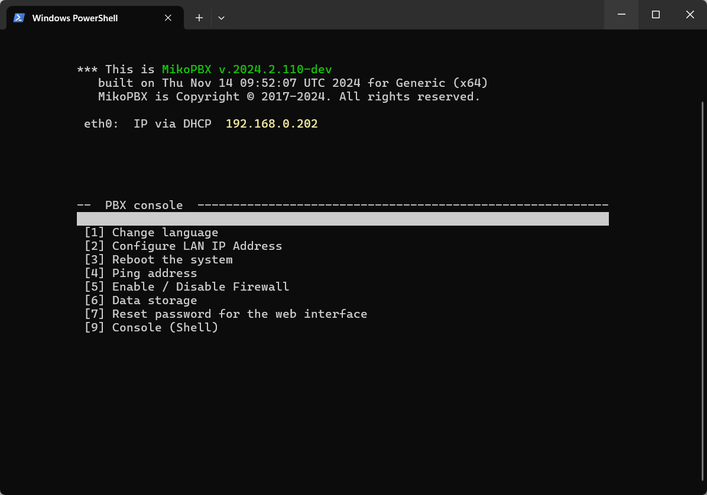

# Transfer using rsync

This article discusses transferring data to a new host using `rsync`. This approach uses a generated SSH key for authentication, making it the most reliable and therefore the recommended method.

## Creating the Script File and Adding Content

1. First, establish an SSH connection to your **new** MikoPBX. You can find instructions on how to do this in [this article](../../troubleshooting/connecting-to-a-pbx-using-ssh/connecting-to-a-pbx-using-an-ssh-client.md).

<figure><figcaption><p>Successful SSH connection to the new MikoPBX</p></figcaption></figure>

2. Once connected, switch to the console (**\[9] Console**). First, you need to create a directory to store the script file. Use the following command:

```
mkdir -p /storage/usbdisk1/transfer
```

3. Navigate to the created directory:

```
cd /storage/usbdisk1/transfer
```

4. Create the file "**transfer-rsync.sh**" to store the script:

```
touch transfer-rsync.sh
```

<figure><figcaption><p>Running commands to create a file</p></figcaption></figure>

5. Next, you need to fill the file with the script content. You can find the script [here](https://gist.github.com/excla1mmm/c9891306b459cac0c7ea3c785ab0936e).

Use the following command to download the script:

```php
curl -o /storage/usbdisk1/transfer/transfer-rsync.sh https://gist.githubusercontent.com/excla1mmm/c9891306b459cac0c7ea3c785ab0936e/raw/41ada1e25e2c60b64d69f17120d3147da188cf27/transfer-rsync.sh
```

## Running and Using the Script

1. Make the file executable:

```php
chmod +x transfer-rsync.sh
```

2. Run the script:

```php
./transfer-rsync.sh
```

3. You will be prompted to enter necessary information about your old MikoPBX:

* IP address of your old station
* Username for SSH authentication
* Port for SSH authentication

<figure><figcaption><p>Entering the required data</p></figcaption></figure>

4. Next, you’ll be asked whether to generate a new key. If you haven’t done this before, type "y" to confirm. If you previously generated a key for accessing the second MikoPBX, type "n":

<figure><figcaption><p>Generating a new key</p></figcaption></figure>

5. A new SSH key will be created. You must copy this key and insert it into the web interface of your old MikoPBX at **General Settings** → **SSH** → **SSH Authorized keys** field.

<figure><figcaption><p>Generated ssh key</p></figcaption></figure>

<figure><figcaption><p>Inserted key</p></figcaption></figure>

6. After saving the key on the old MikoPBX, wait a few seconds, then press any key to continue the script.

The transfer of all data to the new host will begin. This may take some time.


After the transfer, always verify the integrity of all data before retiring the old MikoPBX!


<figure><figcaption><p>Successful transfer</p></figcaption></figure>
