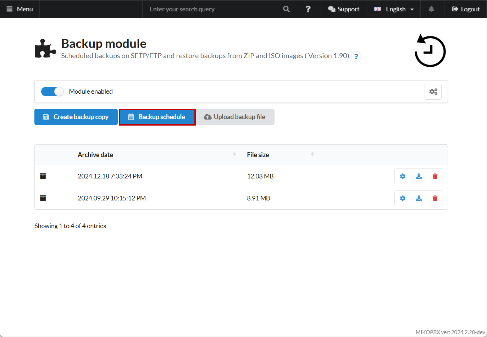
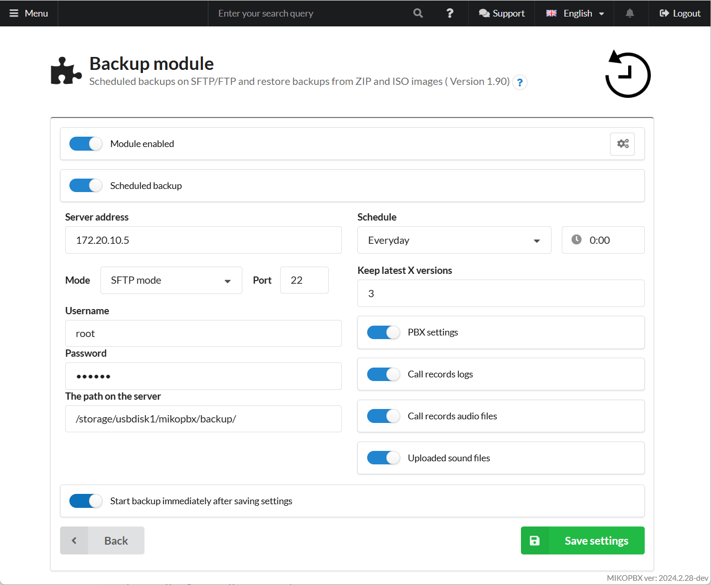
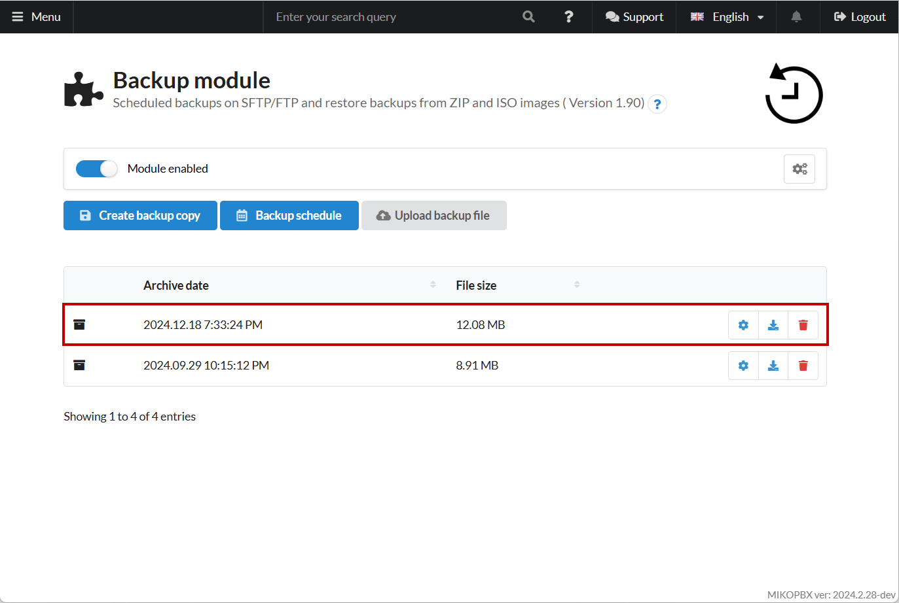
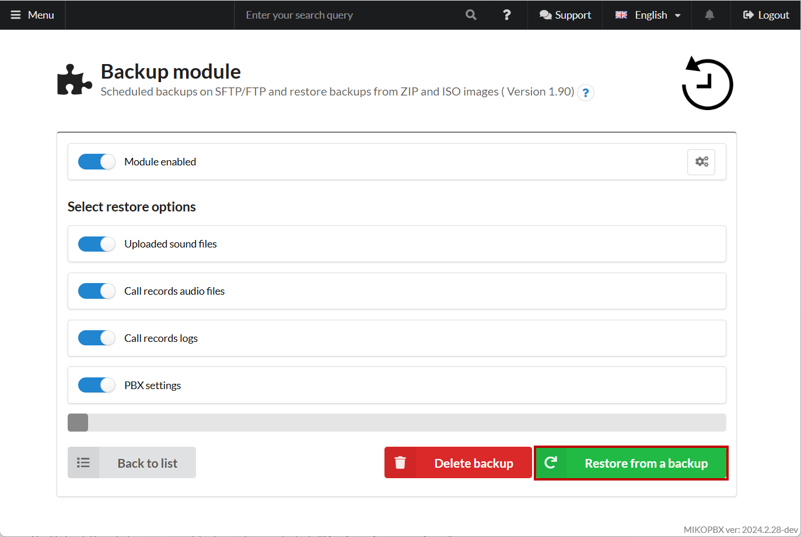

# Transfer using scheduled backup (SFTP)

The second method involves setting up automatic scheduled backups, saving the data directly onto the target server via SFTP. This approach is particularly convenient for transferring larger amounts of data, as it eliminates the need for intermediate storage of the backup.

## Configuring Scheduled Backup

First, you need to configure scheduled backups for the MikoPBX you want to transfer data from.

1. Go to the **"Backup"** module. Navigate to the **"Backup Schedule"** tab:

<figure><figcaption>
"Backup schedule" button
</figcaption></figure>

2. Next, set the scheduled backup parameters:

* **Server Address**: Enter the address of your new MikoPBX server.
* **Mode**: SFTP mode
* **Port**: 22
* **Username**: The SSH username for your **new** MikoPBX server.
* **Password**: The SSH password for your **new** MikoPBX server.
* **The path on the server**: `"/storage/usbdisk1/mikopbx/backup/"`

For information on SSH connection, refer to the related documentation. To start the backup immediately after saving the settings, choose the option **"Start backup immediately after saving settings"**. You can also select the specific data you want to transfer in the corresponding section.

<figure><figcaption>
Parameters of backup
</figcaption></figure>

Wait for the backup to complete, and then shut down the old machine.

## Restoring from the Backup on the New Host

If the data transfer is successful, your backup will appear in the backup module section on the new host:

<figure><figcaption>
Backup copy
</figcaption></figure>

To restore from the backup on your new host, do the following:

1. Go to the backup settings by clicking on the respective element:

<figure><figcaption>
Way to recovery settings from a copy
</figcaption></figure>

2. Select the data you need to transfer and click **"Restore from a backup"**:

<figure><figcaption>
"Restore from a backup"
</figcaption></figure>
