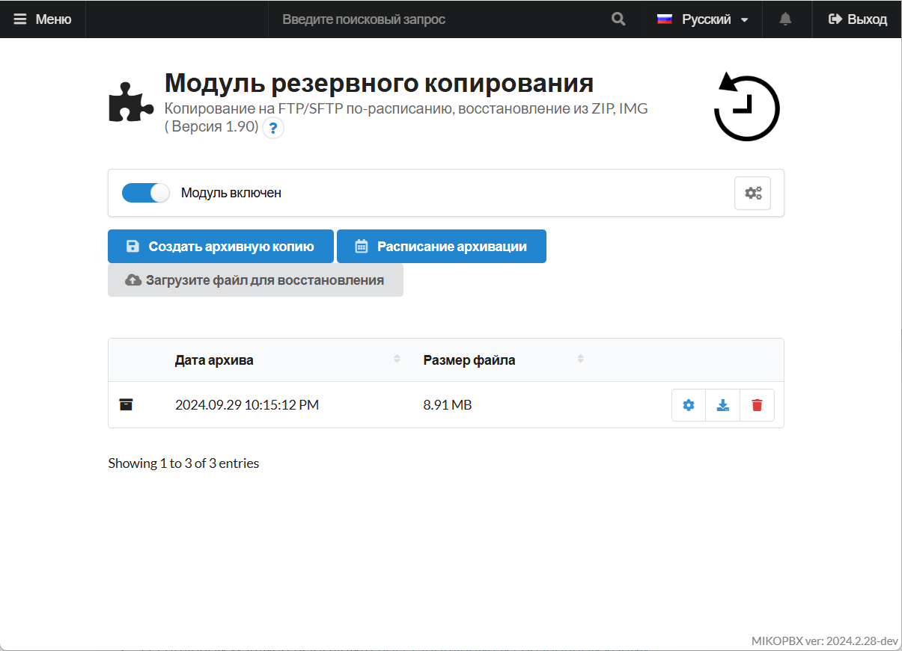
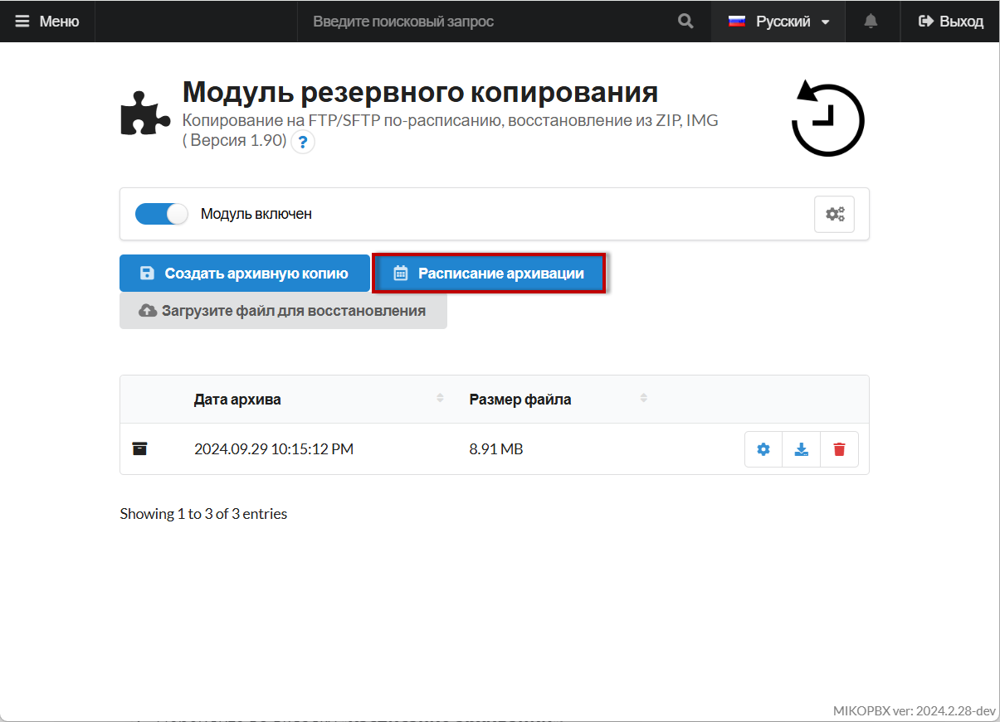
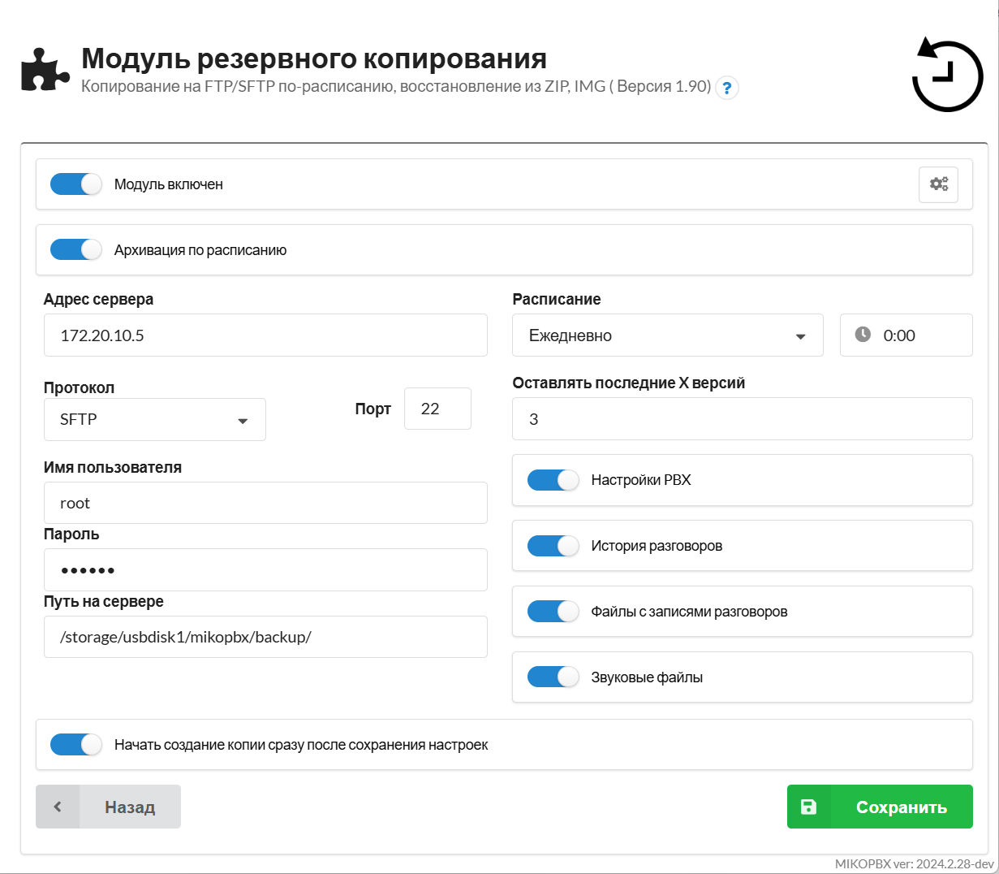
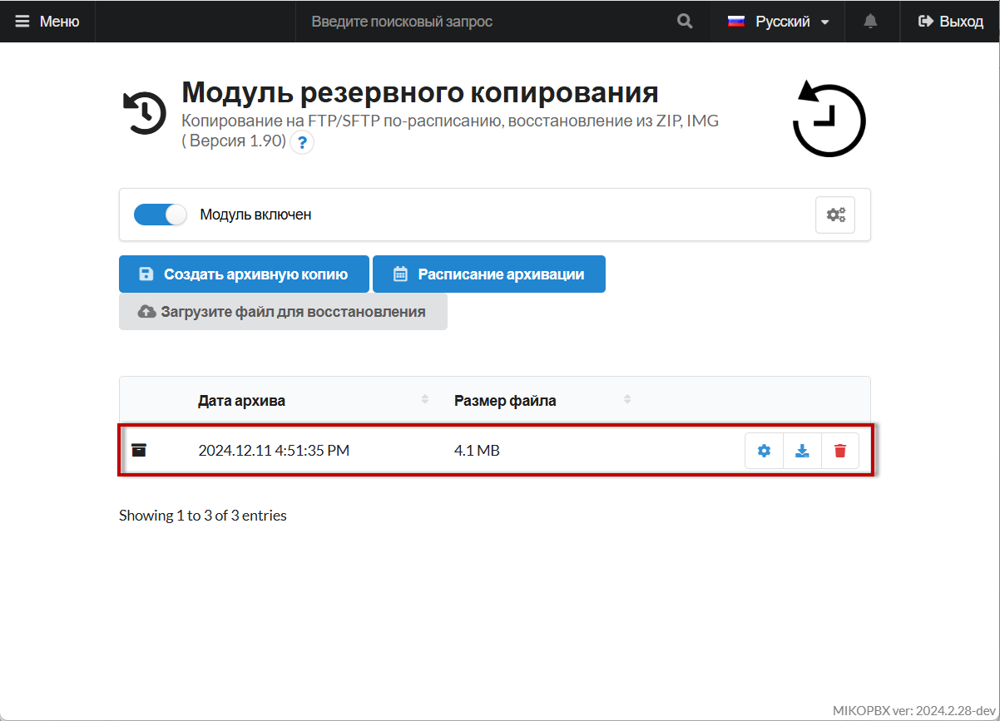
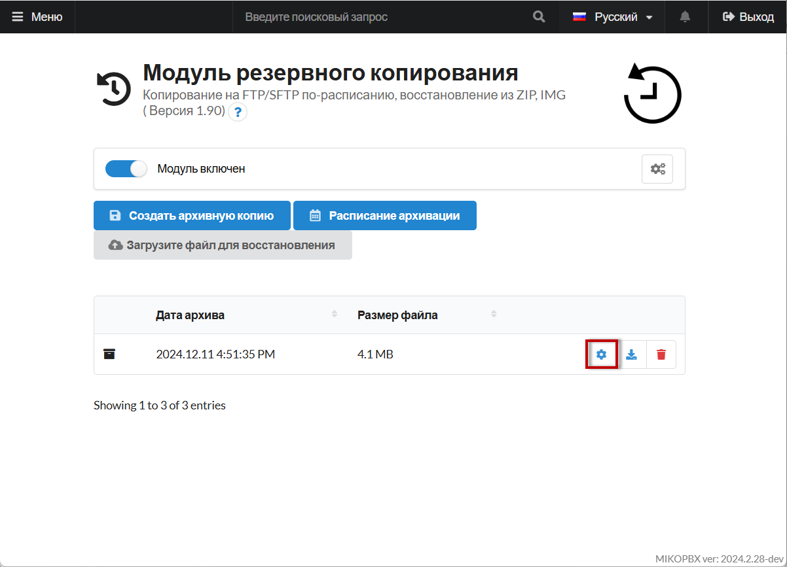
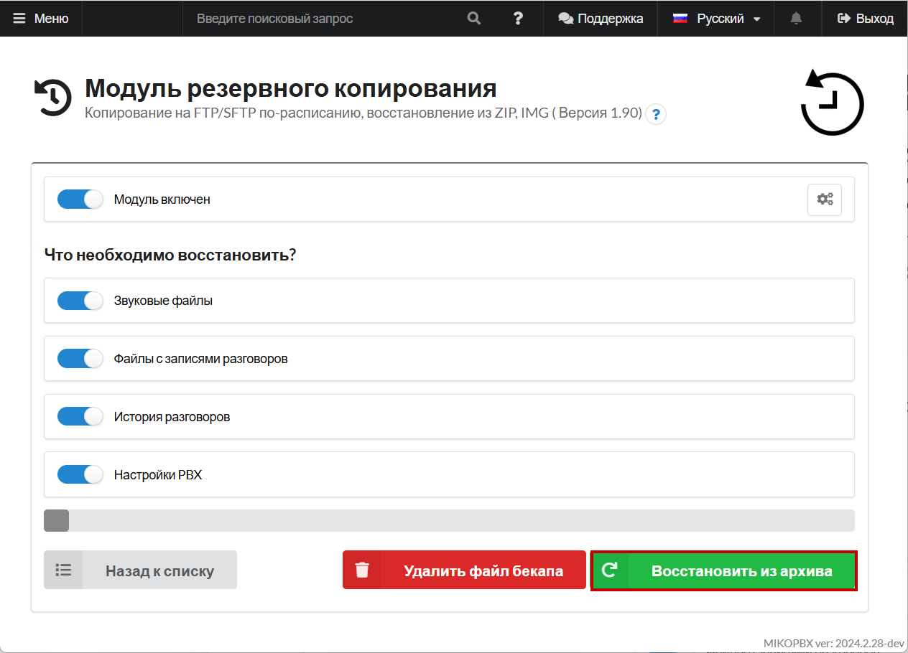

# Перенос с помощью резервного копирования по расписанию

Второй способ предполагает настройку автоматического резервного копирования с сохранением данных напрямую на целевой сервер через SFTP. Этот метод особенно удобен для переноса большего объёма данных, так как исключает необходимость промежуточного хранения резервной копии.

## Настройка Резервного копирования по расписанию&#x20;

Для начала нам необходимо настроить резервное копирование по расписанию для MikoPBX, с которой необходимо перенести данные.

1. Перейдите в модуль "**Резервное копирование**":

<figure><figcaption>
Страница модуля резервного копирования
</figcaption></figure>

2. Перейдите во вкладку "**Расписание архивации**":

<figure><figcaption>
Вкладка "Расписание архивации"
</figcaption></figure>

3. Далее настраиваем параметры архивации по расписанию:

* **Адрес сервера** - адрес Вашей новой станции MikoPBX.
* **Протокол** - SFTP
* **Порт** - 22
* **Имя пользователя** - имя пользователя для SSH подключения к вашей **новой** станции.
* **Пароль** - пароль для SSH подключения к вашей **новой** станции.
* **Путь на сервере** - "_/storage/usbdisk1/mikopbx/backup/_**"**

Прочитать про SSH подключение Вы можете в этой статье. Для начала резервного копирования сразу после сохранения настроек - выберите параметр "**Начать создание копии сразу после сохранения настроек**". Так же вы можете выбрать необходимые данные для переноса в соответствующем разделе.

<figure><figcaption>
Параметры разервного копирования по расписанию
</figcaption></figure>

Дождитесь завершения резервного копирования и отключите старую машину.

## **Восстановление из копии на новом хосте**

При успешном переносе данных, Ваша резервная копия появится в разделе модуля на новом хосте:

<figure><figcaption>
Резервная копия
</figcaption></figure>

Выполните восстановление из копии на вашем новом хосте, для этого:

1. Перейдите в раздел настроек резервной копии, нажав на соответствующий элемент:

<figure><figcaption>
Переход в настройки восстановления из копии
</figcaption></figure>

2. Выберите данные, которые Вам необходимо перенести и нажмите "**Восстановить из архива**":

<figure><figcaption>
Окно восстановления из архива
</figcaption></figure>
