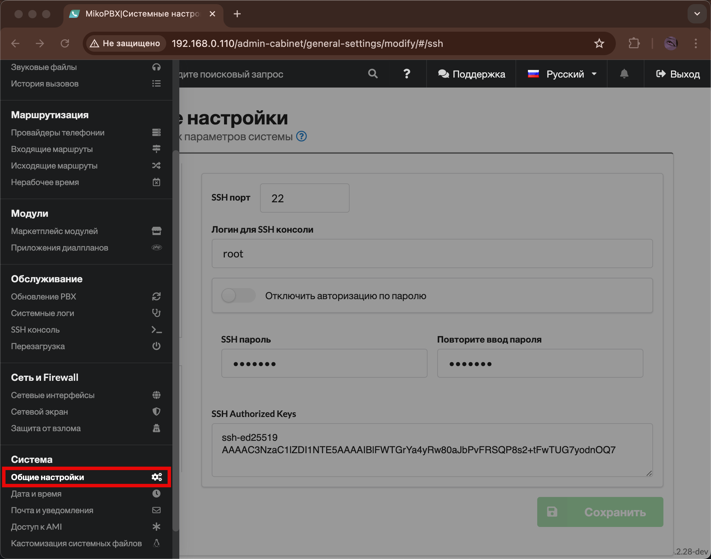

# Подключение с помощью SSH (Linux/MacOS)

## Создание и привязка ключа&#x20;

1. Для начала необходимо сгенерировать SSH ключ. Перейдите в терминал и введите следующую комманду для его генерации:

```
ssh-keygen -t ed25519 -C "example.poweshell@gmail.com"
```

В данном случае будет сгенерирован ключ типа "ed25519" с комментарием "example.powershell@gmail.com" - это поможет идентифицировать его в будущем.

Помимо этого, можно указать путь, куда будет сохранён файл с ключами, по умолчанию это "**C:\Users\<Username>.ssh\id\_ed25519**". Для этого добавьте -f и укажите путь, например:

```
ssh-keygen -t ed25519 -f ~/.ssh/my_new_key
```

<figure><figcaption><p>Создание SSH ключа</p></figcaption></figure>


По умолчанию ключ сохраняется в /Users/Username/.ssh/id\_ed25519.pub


2. Далее необходимо получить и скопировать созданный публичный ключ. Для этого введем команду:

```
cat ~/.ssh/id_ed25519.pub
```

<figure><figcaption><p>Полученный ключ</p></figcaption></figure>

3. Перейдите в "**Система**" -> "**Общие настройки**" в web-интерфейсе MikoPBX.

<figure><figcaption><p>Раздел "Общие настройки"</p></figcaption></figure>

4. Вставьте ваш ключ в поле "**SSH Authorized Keys**":

<figure><figcaption><p>Поле "<strong>SSH Authorized Keys</strong>"</p></figcaption></figure>

## Подключение с помощью SSH

Для подключения по SSH выполните следующую команду в Terminal:

```
ssh -i C:\Users\<Username>\.ssh\id_ed25519 root@mikopbxipadress
```

Замените следующие данные, исходя из ваших параметров:

* Путь к SSH ключу.
* Подставьте IP вашей MikoPBX вместо _mikopbxipadress._

Введите пароль от ssh. Произойдет подключение к консоли MikoPBX с помощью SSH:

<figure><figcaption><p>Успешное подключение!</p></figcaption></figure>
