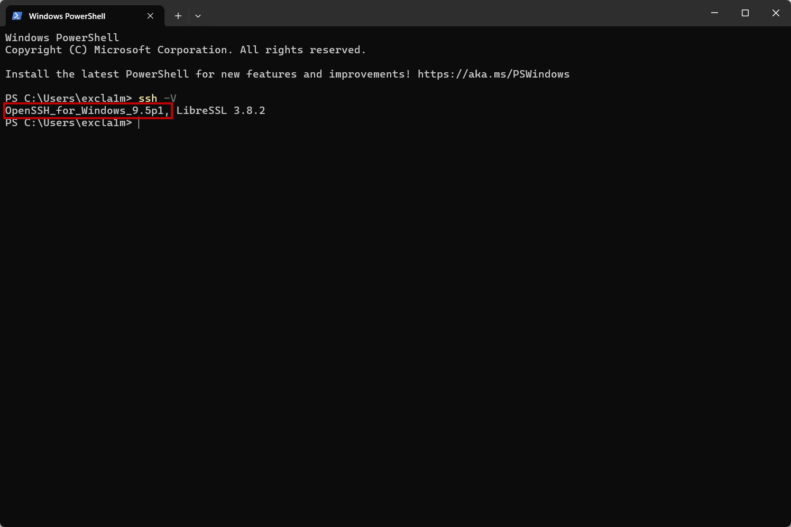
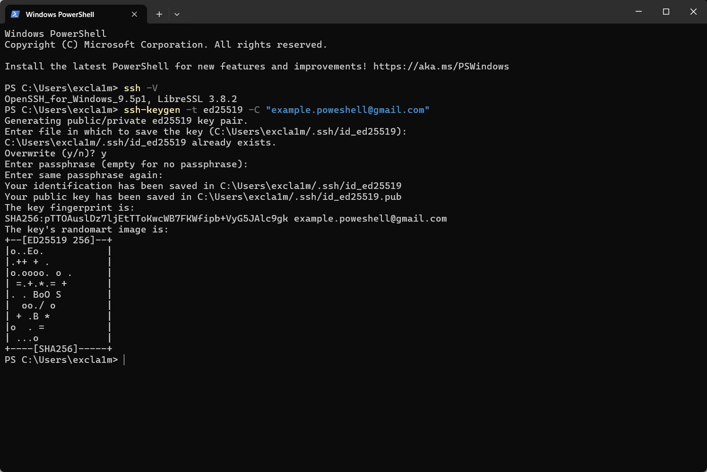
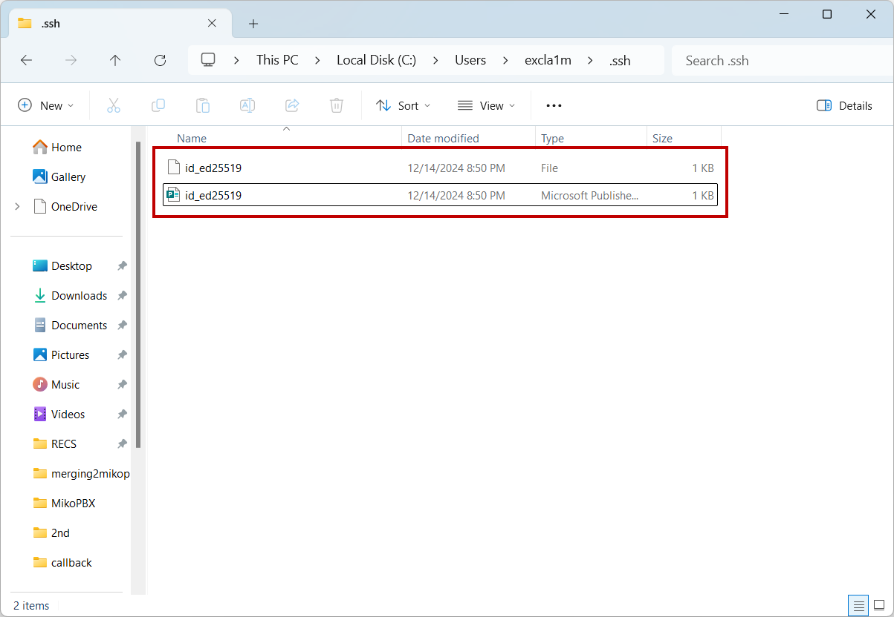
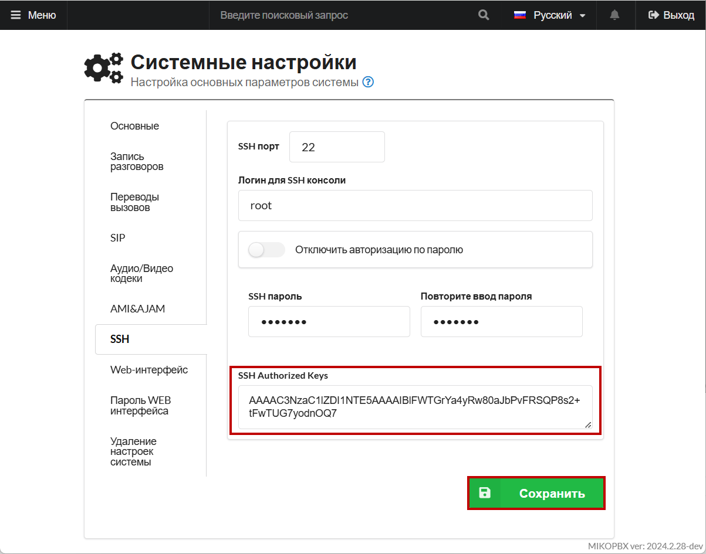
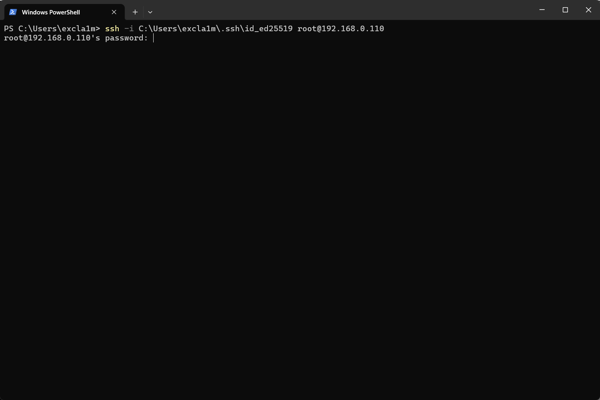

# Подключение с помощью SSH (Windows)

## Создание и привязка ключа

Для начала необходимо произвести установку OpenSSH. Сделать это можно [по ссылке](https://github.com/PowerShell/Win32-OpenSSH/releases).

1. После установки необходимо проверить ее корректность. Для этого введите следующую команду в Powershell:

```
ssh -V
```

У Вас должна отобразиться версия OpenSSH:

<figure><figcaption><p>Версия OpenSSH</p></figcaption></figure>


В случае, если при вводе команды для проверки версии ничего не произошло, Вы можете ввести - `Add-WindowsCapability -Online -Name OpenSSH.Client*`


2. Далее необходимо сгенерировать SSH ключ, для этого введем следующую команду:

```
ssh-keygen -t ed25519 -C "example.poweshell@gmail.com"
```

В данном случае будет сгенерирован ключ типа "ed25519" с комментарием "example.powershell@gmail.com" - это поможет идентифицировать его в будущем.

Помимо этого, можно указать путь, куда будет сохранён файл с ключами, по умолчанию это \
"**C:\Users\<Username>.ssh\id\_ed25519**".  Для этого добавьте -f и укажите путь, например:

```
ssh-keygen -t ed25519 -f ~/.ssh/my_new_key
```

<figure><figcaption><p>Создание ключа в Powershell</p></figcaption></figure>

После этого, ключ будет создан в указаной директории. В одном файле будет располагаться публичный ключ, а в другом - приватный.

<figure><figcaption><p>Созданные ключи</p></figcaption></figure>

3. Введем команду для получения публичного Ssh-ключа:

```
Get-Content ~/.ssh/id_ed25519.pub
```

Скопируйте его.

4. Перейдите в web-интерфейс MikoPBX, во вкладку "**Система**" -> "**Общие настройки**":

<figure><figcaption><p>Раздел "<strong>Общие настройки</strong>"</p></figcaption></figure>

5. Перейдите в раздел "**SSH**" и вставьте публичный ключ в поле "**SSH Authorized Keys**"

Нажмите "**Сохранить**":

<figure><figcaption><p>Поле "<strong>SSH Authorized Keys</strong>"</p></figcaption></figure>

## Подключение с помощью SSH

Для подключения по SSH  выполните следующую команду в Powershell:

```
ssh -i C:\Users\<Username>\.ssh\id_ed25519 root@mikopbxipadress
```

Замените следующие данные, исходя из ваших параметров:

* Путь к SSH ключу.
* Подставьте IP вашей MikoPBX вместо _mikopbxipadress._

Введите пароль от ssh:

<figure><figcaption><p>Подключение с помощью SSH</p></figcaption></figure>

Произойдет подключение к консоли MikoPBX с помощью SSH:

<figure><figcaption><p>Успешное подключение!</p></figcaption></figure>
