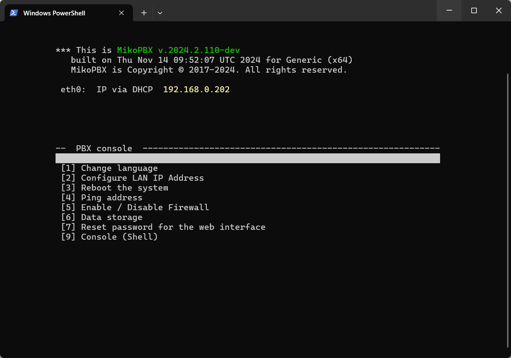

# Connecting via SSH (Windows)

## Generating and Linking the Key

To begin, you need to install OpenSSH on Windows. You can do this from [this link](https://github.com/PowerShell/Win32-OpenSSH/releases).

1. After installation, verify it by entering the following command in PowerShell:

```
ssh -V
```

You should see the OpenSSH version displayed:

<figure><figcaption><p>OpenSSH version</p></figcaption></figure>


If nothing happens when checking the version, you can run:

`Add-WindowsCapability -Online -Name OpenSSH.Client*`


2. Next, generate an SSH key by entering the following command:

```
ssh-keygen -t ed25519 -C "example.powershell@gmail.com"
```

This will generate an "ed25519" key with the comment "[example.powershell@gmail.com](mailto:example.powershell@gmail.com)" to identify it. You can specify a path for the keys by adding `-f` and a path, for example:

```
ssh-keygen -t ed25519 -f ~/.ssh/my_new_key
```

<figure><figcaption><p>Generating a Key in Powershell</p></figcaption></figure>

After this, the key pair will be created in the specified directory. One file will contain the public key, and the other the private key.

<figure><figcaption><p>Generated keys (pair)</p></figcaption></figure>

3. Run the following command to retrieve the public SSH key:

```
Get-Content ~/.ssh/id_ed25519.pub
```

Copy the public key from the output.

4. Open the MikoPBX web interface and go to "**System" → "General Settings"**:

<figure><figcaption><p>"General settings" section</p></figcaption></figure>

5. Navigate to the **SSH** section and paste the public key into the **"SSH Authorized Keys"** field in the following format:

```
KeyType KeyData
```

Click **"Save settings"**:

<figure><figcaption><p>"SSH Authorized Keys" field</p></figcaption></figure>

## Connecting via SSH

To connect via SSH, run the following command in PowerShell:

```
ssh -i C:\Users\<Username>\.ssh\id_ed25519 root@mikopbxipadress
```

Replace the following based on your parameters:

* The path to your SSH key.
* The IP address of your MikoPBX instead of `mikopbxipadress`.

You will then be connected to the MikoPBX console via SSH:

<figure><figcaption><p>Successful connection!</p></figcaption></figure>
