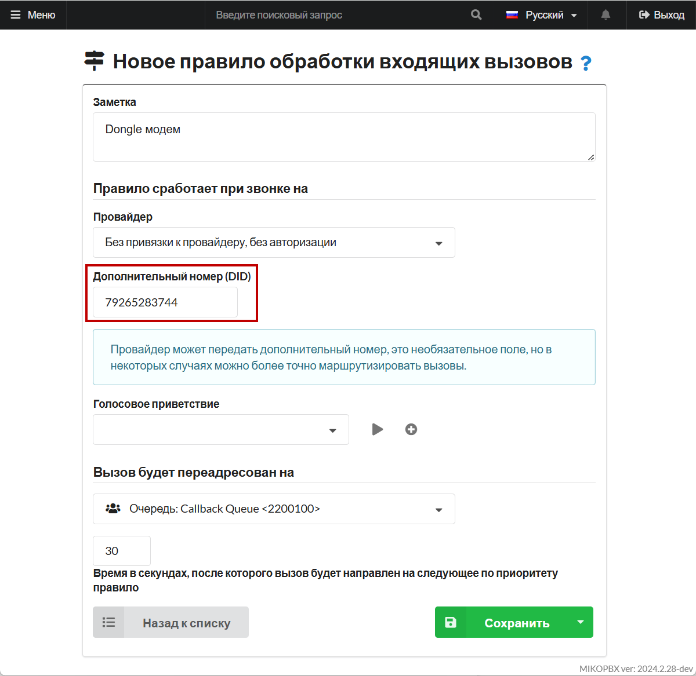
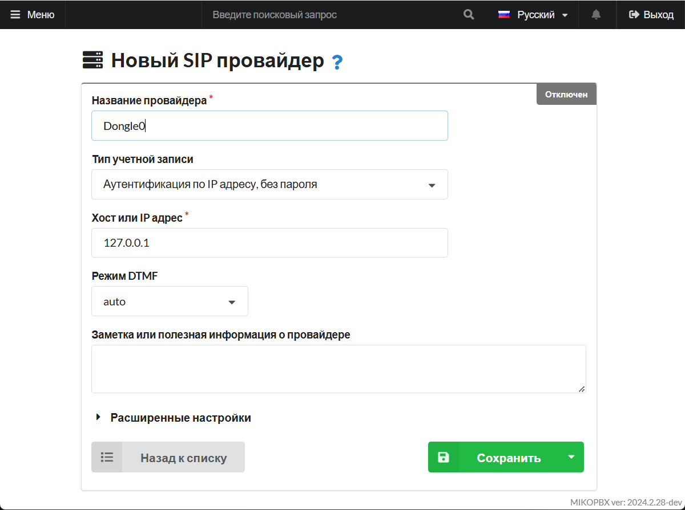
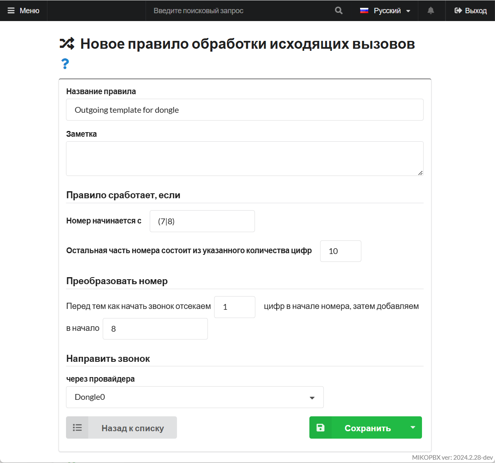
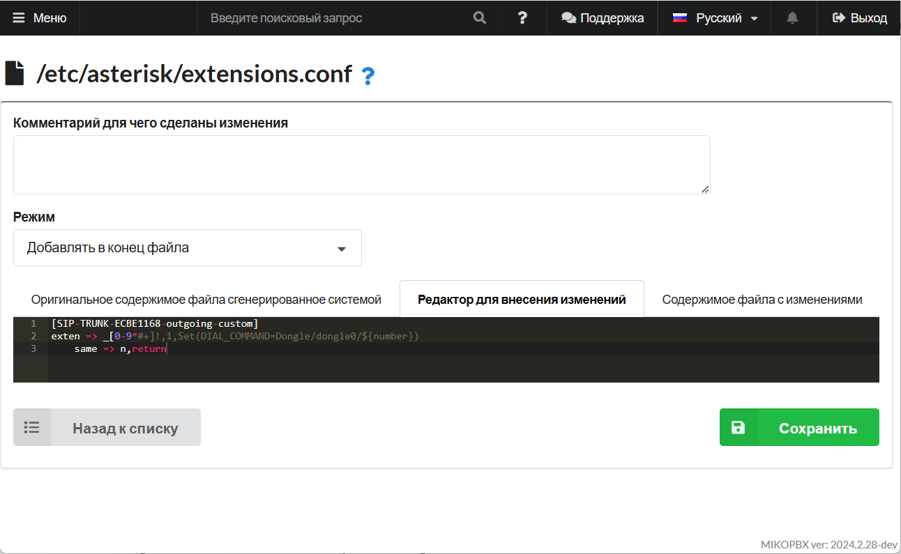

# Звонки через 3G модем Huawei E173 (chan\_dongle)

Huawei E173 — это USB 3G-модем от компании Huawei, который совместим с модулем **chan\_dongle** для Asterisk. Используя этот модем с chan\_dongle, вы можете настроить Asterisk для совершения голосовых звонков и отправки SMS через GSM-сеть, превратив модем в полноценный GSM-шлюз.


Dongle модемы работают не стабильно. Им необходимо надежное, стабильное питание и устойчивый GSM сигнал.


## Подготовка USB модема <a href="#podgotovka_usb_modema" id="podgotovka_usb_modema"></a>

1. Первым делом посмотрим какие USB устройства подключены к ПК:

```php
lsusb
Bus 001 Device 002: ID 12d1:1001 Huawei Technologies Co., Ltd. E169/E620/E800 HSDPA Modem
Bus 001 Device 001: ID 1d6b:0002 Linux Foundation 2.0 root hub
Bus 002 Device 003: ID 0e0f:0002 VMware, Inc. Virtual USB Hub
Bus 002 Device 002: ID 0e0f:0003 VMware, Inc. Virtual Mouse
Bus 002 Device 001: ID 1d6b:0001 Linux Foundation 1.1 root hub
```

Тут нам интересно устройство «**12d1:1001** Huawei Technologies Co., Ltd. E169/E620/E800 HSDPA Modem».

* **12d1** - это идентификатор вендора.
* **1001** - идентификатор продукта.

Для корректной работы модема его необходимо перевести в режим «**1001** (только модем)».

2. Далее ищем информацию об устройстве по идентификатору вендора «**12d1**»:

```
dmesg | grep 12d1
[    2.828272] usb 1-1: New USB device found, idVendor=12d1, idProduct=1001, bcdDevice= 0.00
```

3. Далее ищем информацию по номеру USB устройства «**usb 1-1**»:

```php
dmesg | grep 'usb 1-1'

[    2.262750] usb 1-1: new high-speed USB device number 2 using ehci-pci
[    2.828272] usb 1-1: New USB device found, idVendor=12d1, idProduct=1001, bcdDevice= 0.00
[    2.828479] usb 1-1: New USB device strings: Mfr=3, Product=2, SerialNumber=0
[    2.828641] usb 1-1: Product: HUAWEI Mobile
[    2.828754] usb 1-1: Manufacturer: HUAWEI Technology
[    2.856994] usb 1-1: GSM modem (1-port) converter now attached to ttyUSB0
[    2.861194] usb 1-1: GSM modem (1-port) converter now attached to ttyUSB1
[    2.864265] usb 1-1: GSM modem (1-port) converter now attached to ttyUSB2
```

Теперь нам известны идентификаторы серийных устройств модема **ttyUSB0, ttyUSB1, ttyUSB2**.


Если устройства найдены, то пол дела сделано. Если же они не появились, то вероятно модем подключен в режиме, отличном от **1001**, цифровой идентификатор режима может отличаться на разных прошивках.

На некоторых устройствах режим «Только модем» отображается как «**140c**»


## Проверка настроек модема <a href="#proverka_nastroek_modema" id="proverka_nastroek_modema"></a>

```
minicom -D /dev/ttyUSB0
```

Появится приглашение:

```
Welcome to minicom 2.8

OPTIONS: I18n                                                                
Compiled on Apr 26 2021, 18:06:16.                                           
Port /dev/ttyUSB0, 12:30:42                                                  
                                                                             
Press CTRL-A Z for help on special keys   
```

Теперь можно вводить команды **AT** для управления и настройки модема.

### Примеры команд <a href="#primery_komand" id="primery_komand"></a>

* **AT^CARDLOCK?** – проверка состояния блокировки модема и количества попыток ввода кода разблокировки:(ответ модема: CARDLOCK: A,B,0 , если A=2 модем разблокирован, A=1 модем заблокирован – SimLock, если A=3 здесь два варианта либо вы израсходовали все 10 попыток ввести код, либо у вас в модеме кастомизированная прошивка, B – количество оставшихся попыток ввода кода разблокировки (по умолчанию 10 раз))
* **AT^CARDLOCK=«NCK Code»** разблокировка модема, для возможности работы со всеми операторами связи
* **AT^CVOICE=?** – проверка состояния голосовых функций модема (0 - значит включено)
* **AT^CVOICE=0** – включение голосовых функций модема
* **AT^U2DIAG=0** - включение режима «**Только модем**»

### Что проверяем? <a href="#chto_proverjaem" id="chto_proverjaem"></a>

1. Убедитесь, что модем поддерживает голосовые функции
2. Модем должен работать в режиме «**Только модем**»
3. По возможности (при наличии кода) разблокируйте модем для возможности работы с любым оператором связи

## chan\_dongle Asterisk <a href="#chan_dongle_asterisk" id="chan_dongle_asterisk"></a>

1. В web интерфейсе АТС переходим в web интерфейсе «**Система**» - «**Кастомизация системных файлов**»
2. Открываем файл «**/etc/asterisk/modules.conf**»
3. Выбираем режим «**Добавлять в конец файла**»
4.  Добавляем код

    ```
    load => chan_dongle.so
    ```
5. Открываем на редактирование файл «**/etc/asterisk/dongle.conf**»
6. Выбираем действие «Заменять полностью»
7.  Копируем конфигурацию

    ```
    [general]
    interval=15

    [defaults]
    context=public-direct-dial
    group=0
    rxgain=0
    txgain=0
    autodeletesms=yes
    resetdongle=yes
    u2diag=-1	
    usecallingpres=yes
    callingpres=allowed_passed_screen
    disablesms=no

    language=en	
    smsaspdu=yes	
    mindtmfgap=45
    mindtmfduration=80
    mindtmfinterval=200

    callwaiting=auto
    disable=no
    initstate=start
    dtmf=relax

    [dongle0]
    audio=/dev/ttyUSB1
    data=/dev/ttyUSB2
    ```
8. Открываем на редактирование файл «**/etc/asterisk/modules.conf**»
9. Выбираем режим «**Добавлять в конец файла**»
10. Обязательно добавьте контексты для обработки sms и ussd

    ```
    [dongle-incoming-ussd]
    exten => ussd,1,Noop(Incoming USSD: ${BASE64DECODE(${USSDBASE64})})
    exten => ussd,n,Hangup()

    [dongle-incoming-sms]
    exten => sms,1,Noop(Incoming SMS from ${CALLERID(num)} ${BASE64_DECODE(${SMS_BASE64})})
    exten => sms,n,Hangup()
    ```
11. После настройки «**dongle.conf**» потребуется перезагрузить АТС


Полезные ресурсы:

* Описание конфигурационного файла и опций можно получить на [странице](https://github.com/haha8x/asterisk-chan-dongle-16/blob/master/etc/dongle.conf).
* Более подробное [описание chan\_dongle](https://asterisk-service.com/en_US/page/chan-dongle-use).



**dongle0** - произвольное имя линии, в дальнейшем будет использоваться в Dial команде для исходящих звонков.\
**audio**, **data** - значения этих параметров - адреса серийных устройств, определенных на предыдущем этапе. Верные значения придется определить экспериментально. Если не будет звука, то поменять местами.


## Настройка DID <a href="#nastrojka_did" id="nastrojka_did"></a>

Для корректной обработки входящих звонков какдому dongle необходимо настроить DID номер.

1.  Запускаем консоль asterisk:

    ```
    asterisk -r
    ```
2.  Смотрим список модемов

    ```
    mikopbx*CLI> dongle show devices
    ID      Group State RSSI Model Firmware         IMEI IMSI Number        
    dongle0 0     Free  12   E173  11.126.15.00.209 ***  ***  79255283744 
    ```
3.  Если в колонке «Number» номер не указан, то необходимо выполнить команды

    ```
    dongle cmd dongle0 AT+CPBS=\"ON\"
    dongle cmd dongle0 AT+CPBW=1,\"79255283744\",145
    ```


Вместо «**dongle0**» укажите идентификатор своей линии\
Вместо «**79255283744**» номер телефона sim карты.


Перезагрузите АТС.

## Настройка входящего маршрута <a href="#nastrojka_vxodjaschego_marshruta" id="nastrojka_vxodjaschego_marshruta"></a>

1. В web перейлите в раздел «**Маршрутизация**» -> «**Входящие маршруты**»
2. Опишите новый маршрут, в поле DID укажите номер sim карты, настроенный на предыдущем этапе:

<figure><figcaption><p>did номер</p></figcaption></figure>

## Настройка исходящих маршрутов <a href="#isxodjaschie" id="isxodjaschie"></a>

1. В разделе «**Маршрутизация**» - «**Провайдеры**» добавьте новую учетную запись **SIP со следующими параметрами:**

* "**Название"** - «Dongle0» (может быть произвольным)
* **"Хост или IP адрес"** - укажите **127.0.0.1**
* "**Тип учетной записи"** - Аутентификация по IP адресу, без пароля

<figure><figcaption><p>Параметры провайдера</p></figcaption></figure>

2. Из адресной строки браузера скопируйте **ID** провайдера, он будет иметь вид **SIP-TRUNK-ECBE1168**

<figure><figcaption><p>ID провайдера</p></figcaption></figure>

3. В разделе «**Маршуртизация**» - «**Исходящие маршруты**» создайте новый маршрут со следующими параметрами:

<figure><figcaption><p>Параметры для нового правила обработки исходящих вызовов</p></figcaption></figure>

4. Перейдите в раздел "Система" -> "Кастомизация системных файлов". Откройте для редактирования файл "**/etc/asterisk/extensions.conf".** Выберите режим **"Добавлять в конец файла"** и вставьте следующий код:

```
[SIP-TRUNK-ECBE1168-outgoing-custom]
exten => _[0-9*#+]!,1,Set(DIAL_COMMAND=Dongle/dongle0/${number})
	same => n,return
```


Замените SIP-TRUNK-ECBE1168 и dongle на ваши значения соответственно.


<figure><figcaption><p>Код для файла extensions.conf</p></figcaption></figure>
