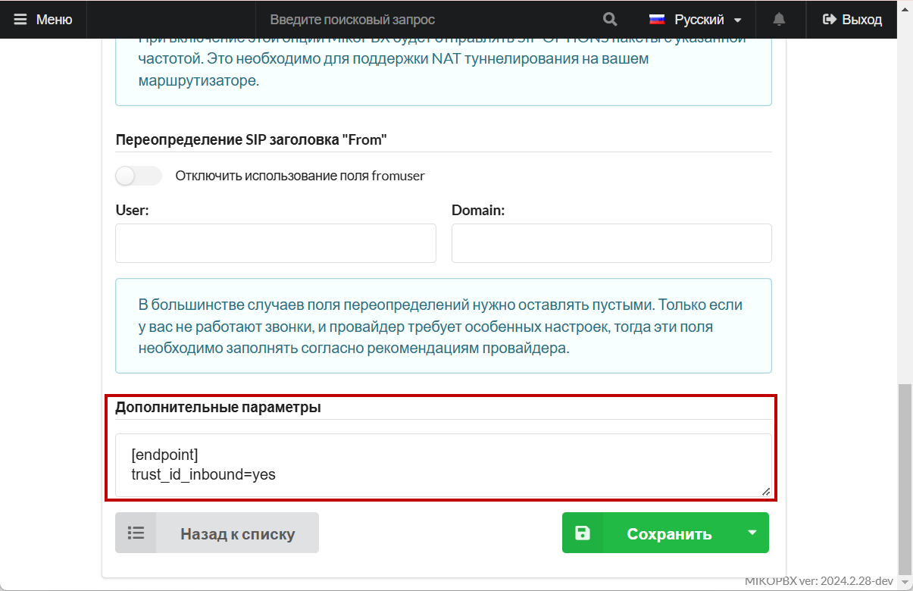
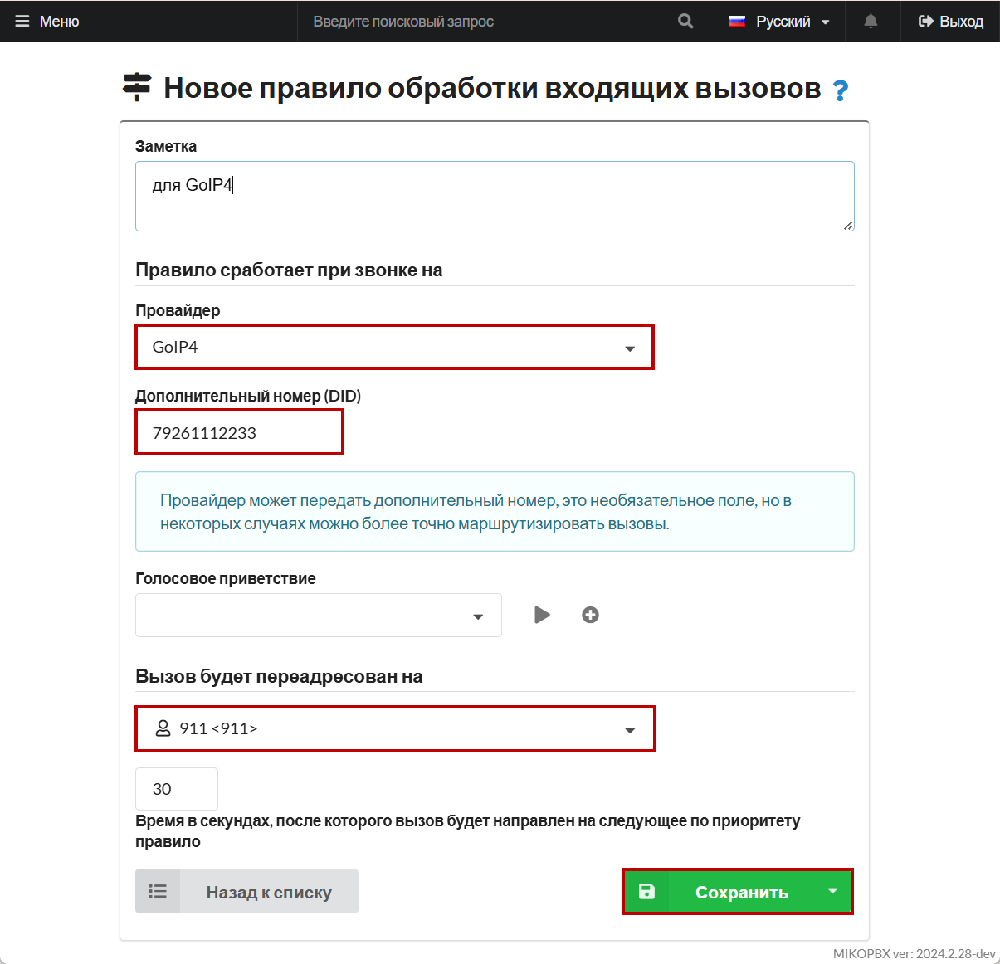
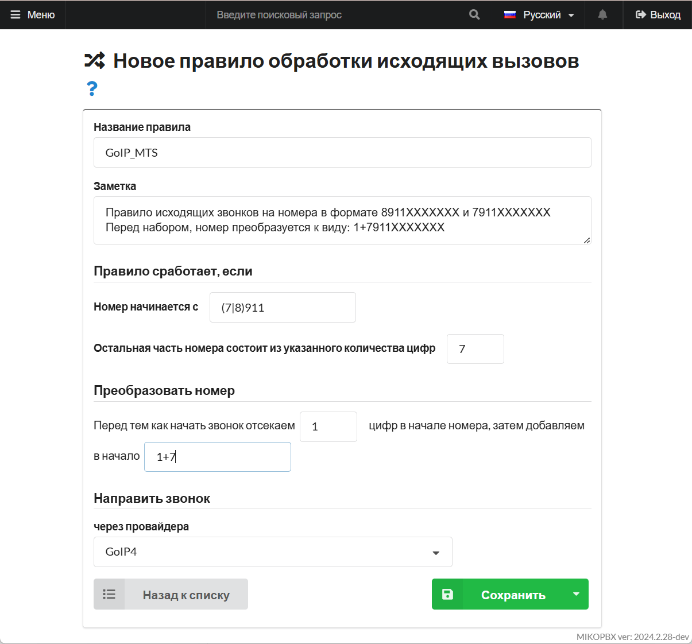

# GoIP4

Это четырехпортовый шлюз, предназначенный для постоянного соединения между сетью GSM и сетью VoIP. С помощью GoIP4 пользователи могут осуществлять восходящие и нисходящие вызовы между этими сетями.

## Перед работами <a href="#pered_rabotami" id="pered_rabotami"></a>

1. Выполните резервное копирование настроек шлюза.
2. Сбросьте шлюз к заводским настройкам.

## Учетная запись провайдера на MikoPBX <a href="#uchetnaja_zapis_provajdera_na_mikopbx" id="uchetnaja_zapis_provajdera_na_mikopbx"></a>

В нашем примере шлюз GoIP4 будет регистрироваться на АТС MikoPBX. Для этого на АТС создадим учетную запись провайдера(SIP), со следующими параметрами:

* **Название провайдера** - укажем подходящее название, к примеру GoIP4.
* **Тип учетной записи** - «Входящая регистрация».
* **Логин** - будет установлен равным ID провайдера, поменять возможности нет, пример логина «**SIP-TRUNK-3A13EB43**».
* **Пароль** - укажем и запомним сложный пароль, с ним шлюз будет регистрироваться на MikoPBX.

<figure><figcaption><p>Параметры провайдера </p></figcaption></figure>

2. В расширенных настройках провайдера, в поле "**Дополнительные параметры**", укажите:

```
[endpoint]
trust_id_inbound=yes
```

Нажмите "**Сохранить**".


Шлюз при направлении звонка в MikoPBX будет присылать дополнительных заголовок «**Remoe Party ID**», в нем будет содержаться информация по номеру телефона клиента. MikoPBX будет устанавливать CID согласно этому заголовку.


<figure><figcaption><p>Дополнительные параметры создаваемого провайдера </p></figcaption></figure>

## Настройка шлюза <a href="#nastrojka_shljuza" id="nastrojka_shljuza"></a>

Перейдем к настройка в web-интерфейсе шлюза GoIP:

### Configurations - Preferences <a href="#configurations_-_preferences" id="configurations_-_preferences"></a>

Перейдем на вкладку **Configurations - Preferences**. Необходимо установить подходящий часовой пояс, отключить использование IVR:

<figure><figcaption><p>Параметры шлюза</p></figcaption></figure>

### Configurations - Basic VoIP <a href="#configurations_-_basic_voip" id="configurations_-_basic_voip"></a>

Перейдем на вкладку **Basic VoIP**, укажем настройки подключения к АТС:

* **"Config Mode"** - **Single Server Mode**
* **"Authentication ID"**, "**Phone Number"**, "**Display Name"** - укажите ID (логин) учетной записи провайдера в формате **SIP-TRUNK-XXXXXXXX…**
* **"Password"** - укажем пароль из учетной записи провайдера
* **"SIP Proxy"**, "**SIP Registrar"**, "**Home Domain"** - укажем IP адрес MikoPBX
* **"Delete Callee Prefix while Dialing"** - устанавливаем в значение **Disable**
* **"Routing Prefix"** - для Line1 префикс 1, для Line2 префикс 2 и т.д.


Позже, на MikoPBX мы добавим маршруты исходящих звонков для каждой SIM карты, перед набором к номеру будет добавляться необходимый префикс.


<figure><figcaption><p>Параметры подключения</p></figcaption></figure>

### Configurations - Call Out <a href="#configurations_-_call_out" id="configurations_-_call_out"></a>

Перейдем на вкладку **Call Out**.

Перед совершением исходящего звонка необходимо обработать номер телефона и удалить префикс, с которым пришел номер от АТС.

* Для **CH1**, в поле **Dial Plan** настроим правило **1:-1**
* Для **CH2**, в поле **Dial Plan** настроим правило **2:-2**
* Так для каждого канал «CH\*», где \* - порядковый номер SIM канала
* Для **CH8**, в поле **Dial Plan** настроим правило **8:-8**


Правило dialplan ««1:-1» означает,что если номер начинается на 1, то первая цифра будет удалена, отсекаем префикс


<figure><figcaption><p>Параметры на вкладке "Call Out"</p></figcaption></figure>

### Configurations - Call In <a href="#configurations_-_call_in" id="configurations_-_call_in"></a>

ерейдем на страницу **Call In** для настройки переадресации входящих звонков на SIP линию.

* **CID Forward Mode** выставляем значение «**Use Remoe Party ID**».
* Для каждого GSM канала **CH1**, **CH2**… **CH**\*, в поле **Forwarding to VoIP Number**, укажем номер телефона SIM без (только цифры).

<figure><figcaption><p>Параметры на вкладке "Call In"</p></figcaption></figure>

На этом настройка шлюза завершена.

### Status - Summary <a href="#status_-_summary" id="status_-_summary"></a>

Перейдем на страницу **Status - Summary**. В колонке **VoIP** отображается статус подключения шлюза к АТС MikoPBX, **Y** - шлюз успешно зарегистрировался на АТС(по 4 линии статус **N**, т.к. на ней не установлена sim):

<figure><figcaption><p>Итоговая конфигурация</p></figcaption></figure>

## Маршруты звонков MikoPBX <a href="#marshruty_zvonkov_mikopbx" id="marshruty_zvonkov_mikopbx"></a>

### Входящие маршруты <a href="#vxodjaschie_marshruty" id="vxodjaschie_marshruty"></a>

В интерфейсе АТС MikoPBX, перейдите на страницу "**Маршрутизация" -> "Входящие маршруты"**.

Добавьте новое правило входящих звонков с первого канала GSM шлюза:

* **"Провайдер"** - укажите ранее созданного провайдера GoIP4
* **"Дополнительный номер(DID)"** - укажите номер, который Вы заполнили в поле **Forwarding to VoIP Number** для первого канала в настройках входящих звонков шлюза. В нашем случае это номер телефона первой sim карты
* **"Вызов будет переадресован на"** - укажите номер, на который Вы хотите направить входящие звонки. В нашем случае это трубка с номером 911.

Нажмите "**Сохранить**".

<figure><figcaption><p>Новое правило обработки входящих вызовов</p></figcaption></figure>

### Исходящие маршруты <a href="#isxodjaschie_marshruty" id="isxodjaschie_marshruty"></a>

Перейдите на страницу "**Маршрутизация" -> "Исходящие маршруты"**.

Добавьте новое правило для звонков через **первую** sim:

Звонки на номера соответствующие шаблону 8911XXXXXXX или 7911XXXXXXX, будем отправлять через провайдера GoIP4, перед набором к номеру будем добавлять префикс **1+**.

* **Номер начинается с** - укажем начало набираемого номера, в нашем случае (7|8)911
* **Остальная часть номера состоит…** - 7 цифр
* **Перед тем как начать звонок отсекаем** - 1 цифр
* **Затем добавляем к номеру** - 1+

Нажмите "**Сохранить**".

<figure><figcaption><p>Параметры исходящего правила для первой SIM</p></figcaption></figure>

Добавим новое правило для звонков через **вторую** sim:

Звонки на номера с шаблоном 8926XXXXXXX или 7926XXXXXXX, будем отправлять через провайдера GoIP4, перед набором к номеру будем добавлять префикс **2+**.

<figure><figcaption><p>Параметры исходящего правила для второй SIM</p></figcaption></figure>

Аналогичным образом можно настроить правила для звонков через другие sim.


Правила настройки исходящих маршрутов подробно описаны на в [этой статье](../../../manual/routing/outbound-routing.md).


На этом настройка подключения шлюза к MikoPBX завершена. Можно тестировать входящие и исходящие звонки через GSM шлюз.


Используя модуль "[Группы пользователей](../../../modules/miko/module-users-groups.md)" можно назначить каждому сотруднику свою SIM карту для исходящих.

