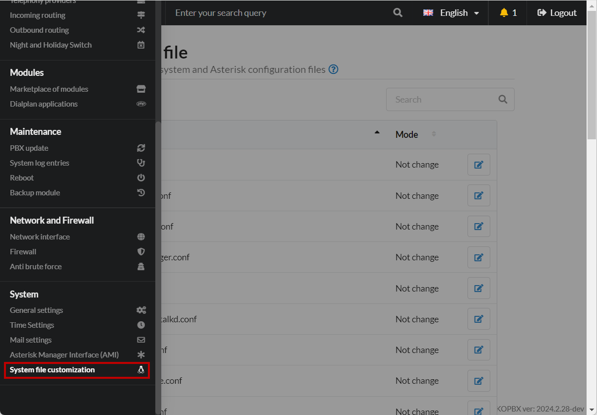
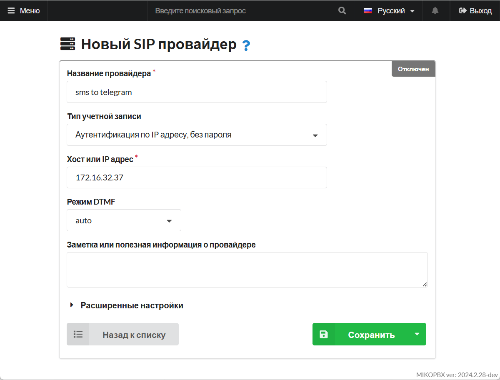

# SMS в Telegram

## Настройки в Telegram <a href="#nastrojki_telegram" id="nastrojki_telegram"></a>

Для начала через чат Telegram следует написать боту [**@BotFather**](https://t.me/BotFather). Этот бот позволит создать и настроить вашего нового бота для интеграции с MIKOPBX.

1. Отправляем боту команду

```
/start
```

2. Команда создания нового бота:

```
/newbot
```

3. Отправляем имя нашего нового бота. К примеру:

```
MIKOPBX_NEW_BOT
```

4. Сохраните значение «**token**»: он понадобится для настройки со стороны АТС.
5. Создайте новую «**группу**».
6. Перешлите любое сообщение из группы боту [@getmypid\_bot](https://t.me/getmyid_bot)
7. Сохраните значение «chat ID», для пользователя значение вида "**190389360"**, для группы -  отрицательное, вида: "**-4190389360".**

## Настройки в MikoPBX <a href="#nastrojka_mikopbx" id="nastrojka_mikopbx"></a>

### Приложение Dialplan <a href="#prilozhenie_dialplan" id="prilozhenie_dialplan"></a>

В разделе «**Модули**» - «**Приложения диалплан**» создадите новое приложения, со следующими параметрами:

* "**Название**" - Переслать sms в telegram (произвольное).
* "**Тип кода**" -  PHP-AGI
* Программный код:

```php
<?php
require_once 'Globals.php';
use \GuzzleHttp\Client;

const API_KEY = '';
const CHAT_ID = '';

$agi = new MikoPBX\Core\Asterisk\AGI();
$message  = str_replace(
    ['n'],
    ["\n"], 
    $argv[1]??"");;
$did      = $agi->request['agi_extension'];
$agi->verbose($message, 3);

$TEXT = "
SMS на номер: $did
От: $message
";

$apiURL = 'https://api.telegram.org/bot' . API_KEY . '/';
$client = new Client([
    'base_uri' => $apiURL,
    'timeout' => 1,
    'http_errors' => false,
]);
try {
    $client->post( 'sendMessage', ['query' => ['chat_id' => CHAT_ID, 'text' => $TEXT]] );
}catch (Throwable $e){
}
```


«**API\_KEY**» - токен телеграм бота

«**CHAT\_ID**» - идентификатор телеграм чата (группы).


<figure><figcaption><p>Программный код для диалплана</p></figcaption></figure>

\
В адресной строке браузера нужно скопировать идентификатор приложения, он имеет вид:  «**DIALPLAN-APP-8B0D0964**»:

<figure><figcaption><p>Идентификатор приложения диалплана</p></figcaption></figure>

### Кастомизация системных файлов <a href="#kastomizacija_sistemnyx_fajlov" id="kastomizacija_sistemnyx_fajlov"></a>

1. Перейдите в раздел "**Система**" -> "**Кастомизация системных файлов**":

<figure><figcaption><p>Раздел "<strong>Кастомизация системных файлов</strong>"</p></figcaption></figure>

2. Перейдите к редактированию файла "**/etc/asterisk/extensions.conf",** установите режим **"Добавлять в конец файла".** Используйте следующий код:

```php
[messages-from-goip]
exten => _[0-9*#+a-zA-Z]!,1,AGI(DIALPLAN-APP-8B0D0964.php, "${MESSAGE(body)}")
    same => n,hangup()
exten => _[hit],1,Hangup()
```


«**DIALPLAN-APP-8B0D0964**» - в данном коде - это идентификатор приложения. Сохраните изменения.


<figure><figcaption><p>Изменения в файле extensions.conf</p></figcaption></figure>

### Провайдер <a href="#provajder" id="provajder"></a>

1. Перейдите в раздел "**Маршрутизация**" -> "**Провайдеры телефонии**". Добавьте нового SIP-провайдера, со следующими параметрами:

* "**Название**" - произвольное
* **"Тип учетной записи"** - Аутентификация по IP адресу, без пароля.
* "**Хост или IP адрес**" - IP-адрес Вашего шлюза

<figure><figcaption><p>Параметры провайдера</p></figcaption></figure>

2. В "**Расширенные настройки**" -> "**Дополнительные параметры**" пропишите:

```
[endpoint]
message_context = messages-from-goip
```

<figure><figcaption><p>Дополнительные параметры</p></figcaption></figure>

## Настройка GoIP <a href="#nastrojka_goip" id="nastrojka_goip"></a>

1. Перейдите в раздел «**Configurations**» - «**SMS**»
2. Для каждого канала CH1 / CH2 … CHN выполните настройку:

* «**SMS to VoIP**» (верхнее) - «**Call Function**»
* «**Call mode**» - «**Mode 1**»
* «**SMS to VoIP**» (нижнее) - укажите номер телефона sim карты

<figure><figcaption><p>Параметры в GoIP</p></figcaption></figure>
