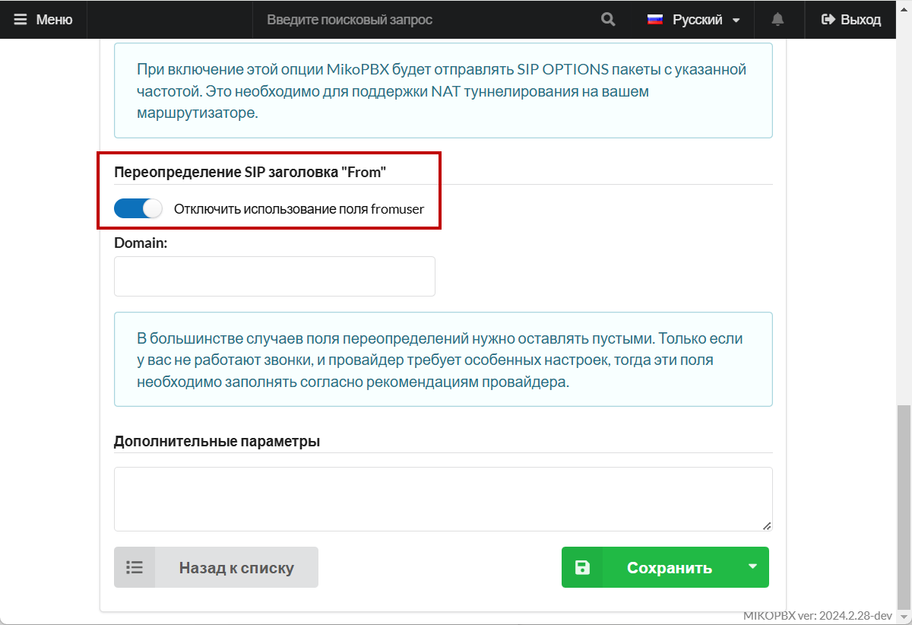

# Yeastar NeoGate TG 400

Yeastar NeoGate TG400 — это VoIP GSM-шлюз с четырьмя GSM-каналами, позволяющий интегрировать мобильные сети с IP-телефонией. Он обеспечивает гибкое решение для маршрутизации звонков между GSM и VoIP-системами, поддерживая функции SMS и USSD.

## Настройка NeoGate TG400 

1. Подключите ПК к Ethernet Шлюза.
2. Установим IP для шлюза 172.16.32.37, маска 255.255.255.0
3. Для входа в web-интерфейс NeoGate в окне браузера набираем [http://172.16.32.37](http://172.16.32.37/)


Данные для входа по умолчанию:

Логин: admin

Пароль: password


4. В web-интерфейсе необходимо настроить сетевой интерфейс **«Система» -> «Сетевые настройки» -> «Настройки LAN»:**

<figure><figcaption>
Параметры
</figcaption></figure>

В данном примере настроен статический IP адрес 172.16.32.37.

5. Далее необходимо вставить sim карты и убедиться, что линии подключены **«Статус» -> «Мобильные линии»**:

<figure><figcaption>
Раздел "<strong>Мобильные линии</strong>"
</figcaption></figure>

В настройке линии есть важный параметр, без него при дозвоне не будет слышно гудков:

<figure><figcaption>
Параметр "<strong>Генерация КПВ</strong>"
</figcaption></figure>

6. Переходим к настройке VoIP линий шлюза: **«Шлюз»-«Линии VOIP»** Необходимо добавить VOIP линию:

* **«Тип линии»** - SIP аккаунт
* **«Имя»** - произвольно имя, уникальное среди имен учетных записей на шлюзе.
* **«Аккаунт»** - имя учетной записи. Под этим именем будет подключаться MikoPBX.
* **«Пароль»** - пароль учетной записи.

<figure><figcaption>
Настройки VoIP линий
</figcaption></figure>

На вкладке «**Дополнительно**» следует указать «**DTMF mode**»:

<figure><figcaption>
Вкладка "<strong>Дополнительно</strong>"
</figcaption></figure>

7. Важная настройка GSM шлюза: если линия занята, то шлюз будет отвечать «занято», в противном случае он возвращает не корректный статус кода SIP.

<figure><figcaption>
Настройки SIP
</figcaption></figure>

8. Далее следует определить группу GSM линий **«Шлюз» - «Мобильные группы»**:

<figure><figcaption></figcaption></figure>

Определите набор линий в группе. В текущем примере 2 линии Мегафон объединены в одну группу. Стратегия обзвона задана как «**Баланс**» - исходящие вызовы будут распределяться равномерно.

9. Далее необходимо задать маршруты вызовов: Для исходящих **«Шлюз» - «SIP в GSM»**. Создать новый маршрут:

* **Источник** - SIP аккаунт
* **Назначение** - группа GSM линий.

<figure><figcaption>
Маршрут вызова
</figcaption></figure>

## Настройки в MikoPBX 

1. Перейдите в раздел **«Маршрутизация» -> «Провайдеры телефонии».** Добавьте SIP-провайдера со следующими параметрами:

* **"Название провайдера"** - произвольное
* "**Тип учетной записи**" - Исходящая регистрация
* "**Хост или IP-адрес**" - IP-адрес шлюза
* "**Логин**" - логин из шлюза
* "**Пароль**" - пароль из шлюза
* "**Режим DTMF**" - rfc4733

<figure><figcaption>
Параметры провайдера
</figcaption></figure>

2. В дополнительных параметрах провайдера отключите использования поля fromuser:

<figure><figcaption>
Элемент "Отключить использование поля fromuser"
</figcaption></figure>

Далее, настройте входящие и исходящие маршруты для созданного провайдера. После сохранения учетной записи, она должна зарегистрироваться на шлюзе.

Теперь можно совершать входящие / исходящие вызовы через GSM.
