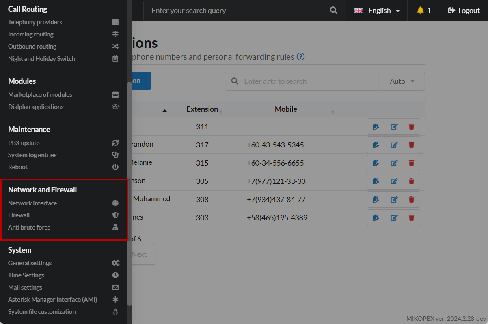

# Network and Firewall

The "**Network and Firewall"** section of MikoPBX is an interface for configuring network settings and managing the system's firewall. Here, administrators can configure IP addresses, network interfaces, and create firewall rules to protect the system from unauthorized access. This section ensures the secure and stable operation of MikoPBX in the organization's network infrastructure.

<figure><figcaption>
Section "Network and Firewall" in MikoPBX
</figcaption></figure>

## Network interface


[network.md](network.md)


The "**Network Interface**" section in MikoPBX is an interface for configuring the system's network connection parameters. Here, administrators can manage IP addresses, subnet masks, gateways, and other network settings for each network interface. This allows MikoPBX to be correctly integrated into the organization's network and ensure its stable operation in accordance with the requirements of the network infrastructure.

***

## Firewall


[firewall.md](firewall.md)


The "**Firewall**" section of MikoPBX is an interface for configuring the system's firewall. Here, administrators can create and manage network traffic filtering rules, controlling access to MikoPBX and protecting it from unauthorized access and network threats. Configuring the firewall ensures the security of the telephone system, preventing potential attacks and ensuring stable operation in the organization's network infrastructure.

***

## Anti brute force (Fail2Ban)

The "**Anti brute force (Fail2Ban)**" section in MikoPBX is a tool for ensuring system security from unauthorized access and network attacks. Fail2Ban monitors event logs and automatically blocks IP addresses that make suspicious or repeated failed login attempts. Setting up this section helps prevent system hacking and protect the organization's confidential data.
