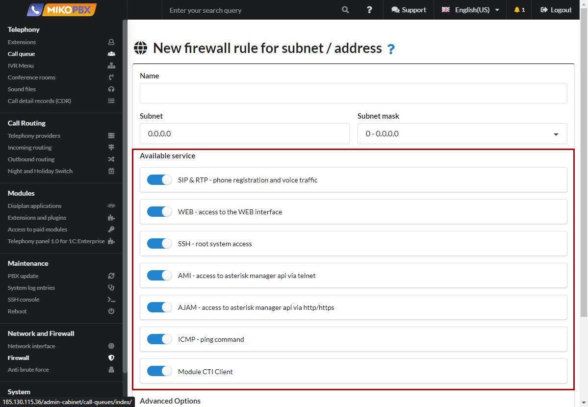
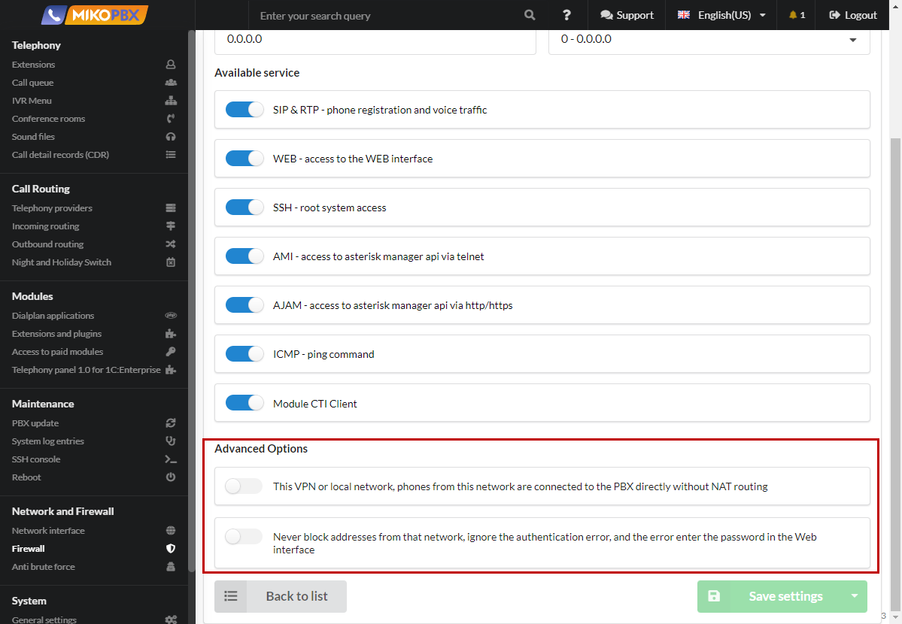

# Firewall

The **Firewall** in MikoPBX is an interface for configuring the system's firewall. Here, administrators can create and manage network traffic filtering rules, controlling access to MikoPBX and protecting it from unauthorized access and network threats. Configuring the firewall ensures the security of the telephone system, preventing potential attacks and ensuring stable operation in the organization's network infrastructure.

In MikoPBX, all local subnets can be described in the "**Network and Firewall**" → "**Firewall**" section. The firewall is designed to restrict access to the station by traffic type and subnets.

<figure><figcaption>
Section "Network and Firewall" -> "Firewall" in MikoPBX
</figcaption></figure>

To add a new rule, you need to click on the button:

<figure><figcaption>
Button for creating a new rule
</figcaption></figure>

## General settings

You can give the rule any custom name. To the right of the subnet address, there is a field for Subnet Mask in CIDR format.&#x20;

<figure><figcaption>
Rule parameters
</figcaption></figure>

## Available services

* **SIP\&RTP** - registration of phones and voice traffic. Session Initiation Protocol is used for establishing connections between VoIP phones.
* &#x20;**WEB** - access to the administrative interface for configuring the PBX. SSH - root access to the system.&#x20;
* **SSH** (Secure Shell) allows accessing the MikoPBX console.
* &#x20;**AMI** - access to Asterisk Manager API via telnet. Asterisk Manager Interface (AMI) provides access to Asterisk via TCP/IP protocol.&#x20;
* **AJAM** - access to Asterisk Manager API via HTTP or HTTPS.
* &#x20;**ICMP** - communication check using the 'ping' command.&#x20;
* **CTICLIENT** - connection of the telephony panel 2 for 1C.

<figure><figcaption>
"Available service" section
</figcaption></figure>

## Advanced Options

* Each subnet has a flag 'Is it a VPN or a local network'. When this flag is set, MikoPBX will present itself as a local IP to all local subnets instead of external ones.&#x20;
* The flag 'Never block addresses from this network' should be enabled only for trusted subnets. If this flag is enabled, intrusion prevention rules will not apply to this subnet

<figure><figcaption>
"Advanced options" section
</figcaption></figure>
