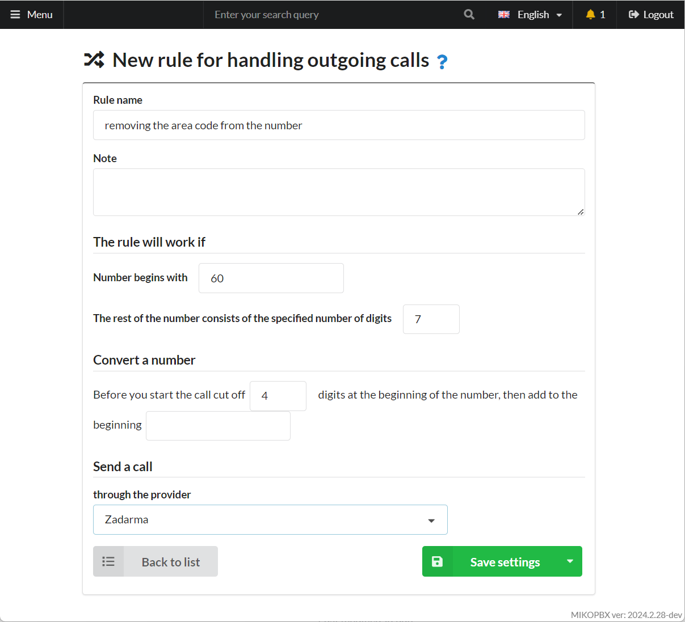
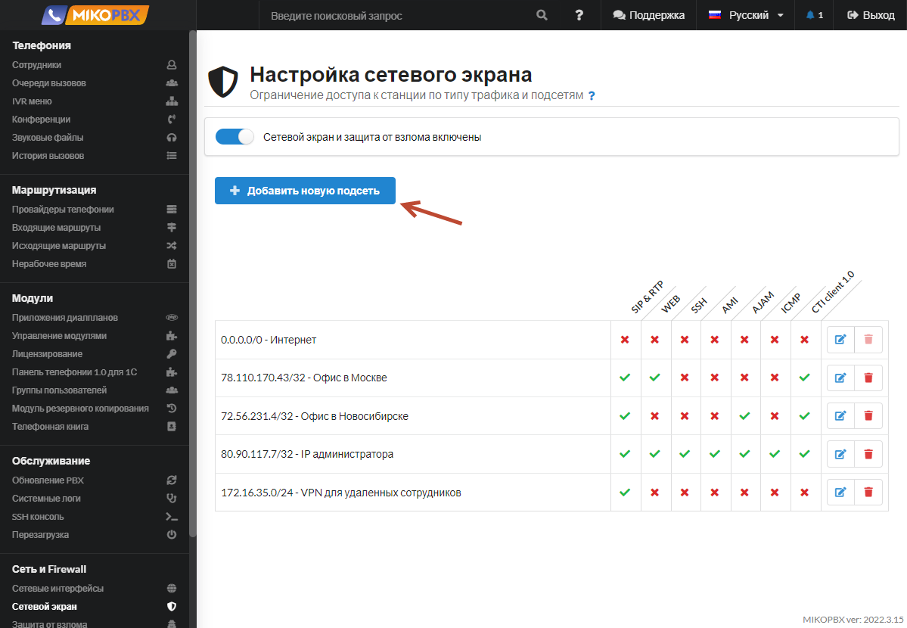

# Сетевой экран

**Сетевой экран** в MikoPBX — это интерфейс для настройки брандмауэра (Firewall) системы. Здесь администраторы могут создавать и управлять правилами фильтрации сетевого трафика, контролируя доступ к MikoPBX и защищая ее от несанкционированного доступа и сетевых угроз. Настройка сетевого экрана обеспечивает безопасность телефонной системы, предотвращая потенциальные атаки и обеспечивая стабильную работу в сетевой инфраструктуре организации.

В MikoPBX все локальные подсети возможно описать в разделе «**Сеть и Firewall**» → «**Сетевой экран**». Сетевой экран предназначен для ограничения доступа к станции по типу трафика и подсетям.

<figure><figcaption>
Раздел "<strong>Сеть и Firewall</strong>" -> "<strong>Сетевой экран</strong>" в MikoPBX
</figcaption></figure>

Для того, чтобы добавить новое правило, необходимо нажать на кнопку "**Добавить новую подсеть**":

<figure><figcaption>
Элемент для создания нового правила
</figcaption></figure>

## Общие настройки

Название - задайте произвольное имя для нового правила сетевого экрана.\
Справа от **адреса подсети** находится поле **Маска подсети** в формате CIDR.&#x20;

<figure><figcaption>
Параметры правила
</figcaption></figure>

## Доступные сервисы 

* SIP\&RTP-регистрация телефонов и голосовой трафик - Session Initiation Protocol используется для установки соединений между VoIP телефонами
* WEB-доступ к административному интерфейсу настройки АТС
* SSH-root доступ к системе. SSH(Secure Shell) позволяет получить доступ к консоли MikoPBX.
* AMI-доступ к asterisk manager api через telnet. Asterisk Manager Interface (AMI) предоставляет доступ к Asterisk по TCP/IP протоколу.
* AJAM - доступ к asterisk manager api, через http, https
* ICMP-проверка связи командой ping
* CTICLIENT-подключение панели телефонии для 1С

<figure><figcaption>
Раздел "<strong>Доступные сервисы</strong>"
</figcaption></figure>

## Дополнительные параметры 

* У каждой подсети есть флаг «**Это VPN или локальная сеть**». При установке этого флага MikoPBX будет представляться всем локальным подсетям локальным IP, а не внешним.
* Флаг «**Никогда не блокировать адреса из этой сети**» следует включать только для доверенных подсетей. Если включен данный флаг, то правила защиты от взлома на данную подсеть не распространяются.

<figure><figcaption>
Раздел "<strong>Дополнительные параметры</strong>"
</figcaption></figure>
