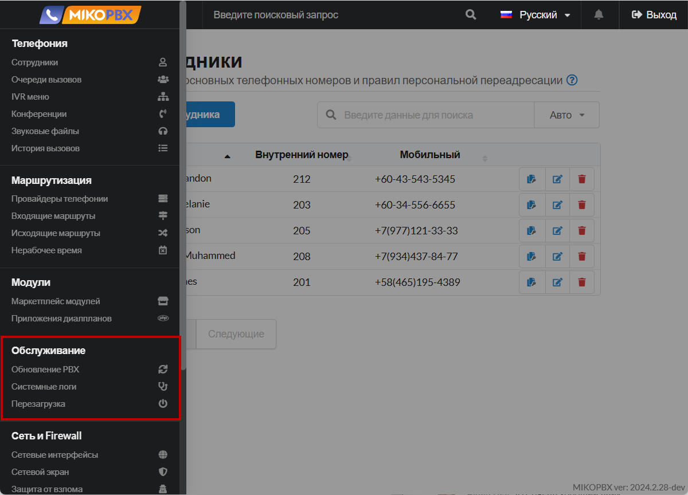

# Обслуживание

Раздел **«Обслуживание»** в MikoPBX — это интерфейс для управления техническими аспектами системы и обеспечения ее стабильной работы. Здесь администраторы могут выполнять задачи по резервному копированию и восстановлению данных, обновлению программного обеспечения, мониторингу состояния системы и управлению журналами событий. Этот раздел помогает поддерживать работоспособность телефонной системы, своевременно обнаруживать и устранять возможные проблемы.

<figure><figcaption>
Раздел "Обслуживание"
</figcaption></figure>

### Обновление системы


[update](update/)


Раздел **«Обновление»** в MikoPBX — это интерфейс для управления обновлениями программного обеспечения системы. Здесь администраторы могут проверять наличие новых версий, устанавливать обновления и просматривать историю изменений. Регулярное использование этого раздела обеспечивает актуальность, безопасность и стабильность работы MikoPBX.

***

### Диагностика системы


[system-diagnostic.md](system-diagnostic.md)


Раздел **«Диагностика системы»** в MikoPBX — это инструмент для мониторинга и анализа состояния телефонной системы. Здесь администраторы могут просматривать журналы событий, проверять с помощью них статус различных сервисов и компонентов системы, а также выполнять тестирование соединений и вызовов. Использование этого раздела помогает своевременно обнаруживать и устранять технические проблемы, обеспечивая стабильную и эффективную работу MikoPBX.

***

### Перезагрузка и выключение системы


[restart.md](restart.md)


Раздел **«Перезагрузка и выключение системы»** в MikoPBX — это интерфейс для безопасного управления состоянием телефонной системы через веб-интерфейс. Здесь администраторы могут перезагрузить систему для применения новых настроек или корректно выключить ее для технического обслуживания. Использование этого раздела предотвращает возможные ошибки и обеспечивает стабильную работу MikoPBX. Помимо этого, будет рассмотрена возможность перезагрузки через консоль.
