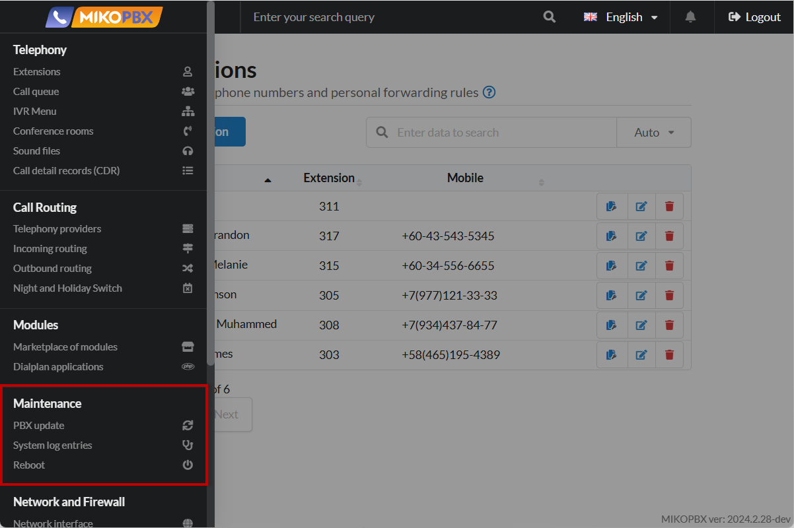

# Maintenance

The **Maintenance** section of MikoPBX is an interface for managing the technical aspects of the system and ensuring its stable operation. Here, administrators can perform tasks on data backup and recovery, software updates, system status monitoring, and event log management. This section helps maintain the functionality of the telephone system, promptly detect and eliminate possible problems.

<figure><figcaption>
"Maintenance" section in MikoPBX
</figcaption></figure>

## PBX update


[update](update/)


The "**PBX update**" section in MikoPBX is an interface for managing system software updates. Here, administrators can check for new versions, install updates, and view the change history. Regular use of this section ensures that MikoPBX is up-to-date, secure, and stable.

***

## System log entries


[system-diagnostic.md](system-diagnostic.md)


The "**System log entries**" section in MikoPBX is a tool for monitoring and analyzing the status of the telephone system. Here, administrators can view event logs, check the status of various services and system components, and test connections and calls. Using this section helps to promptly detect and eliminate technical problems, ensuring stable and efficient operation of MikoPBX.

***

## Reboot


[restart.md](restart.md)


The "**Reboot**" section in MikoPBX is an interface for securely managing the state of the telephone system via the web interface. Here, administrators can reboot the system to apply new settings or shut it down gracefully for maintenance. Using this section prevents possible errors and ensures stable operation of MikoPBX. In addition, the possibility of rebooting via the console will be discussed.
