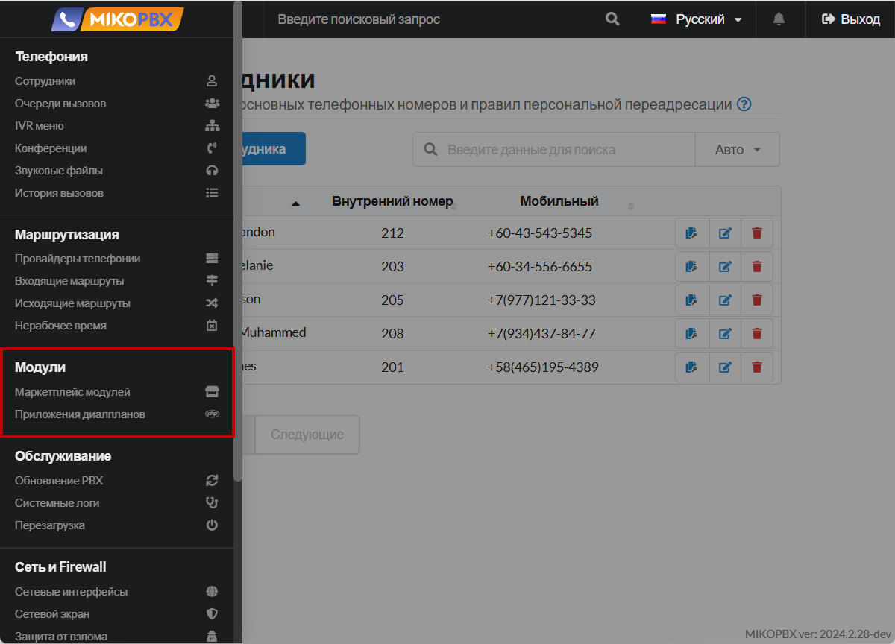

# Модули

Раздел «Модули» в MikoPBX — это интерфейс для управления дополнительными функциональными компонентами системы, который включает два подраздела: **«Управление модулями»** и **«Приложения диалплана»**.

Управление этими подразделами позволяет настроить MikoPBX максимально гибко и эффективно, расширяя функциональность телефонной системы и адаптируя ее под уникальные требования организации.

<figure><figcaption>
Раздел "Модули" в MikoPBX
</figcaption></figure>

### Регистрация в маркетплейсе модулей


[licensing.md](licensing.md)


Регистрация в Маркетплейсе MikoPBX не влияет на базовый функционал системы. Вы можете использовать MikoPBX для работы со звонками без регистрации и установки дополнительных модулей. Однако, Мы рекомендуем пройти процедуру регистрации в маркетплейсе для получения возможности расширения функционала системы.

Регистрация даст вам доступ к дополнительным модулям и расширениям.

***

### Управление модулями&#x20;


[pbx-extension-modules.md](pbx-extension-modules.md)


**Управление модулями** в MikoPBX — это интерфейс для управления дополнительными компонентами системы, расширяющими ее функциональность. Здесь администраторы могут устанавливать, обновлять, включать или отключать модули, добавляя новые возможности или интеграции с внешними сервисами. Этот раздел позволяет адаптировать систему под специфические потребности компании, обеспечивая гибкость и масштабируемость телефонной сети.

***

### Приложения диалпланов


[dialplan-applications.md](dialplan-applications.md)


**Приложения диалпланов** в MikoPBX — это набор инструментов, которые позволяют настраивать индивидуальные сценарии обработки звонков внутри системы. С их помощью вы можете определить последовательность действий, которую система выполнит при поступлении или совершении вызова. Это может включать перенаправление звонка на определенный внутренний номер, воспроизведение специальных аудиосообщений, запрос дополнительной информации у звонящего или выполнение других функций.

Используя приложения диалпланов, вы можете гибко настроить логику работы телефонной системы под потребности вашего бизнеса, не углубляясь в сложное программирование. Это облегчает создание сложных сценариев обработки вызовов, позволяя улучшить эффективность коммуникаций и повысить уровень обслуживания клиентов.
