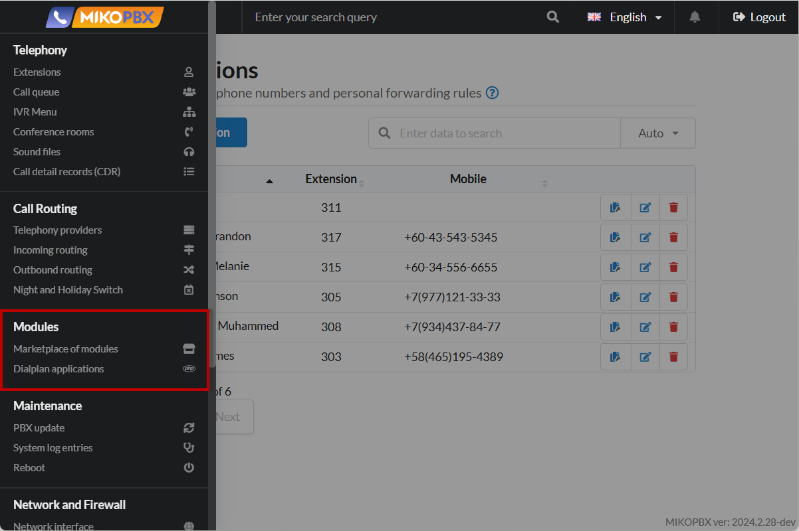

# Modules

The "Modules" section in MikoPBX is an interface for managing additional functional components of the system, which includes two subsections: **"Module Management"** and "**Dialplan Applications"**.

Managing these subsections allows you to configure MikoPBX as flexibly and efficiently as possible, expanding the functionality of the telephone system and adapting it to the unique requirements of the organization.

<figure><figcaption>
"Modules" section in MikoPBX
</figcaption></figure>

## Registration in the modules marketplace


[licensing.md](licensing.md)


Registration in the MikoPBX Marketplace does not affect the basic functionality of the system. You can use MikoPBX to work with calls without registration and installation of additional modules. However, we recommend that you go through the registration procedure in the marketplace to get the opportunity to expand the functionality of the system.

Registration will give you access to additional modules and extensions.

***

## Module management&#x20;


[pbx-extension-modules.md](pbx-extension-modules.md)


**Module management** in MikoPBX is an interface for managing additional system components that expand its functionality. Here, administrators can install, update, enable or disable modules, adding new features or integrations with external services. This section allows you to adapt the system to the specific needs of the company, ensuring flexibility and scalability of the telephone network.

***

## Application dialplans


[dialplan-applications.md](dialplan-applications.md)


MikoPBX **dialplan applications** are a set of tools that allow you to set up individual call processing scenarios within the system. With their help, you can define a sequence of actions that the system will perform when a call is received or made. This may include redirecting a call to a specific extension, playing special audio messages, requesting additional information from the caller, or performing other functions.

Using dialplan applications, you can flexibly customize the logic of the telephone system to the needs of your business without delving into complex programming. This makes it easier to create complex call processing scenarios, allowing you to improve the efficiency of communications and improve the level of customer service.
