# Registration in the modules marketplace

## General Information

Registering in the MikoPBX Module Marketplace is not required for the system’s basic functionality. You can fully utilize MikoPBX for handling calls without registration or installing additional modules. However, we recommend registering in the marketplace to expand your system’s capabilities.

Registration gives you access to additional modules and extensions.\
These include both **free** modules (moved out of the core system for easier initial setup) and **paid** modules from us and third-party developers.\
If you are a developer, you can contact us at **developers@mikopbx.com** to get instructions on creating and adding your module to the Marketplace.


MikoPBX is a free solution and does not require registration.\
The absence of a license does not impact call functionality. You can register or cancel your Marketplace registration anytime.


To begin the registration process, navigate to "**Modules" -> "Marketplace of modules"**:

<figure>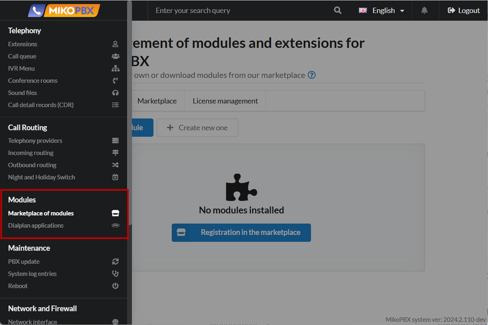<figcaption>
Section "<strong>Modules</strong>" -> "<strong>Marketplace of modules</strong>"
</figcaption></figure>

If you are not registered in the Marketplace, the section will look as follows:

<figure><figcaption>
Marketplace section if registration is not completed
</figcaption></figure>

***

### Registration Process


If you move MikoPBX to another host or restore it from a backup, you will need to reset license bindings in the [License Manager](https://lm.mikopbx.com).



One license key is issued per company. If your company uses multiple MikoPBX instances, a single registration is sufficient.


To start the registration process, click the **Register in Marketplace** button:

<figure>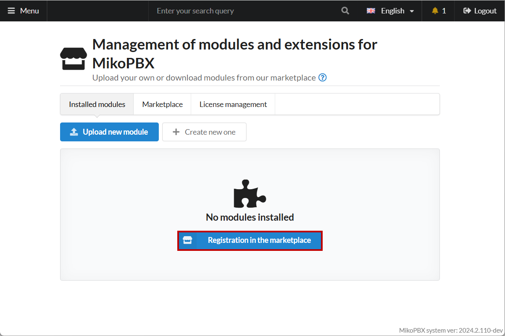<figcaption>
The "<strong>Registration in the marketplace</strong>" button
</figcaption></figure>

The license key stores all your licenses for MikoPBX products. If you already have a key, you can enter it in the corresponding field. If you've forgotten your key, search your email inbox for messages from **lic@miko.ru**

<figure>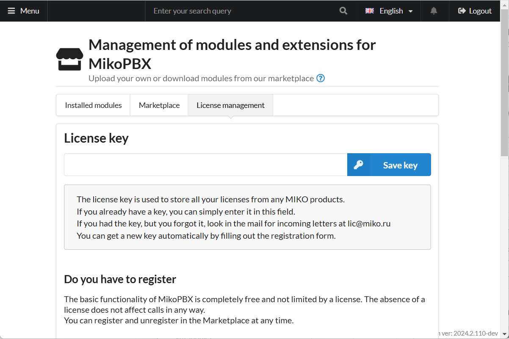<figcaption>
License key
</figcaption></figure>

If you don’t have a key, you can generate a new one by completing the registration form:

<figure>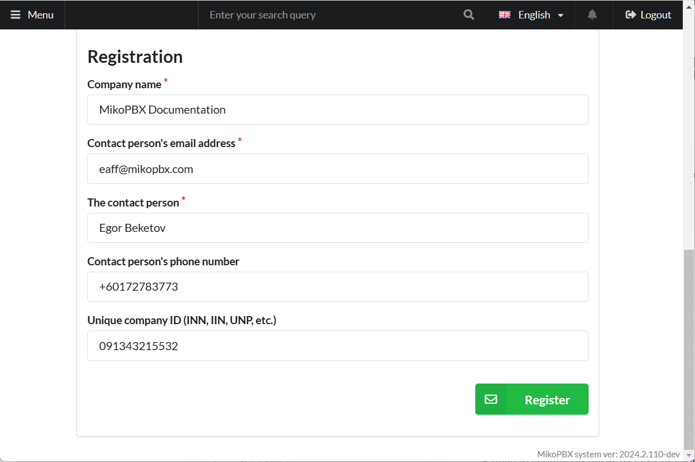<figcaption>
Registration form for the marketplace
</figcaption></figure>

* **Organization Name** – Enter your company/organization name.
* **Contact Email** – Enter your organization’s email address.
* **Contact Person** – Enter the name of the contact person.
* **Contact Phone** (optional) – Provide a contact number.
* **Unique Company Identifier** (e.g., Tax ID, VAT) (optional).

Click **Register**.

Upon successful registration, you will see the following screen:

* A notification confirming the system's registration.
* The license key field will display a blurred value by default. Hover over it to view or copy the key.

<figure>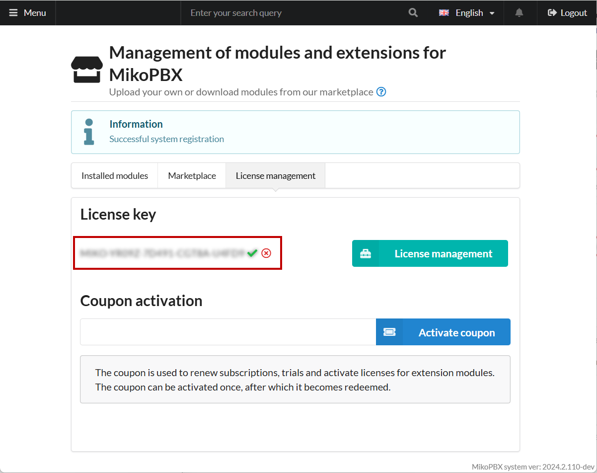<figcaption>
Successful registration in the marketplace
</figcaption></figure>

***

### License Management

To manage your license, go to **Marketplace -> License Management** and click the corresponding option:

<figure>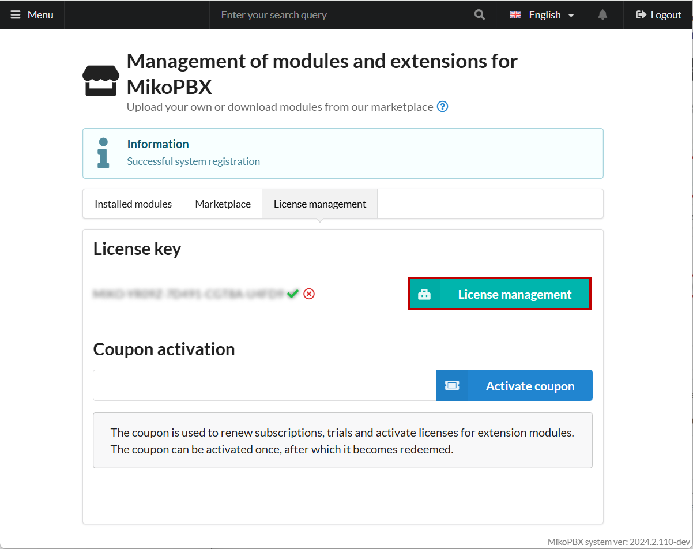<figcaption>
"License Management" element
</figcaption></figure>

You will be redirected to the [SaaS Licensing Server](https://lm.mikopbx.com/client-cabinet/session/index/):

<figure>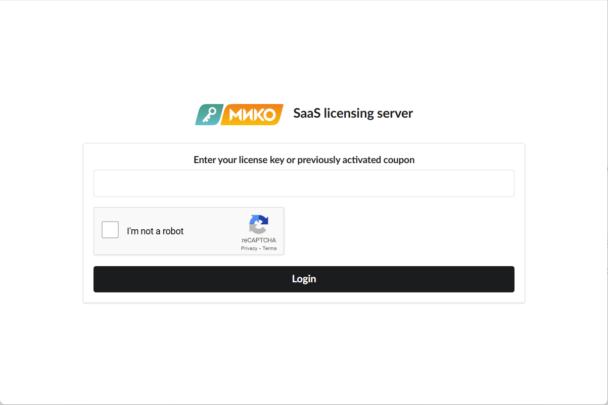<figcaption>
SaaS Licensing Server Page
</figcaption></figure>

Enter your license key in the **Enter your license key or activated coupon** field and click **Login**:

<figure>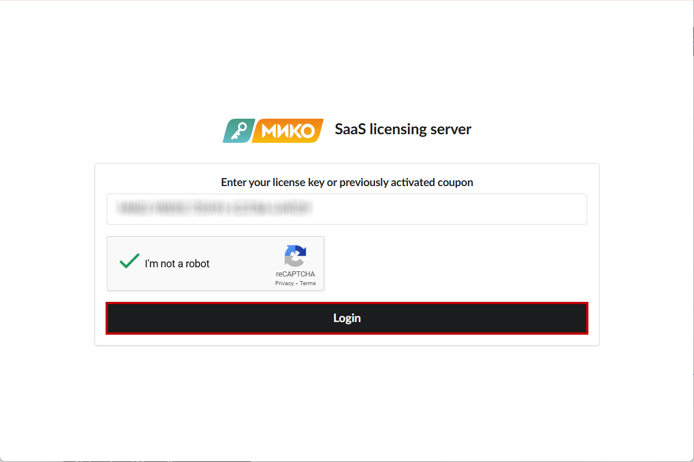<figcaption>
Entered license key
</figcaption></figure>

You will access a system with nine sections:

<figure>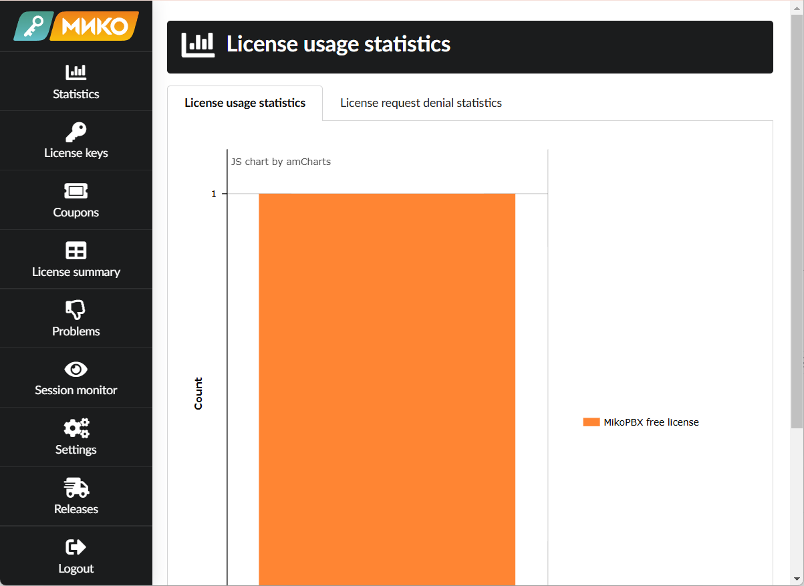<figcaption>
SaaS System
</figcaption></figure>

Go to the **Session monitor** section:

<figure><figcaption>
"Session monitor" Section
</figcaption></figure>

In the **Info** column, click the **i** button for each binding to view detailed host information.

<figure>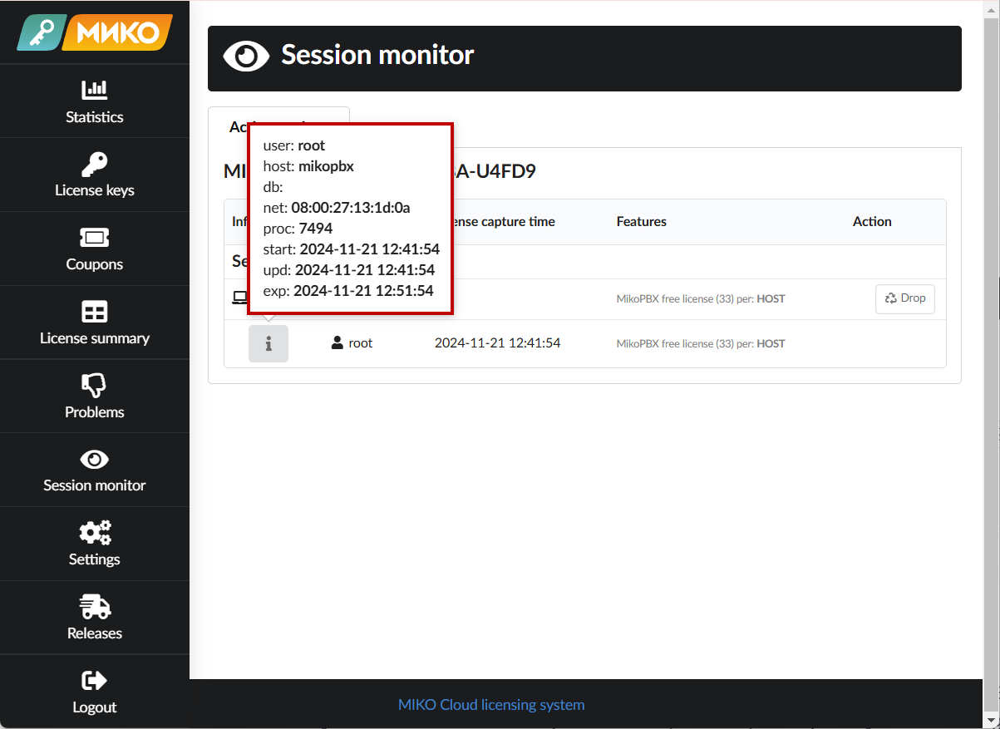<figcaption>
Host information
</figcaption></figure>

In the **Action** column, use the **Drop** button to **unbind the license** from the current host.

<figure>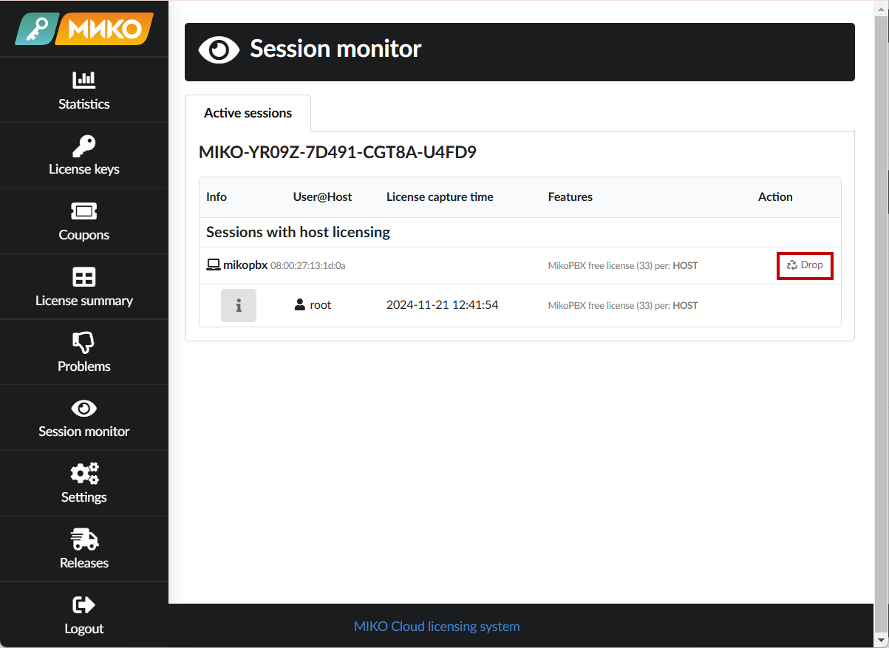<figcaption>
Resetting the license on the host
</figcaption></figure>

***

### Potential Issues

#### Registration Issues

If you encounter issues during registration, check for internet access to the MikoPBX server. Ensure connectivity to **lic.miko.ru** and **lic.mikopbx.com** over port 443 (HTTPS). Verify firewall settings and network permissions.

#### Strikethrough Key Icon

MikoPBX periodically connects to licensing servers to verify installed modules. If a module license becomes unavailable, the module will be disabled, and a strikethrough key icon will appear next to its name.
