# Регистрация в маркетплейсе модулей

## Общая информация&#x20;

Регистрация в Маркетплейсе MikoPBX не влияет на базовый функционал системы. Вы можете использовать MikoPBX для работы со звонками без регистрации и установки дополнительных модулей. Однако, Мы рекомендуем пройти процедуру регистрации в маркетплейсе для получения возможности расширения функционала системы.

Регистрация даст вам доступ к дополнительным модулям и расширениям.\
Есть бесплатные модули, который мы вынесли из базового функционала для упрощения первоначальной настройки, а также платные модули от нас и других разработчиков.\
Если вы разработчик, то можете связаться с нами, написав на почту developers@mikopbx.com для получения инструкций о том, как разработать собственный модуль и добавить его в Marketplace.


Сама MikoPBX - бесплатное решение и не требует никакой регистрации. Отсутствие лицензии никак не влияет на звонки. Вы в любой момент можете зарегистрироваться, а также отменить регистрацию в Marketplace.


Для начала регистрации в маркетплейсе вам необходимо перейти во вкладку "**Модули**" -> "**Маркетплейс модулей**":

<figure>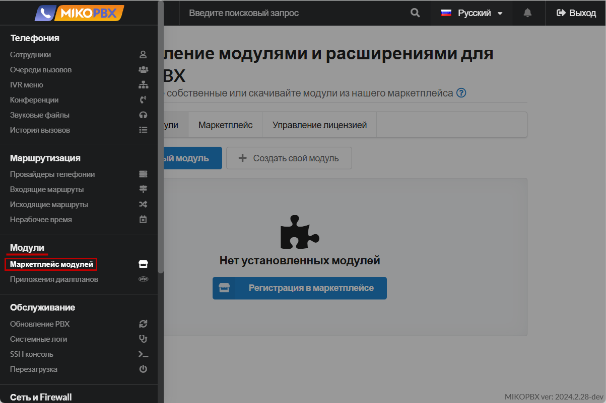<figcaption>
Раздел "<strong>Модули</strong>" <strong>-></strong> "<strong>Маркетплейс модулей</strong>"
</figcaption></figure>

В случае, если у Вас не выполнена регистрация в Маркетплейсе, раздел будет выглядеть вот так:

<figure>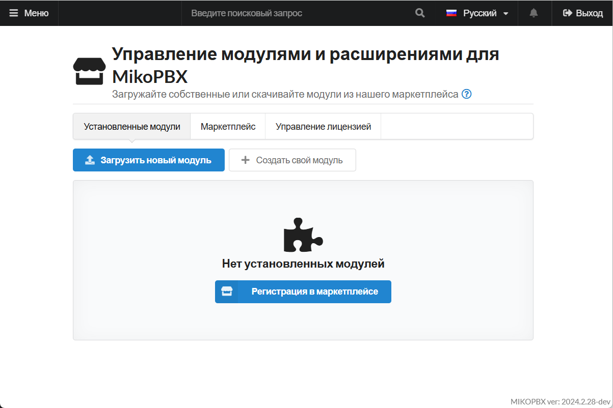<figcaption>
Раздел Маркетплейса, в случае, если не выполнена регистрация
</figcaption></figure>

## Процесс регистрации


В случае переноса MikoPBX на другой хост или восстановлении из бекапа, необходимо выполнить сброс привязок лицензий на модули в личном кабинете lm.mikopbx.com



При регистрации выдается 1 ключ на компанию. Это значит, что если Вы используйте несколько станций MikoPBX в своей компании - вам достаточно будет одной регистрации.


Нажмите синюю кнопку "**Регистрация в маркетплейсе**" для начала регистрации:

<figure>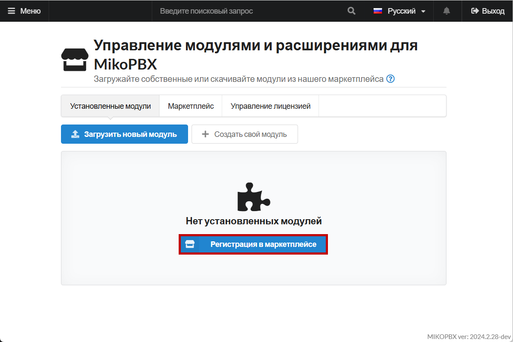<figcaption>
Кнопка "<strong>Регистрация в маркетплейсе</strong>" в разделе "<strong>Модули</strong>" <strong>-></strong> "<strong>Маркетплейс</strong>"
</figcaption></figure>

Лицензионный ключ используется для хранения всех ваших лицензий от любых продуктов МИКО. Если у вас уже есть ключ, вы можете просто вписать его в одноименное поле. Если ключ у вас был, но вы его забыли, вы можете поискать письмо в вашей электронной почте входящие письма по адресу lic@miko.ru

<figure>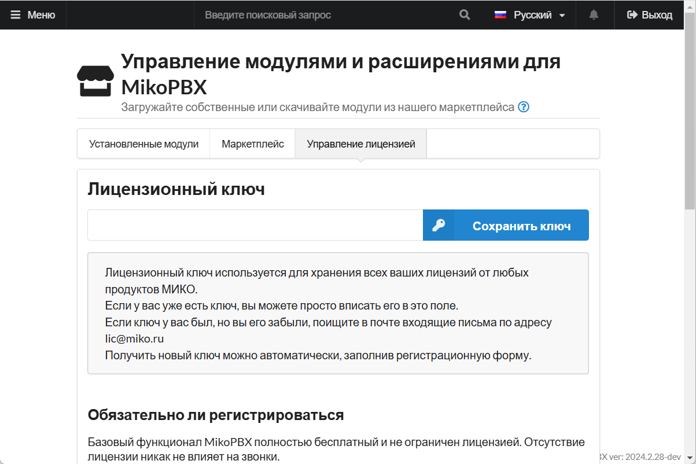<figcaption>
Лицензионный ключ
</figcaption></figure>

&#x20;Получить новый ключ можно автоматически, заполнив регистрационную форму ниже:

* **Название организации** - введите имя вашей компании/организации.
* **Адрес электронной почты контактного лица** - введите адрес электронной почты вышей компании/организации.
* **Контактное лицо** - введите данные контактного лица.
* **Телефон контактного лица** (необязательно).
* **Уникальный идентификатор компании** (ИНН, ИИН, УНП и т.д.) (необязательно).

Нажмите "**Зарегистрироваться**"

<figure><figcaption>
Регистрационная форма для маркетплейса
</figcaption></figure>

В случае успешной регистрации, вы увидите следующий экран:

* Уведомление об успешной регистрации системы.
* Лицензионный ключ (наведитесь, чтобы его увидеть)

<figure>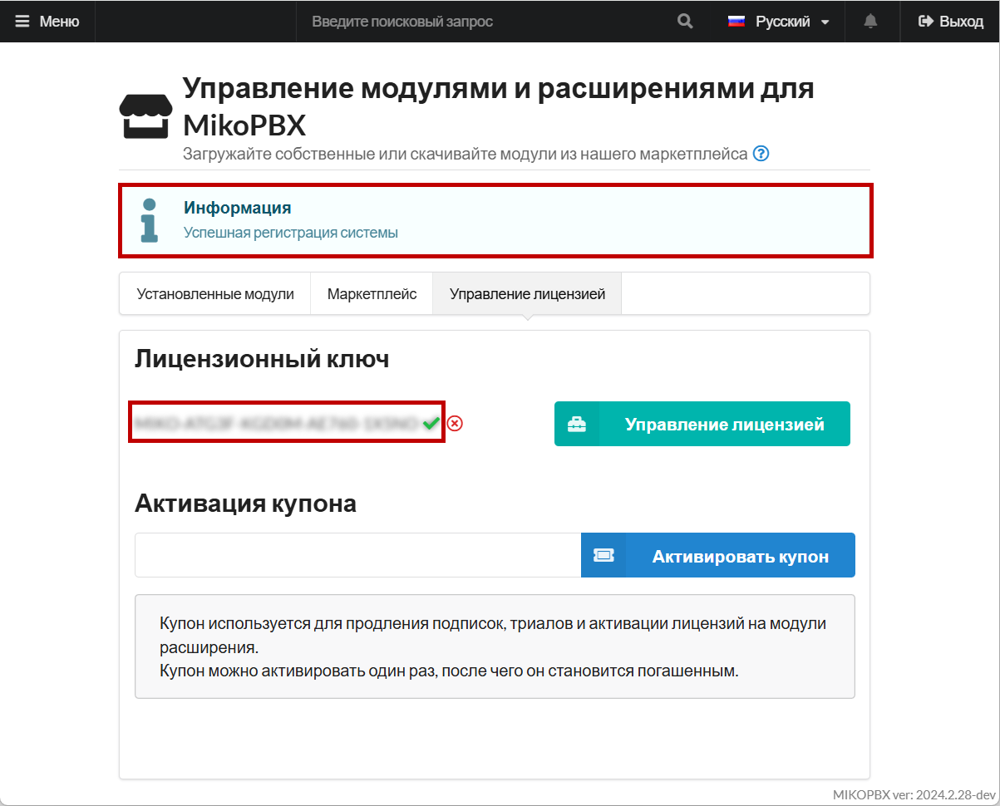<figcaption>
Успешная регистрация в маркетплейсе
</figcaption></figure>

## Управление лицензией&#x20;

Для управления лицензией перейдите в раздел Маркетплейс -> Управление лицензией. Нажмите на одноименный элемент:

<figure>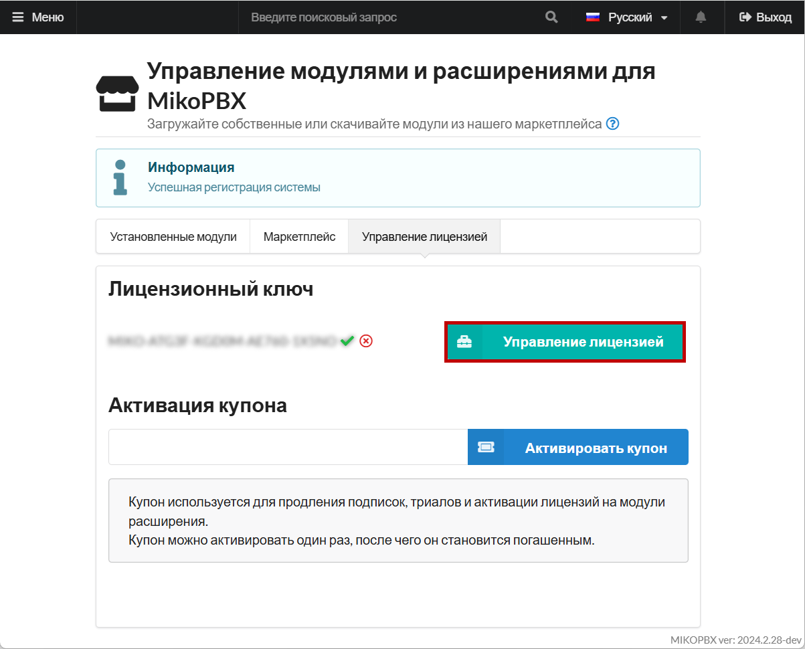<figcaption>
Элемент "<strong>Управление лицензией</strong>"
</figcaption></figure>

Вы попадете на [сайт SaaS сервер лицензирования](https://lm.mikopbx.com/client-cabinet/session/index/):&#x20;

<figure>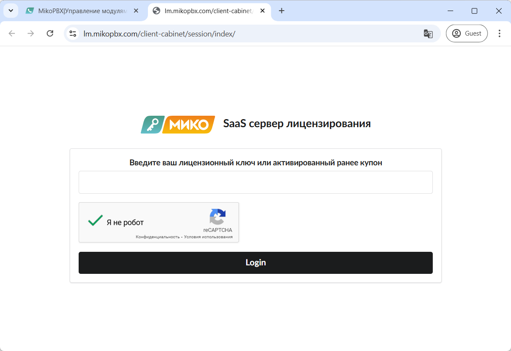<figcaption>
Страница "<strong>SaaS сервер лицензирования</strong>"
</figcaption></figure>

Для управления лицензией введите ваш лицензионный ключ в поле "**Введите ваш лицензионный ключ или активированный ранее купон**":

Нажмите "**Login**"

<figure>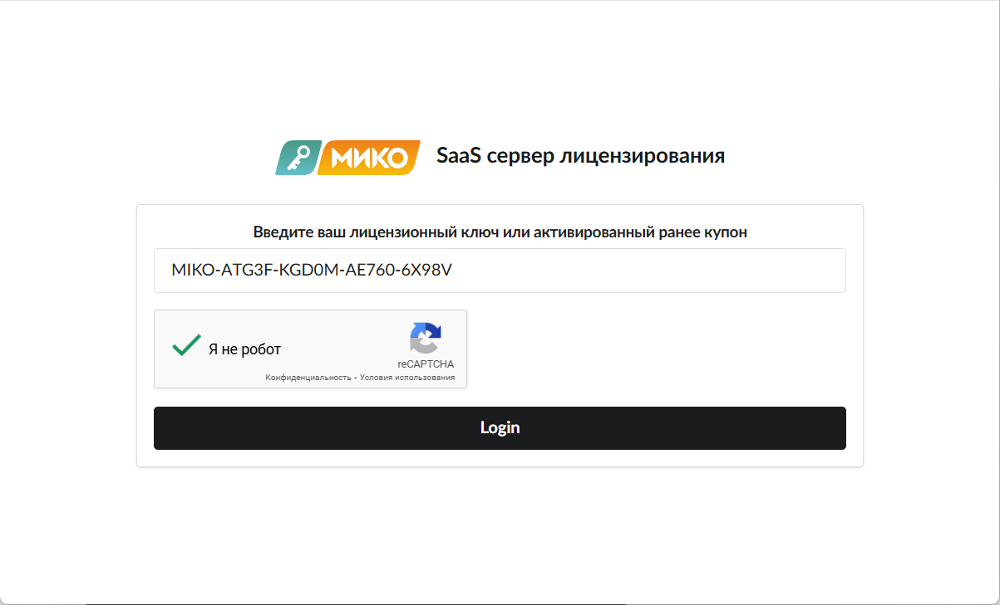<figcaption>
Введённый лицензионный ключ
</figcaption></figure>

Вы попадете в систему, где находятся 9 секций:

<figure>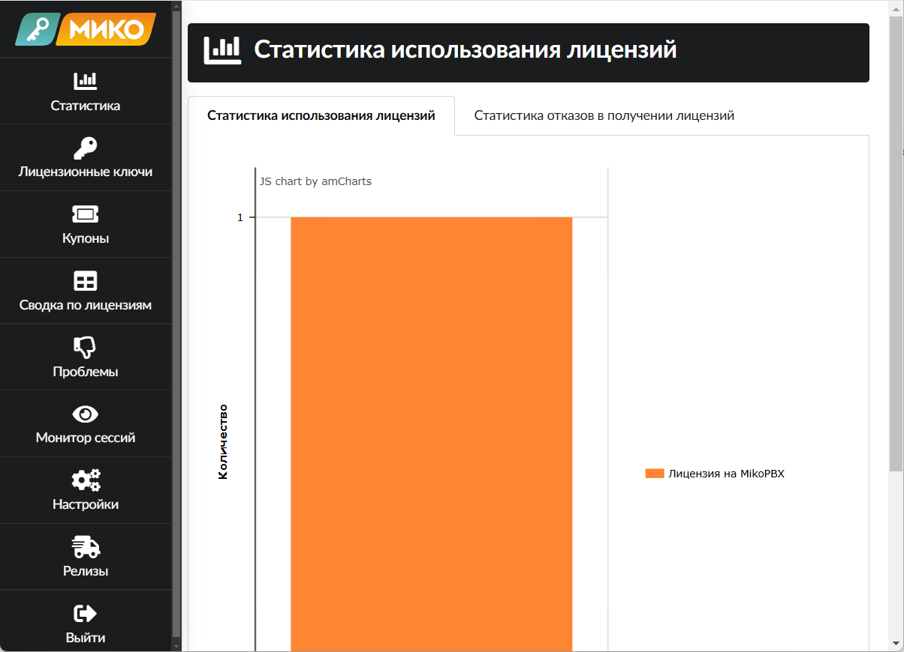<figcaption>
Система SaaS
</figcaption></figure>

Перейдите в раздел "**Монитор сессий**":

<figure>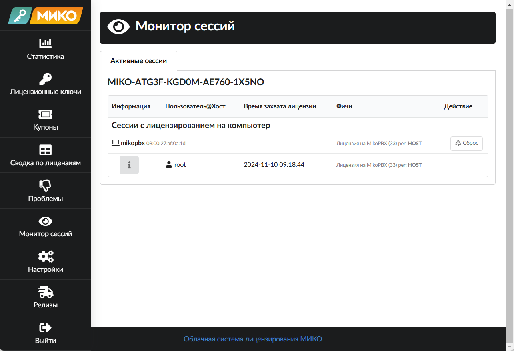<figcaption>
Раздел "<strong>Монитор сессий</strong>"
</figcaption></figure>

Слева для каждой привязки в колонке **Информация** есть кнопка **i**, которая позволяет посмотреть подробную информацию о хосте, к которому привязана лицензия.

<figure>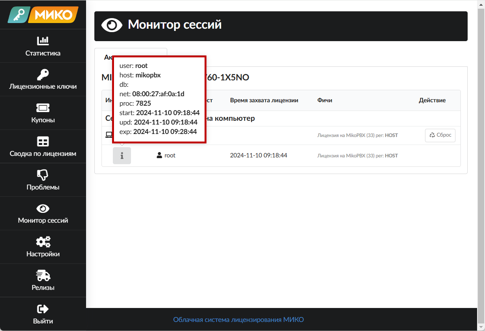<figcaption>
Информация о хосте
</figcaption></figure>

Для каждой привязки в колонке "**Действие"** есть кнопка **"Сброс"**, которая позволяет **сбросить активную привязку** лицензии от хоста.


На одной лицензии может находится 10 хостов.


<figure>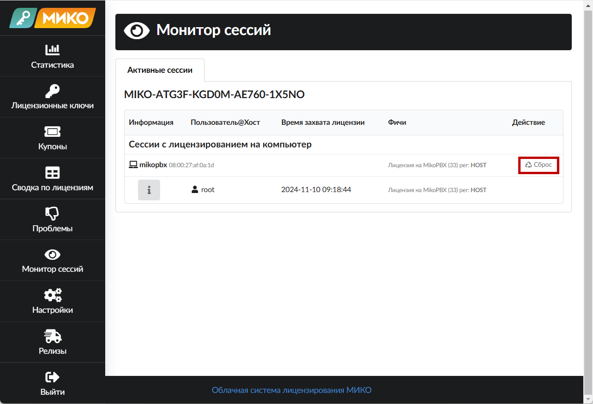<figcaption>
Сброс лицензии на хосте.
</figcaption></figure>

## Возможные проблемы

### Проблема при регистрации в Маркетплейсе

При регистрации может возникать проблема отсутствии у MikoPBX связи с интернетом, а именно с отсутствием связи с серверами lic.miko.ru и lic.mikopbx.com по порту 443(https)

Решение: проверить доступ к станции из интернета, проверить настройки firewall и общего доступа к вышеупомянутым ресурсам.

### Иконка перечеркнутого ключа&#x20;

MikoPBX переодически обращается к серверам лицензирования для проверки установленных модулей. Если лицензия на модуль недоступна, то он будет отключен с соответствующей иконкой.
