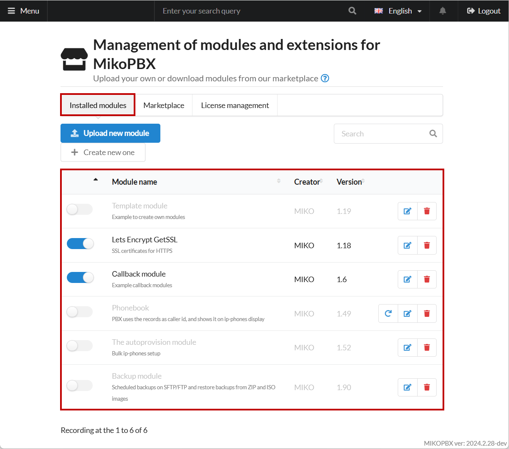
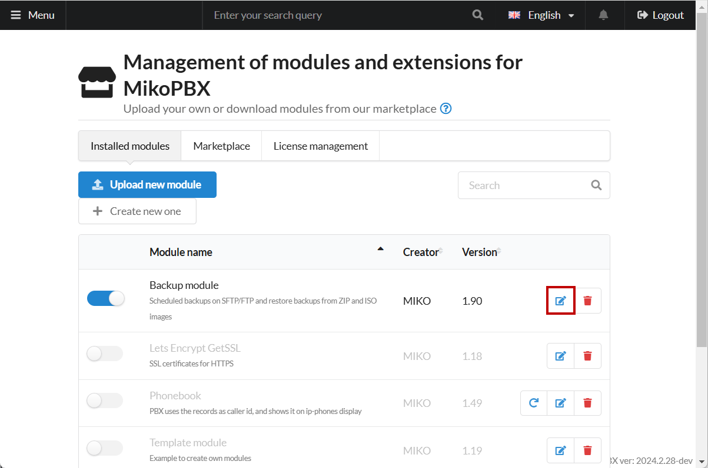

# Module management

Additional modules allow you to expand the functionality of the main system. In this guide, you will find information on managing modules and installing applications using the built-in Marketplace.


To use both paid and free modules, you need to register your copy of MikoPBX and obtain a free license key. Instructions on how to do this can be found [here](licensing.md).


Detailed instructions for configuring and operating each module can be found [here](../../modules/miko/).

You can find the Module Management section under **"Modules"** -> **"Marketplace of modules"**.

<figure><figcaption>
"Marketplace of modules" section
</figcaption></figure>

## Installed Modules

This section allows you to manage modules: connecting them, configuring them, and uploading your own custom modules. Documentation on developing your own modules can be found [here](https://docs.mikopbx.com/mikopbx-development).

All installed modules are listed under the tab of the same name:

<figure><figcaption>
All installed modules
</figcaption></figure>

You can upload your own module using the **"Upload New Module"** button. You need to upload `.zip` files. After uploading, the module will appear in the list under the "**Installed Modules**" tab.

<figure><figcaption>
"Upload new module" button
</figcaption></figure>

You can also access the settings of any module for further configuration:

<figure><figcaption>
Module settings
</figcaption></figure>

Additionally, you can enable or disable a module.

<figure><figcaption>
Enable/disable module
</figcaption></figure>

From the interface of an installed module, you can quickly access its documentation by clicking on the question mark to the right of the module's short description:

<figure><figcaption>
Quick jump to module documentation
</figcaption></figure>

## Quick Access to Modules

You can add any module to the sidebar menu for quick access, which can be useful if you need constant access to the module's settings to change parameters or its status.

<figure><figcaption>
Modules in quick access
</figcaption></figure>

To do this, follow these instructions:

1. Go to the settings of the module you want to add to the sidebar menu by clicking on the edit icon to the right of the module's version:

<figure><figcaption>
Go to module settings
</figcaption></figure>

2. Click on the settings icon to the right of the module's status to access the display settings for the module in the sidebar menu:

<figure><figcaption>
Settings of the module
</figcaption></figure>

3. In this section, you can:

* Toggle the display of the module in the sidebar menu—**"Show module in sidebar menu"**.
* Choose the section where it will be displayed—in the example, the **"Modules"** section is selected.
* Specify a custom name for the module if desired.

After completing the settings, click **"Save"**.

<figure><figcaption>
Module display options in the side menu
</figcaption></figure>

## Marketplace

In this section, you can install modules from MIKO as well as from partner developers.

<figure><figcaption>
Marketplace section
</figcaption></figure>

Each module has a button for downloading and installing it. Basic information about the module with a short description is also displayed here.

<figure><figcaption>
Button for installing the module
</figcaption></figure>

To the left of the module's name, you can find an icon indicating whether it is paid or free. For example, in the image above, the **"Access Control Management"** module is paid, while the **"Backup\&Recovery module"** module is free.


Each paid module has a trial period of 2 weeks. During this period, you can try the module's functionality and decide whether to purchase it. To purchase a module, write to [**sale@mikopbx.com**](mailto:sale@mikopbx.com)


## Module Card

You can access a module's detailed page by clicking on its name in the Marketplace interface.

<figure><figcaption>
Module card
</figcaption></figure>

Here you can find the version of the current release, information about the developer, and whether the module is paid or free. There are also three sections:

**Module Description**

This section contains images illustrating the module's functionality and settings. Additionally, there is a basic description of the module and a **"Useful Links"** section with a link to detailed documentation on configuring and operating the module.

**Version History**

In this section, you can find the module's version history with detailed descriptions of changes, as well as the minimum compatible version of MikoPBX for proper operation. You can also install a specific version of the module by clicking on the blue link under its description.

<figure><figcaption>
Version History section
</figcaption></figure>

## Activating Coupons

If you purchase a module, you will receive a coupon. To activate it, go to **Modules -> Marketplace of modules**:

<figure><figcaption>
Marketplace of modules section
</figcaption></figure>

Then navigate to the **"License Management"** section.

In the **"Activate Coupon"** field, enter your coupon code and click **"Activate Coupon"**


The protection key always starts with **MIKO-**. Coupons for modifying product composition always start with **MIKOUPD-**.&#x20;


<figure><figcaption>
Coupon activation
</figcaption></figure>
