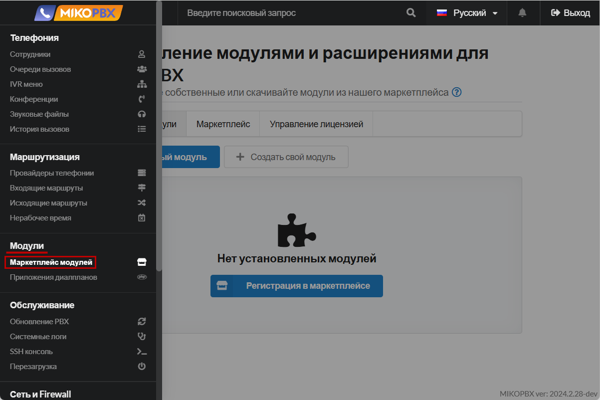

# Управление модулями

Дополнительные модули позволяют расширить возможности функционала основной системы. В данной инструкции вы сможете найти информацию про управление модулями, а так же про установку приложений с помощью встроенного Marketplace.&#x20;


Для использования платных и бесплатных модулей, необходимо зарегистрировать копию MikoPBX и бесплатно получить лицензионный ключ. Инструкцию по тому, как это сделать - вы можете найти [здесь](licensing.md).


Подробные инструкции по настройке и эксплуатации каждого модуля вы можете найти [здесь](../../modules/miko/).

Найти раздел Управления модулями вы можете в **"Модули"** -> **"Маркетплейс модулей".**

<figure><figcaption>
Раздел "Маркетплейс модулей"
</figcaption></figure>

## Установленные модули

В данном разделе происходит основное управление модулями: их подключение, настройка, а так же загрузка своих, "кастомных" модулей. Документацию по разработке своих модулей вы можете найти [здесь](https://docs.mikopbx.com/mikopbx-development).

Все установленные модули находятся в списке, в одноимённой вкладке:

<figure><figcaption>
Все установленные модули
</figcaption></figure>

Есть возможность загрузить свой модуль, используя кнопку **"Загрузить новый модуль"**. Необходимо загружать файлы .zip. После загрузки модуль появится в списке на вкладке "**Установленные модули**"

<figure><figcaption>
Кнопка "Загрузить новый модуль"
</figcaption></figure>

Так же есть возможность перейти в настройки любого модуля для дальнейшей его конфигурации:

<figure><figcaption>
Переход в настройки модуля
</figcaption></figure>

Помимо этого, можно включить/отключить модуль.

<figure><figcaption>
Включение/отключение модуля
</figcaption></figure>

Из интерфейса установленного модуля можно быстро перейти к его документации, нажав на знак вопроса справа от короткого описания модуля:

<figure><figcaption>
Быстрый переход к документации по модулю
</figcaption></figure>

## Быстрый доступ к модулю

Существует возможность вынести любой модуль в боковое меню для быстрого доступа к нему, что может быть полезно, если вам требуется постоянный доступ к настройки модуля для изменения параметров или его состояния.

<figure><figcaption>
Модули в быстром доступе
</figcaption></figure>

Для того, чтобы это сделать - выполните дальнейшую инструкцию:

1. Перейдите в настройки модуля, который Вы хотите вывести в боковое меню, нажав на элемент редактирования справа от версии модуля:

<figure><figcaption>
Переход в настройки модуля
</figcaption></figure>

2. Нажмите на значок настроек справа от статуса состояния модуля для перехода к настройкам отображения модуля в боковом меню:

<figure><figcaption>
Параметры модуля
</figcaption></figure>

3. В данном разделе вы можете:

* Переключить отображение модуля в боковом меню - "**Показывать модуль в боковом меню**".
* Выбрать раздел в котором он будет отображаться - в примере выбран раздел "**Модули**".
* Так же можно указать произвольное название модуля.

После завершения настройки - нажмите "**Сохранить**".

<figure><figcaption>
Параметры отображения модуля в боковом меню
</figcaption></figure>

## Маркетплейс модулей

В данном разделе вы можете установить модули от MIKO, а так же от производителей-партнеров.

<figure><figcaption>
Раздел "Маркетплейс"
</figcaption></figure>

Напротив каждого модуля есть кнопка для его скачивания и установки. Так же здесь отображена базовая информация по модулю с коротким описанием каждого модуля.&#x20;

<figure><figcaption>
Кнопка для установки модуля
</figcaption></figure>

Слева от названия модуля вы можете найти значок, по которому можно понять платный ли он или бесплатный. Например, на изображении выше модуль "**REST API Автоинформатор**" - платный, а модуль "**Генератор SSL сертификатов через Let's Encrypt**" - бесплатный.


У каждого платного модуля есть испытательный период - 2 недели. За этот период вы можете попробовать функционал модуля и принять решение о покупке. Для покупки модуля - напишите на почту sale@mikopbx.com


## Карточка модуля

Существует возможность перейти в карточку модуля, нажав на его название в интерфейсе маркетплейса.

<figure><figcaption>
Карточка модуля
</figcaption></figure>

Здесь вы можете найти версию актуального релиза, информацию про разработчика, платный ли модуль или бесплатный. Тут же находятся 3 раздела:

#### Описание модуля

Здесь вы можете найти изображения про функционал и настройки модуля. Помимо этого - базовое описание модуля, а так же раздел "**Полезные ссылки**", где располагается ссылка на подробную документацию по настройке и эксплуатации модуля.

#### История версий

<figure><figcaption>
Раздел "История версий"
</figcaption></figure>

В данном разделе вы можете найти историю версий модуля, с подробным описанием изменений, а также минимально совместимой версии MikoPBX для корректной его работы. Так же вы можете установить конкретную версию модуля, нажав на синий элемент под общим ее описанием.

#### Лицензионное соглашение

Здесь вы можете ознакомиться с пользовательским лицензионным соглашением для каждого модуля расширения.

## Активация купонов

В случае покупки модуля, вам будет выдан купон. Для его активации перейдите в Модули -> Маркетплейс модулей:

<figure><figcaption>
Раздел "Модули" -> "Маркетплейс модулей"
</figcaption></figure>

Далее перейдите в раздел "**Управление лицензией**"

В поле "**Активация купона**" введите ваш купон, далее нажмите "**Активировать купон**"


Ключ защиты всегда начинается с MIKO-. Купон для изменения состава продуктов всегда начинается с MIKOUPD-


<figure><figcaption>
Активация купона
</figcaption></figure>
