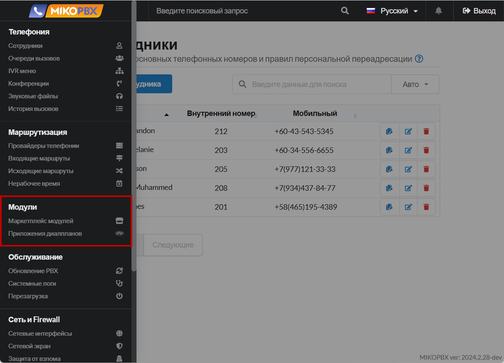
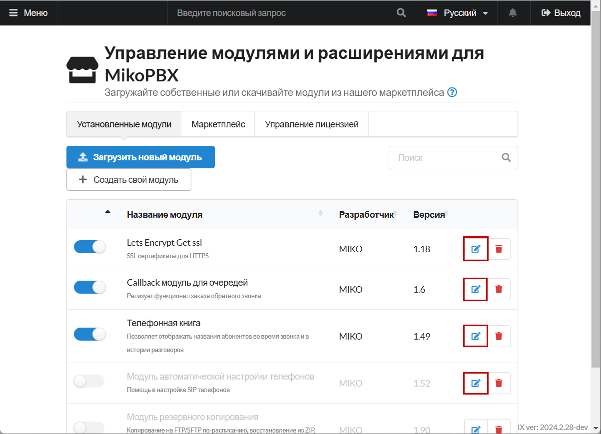
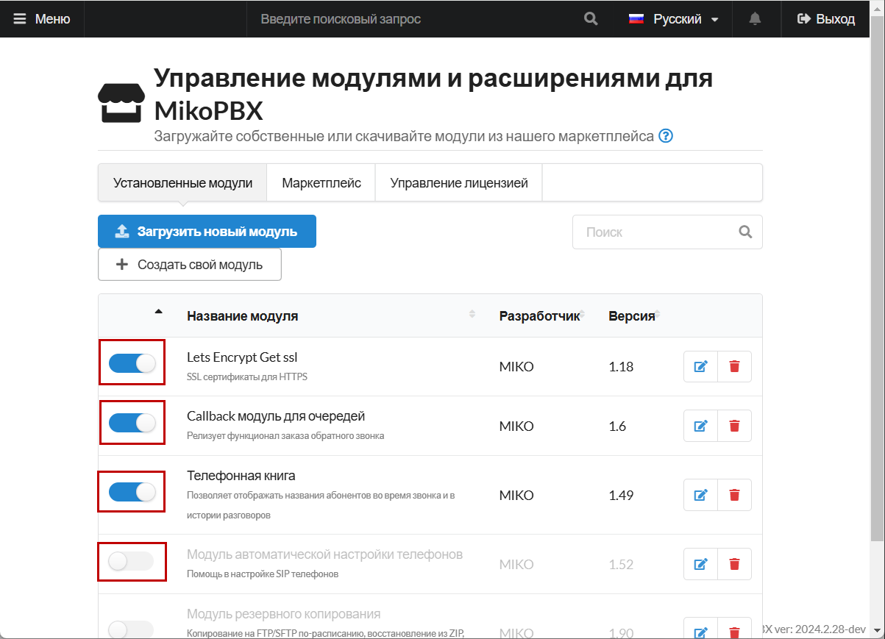
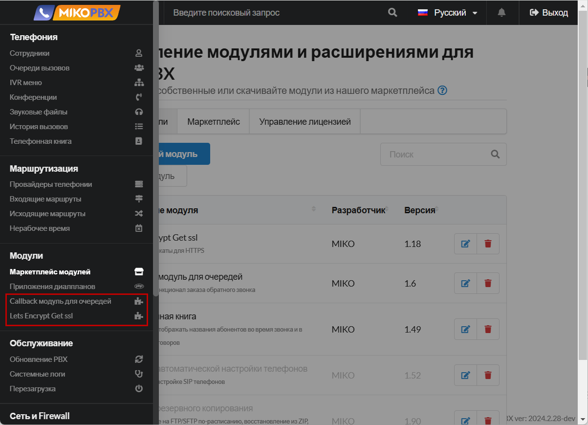

# Управление модулями

Дополнительные модули позволяют расширить возможности функционала основной системы. В данной инструкции вы сможете найти информацию про управление модулями, а так же про установку приложений с помощью встроенного Marketplace.

Найти раздел Управления модулями вы можете в **"Модули"** -> **"Маркетплейс модулей".**

<figure><figcaption>
Раздел "Маркетплейс модулей"
</figcaption></figure>

## Установленные модули

В данном разделе происходит основное управление модулями: их подключение, настройка, а так же загрузка своих, "кастомных" модулей. Документацию по разработке своих модулей вы можете найти [здесь](https://docs.mikopbx.com/mikopbx-development).

Все установленные модули находятся в списке, в одноимённой вкладке:


Если Вы все модули, а так же их актуальные версии, список  в разделе **«Маркетплейс»** будет пустой.


<figure><figcaption>
Все установленные модули
</figcaption></figure>

Есть возможность загрузить свой модуль, используя кнопку **"Загрузить новый модуль"**. Необходимо загружать файлы .zip. После загрузки модуль появится в списке на вкладке "**Установленные модули**"

<figure><figcaption>
Кнопка "Загрузить новый модуль"
</figcaption></figure>

Так же есть возможность перейти в настройки любого модуля для дальнейшей его конфигурации:

<figure><figcaption>
Переход в настройки модуля
</figcaption></figure>

Помимо этого, можно включить/отключить модуль.

<figure><figcaption>
Включение/отключение модуля
</figcaption></figure>

## Быстрый доступ к модулю

Существует возможность вынести любой модуль в боковое меню для быстрого доступа к нему, что может быть полезно, если вам требуется постоянный доступ к настройки модуля для изменения параметров или его состояния.

<figure><figcaption>
Модули в быстром доступе
</figcaption></figure>

Для того, чтобы это сделать - выполните дальнейшую инструкцию:

1. Перейдите в настройки модуля, который Вы хотите вывести в боковое меню, нажав на элемент редактирования справа от версии модуля:

<figure><figcaption>
Переход в настройки модуля
</figcaption></figure>

2. Нажмите на значок настроек справа от статуса состояния модуля для перехода к настройкам отображения модуля в боковом меню:

<figure><figcaption>
Параметры модуля
</figcaption></figure>

3. В данном разделе вы можете:

* Переключить отображение модуля в боковом меню - "**Показывать модуль в боковом меню**".
* Выбрать раздел в котором он будет отображаться - в примере выбран раздел "**Модули**".
* Так же можно указать произвольное название модуля.

После завершения настройки - нажмите "**Сохранить**".

<figure><figcaption>
Параметры отображения модуля в боковом меню
</figcaption></figure>

## Маркетплейс модулей

В данном разделе вы можете установить модули от MIKO, а так же от производителей-партнеров.


Если Вы используете актуальные версии модулей, список **«Макркетплейса»** будет пустой.


<figure><figcaption>
Раздел "Маркетплейс"
</figcaption></figure>

Если у Вас не подключены и не установлены данные модули, то будет доступен раздел **«Маркетплейс»**. Напротив каждого модуля есть кнопка для его скачивания и установки. Так же здесь отображена базовая информация по модулю с коротким описанием каждого модуля. Помимо этого - информация про **Разработчика** и **Версию**.

<figure><figcaption>
Кнопка для установки модуля
</figcaption></figure>

После установки модуль попадает в раздел "**Установленные модули**" и вы можете перейти в его настройки для дальнейшей конфигурации.
