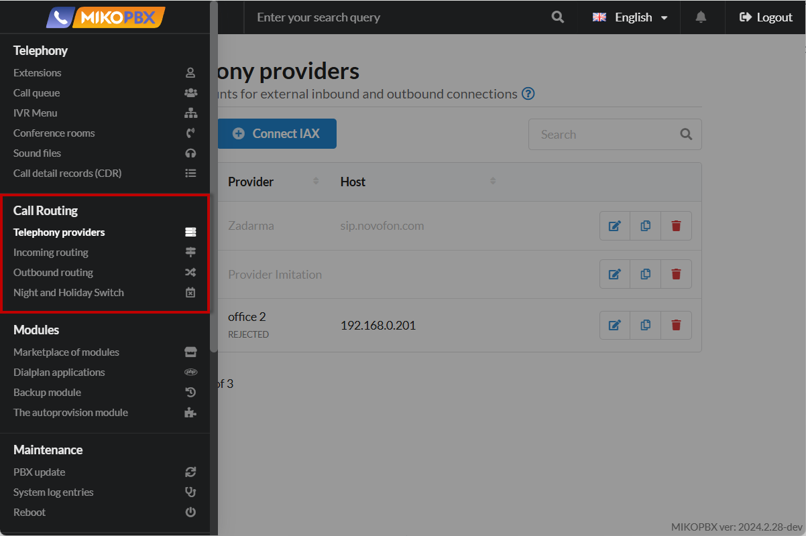

# Call Routing

The "**Call Routing"** section in MikoPBX is an interface for configuring call direction rules within the telephone system. Here, administrators can determine how to handle incoming and outgoing calls by setting conditions and routes for efficient distribution of calls among employees, departments, or external lines.

<figure><figcaption>
"Call Routing" Section MikoPBX
</figcaption></figure>

### Telephony providers


[providers.md](providers.md)


**Telephony providers** in MikoPBX is the system section where connections to external communication operators are configured via internet protocols for IP telephony. Here, administrators can add and configure SIP trunk accounts or other types of connections that allow the system to make and receive calls to and from landline and mobile numbers.

In this article, you will find detailed documentation on connecting providers to the system, their configuration, and features.

***

### Incoming Routes (Incoming Routing)


[incoming-routing.md](incoming-routing.md)


**Incoming Routing** in MikoPBX are a set of rules that define how the system handles incoming calls from external telephony providers. With them, administrators can set call directions based on various conditions such as the caller's number, time of day, or the specific number the call was received on. This enables automatic distribution of incoming calls to specific employees, departments, IVR menus, or call queues. Configuring incoming routes helps optimize call handling and improve customer service quality by providing flexible and efficient management of the company's telephone communications.

In this article, you will find detailed documentation on configuring incoming routing.

***

### Outgoing Routes (Outbound Routing)


[outbound-routing.md](outbound-routing.md)


**Outgoing Routes** in MikoPBX are a set of rules and settings that determine how the system handles outgoing calls from employees to external numbers. With them, administrators can manage call direction through various telephony providers or communication lines based on certain conditions such as the dialed number, prefixes, time of day, or user access rights. This helps optimize communication costs, distribute load between channels, and implement security policies by restricting or allowing certain types of calls. Configuring outgoing routes provides flexibility and control over outgoing telephone communication, contributing to the effective operation of the company's communication system.

In this article, you will find detailed documentation on configuring outgoing routing.

***

### Off-Work Time (Night and Holiday Switch)


[out-off-work-time.md](out-off-work-time.md)


**Off-Work Time** in MikoPBX is a tool for setting up call handling rules during periods when the company is not operating, such as at night, on weekends, or on holidays. With it, administrators can define how the system will handle incoming calls during off-hours: redirect to voicemail, play special voice messages, or forward calls to the mobile numbers of on-call staff. This allows for proper interaction with clients outside of working hours and maintains a high level of service.

In this article, you will find detailed documentation on setting up off-work time for your system.
