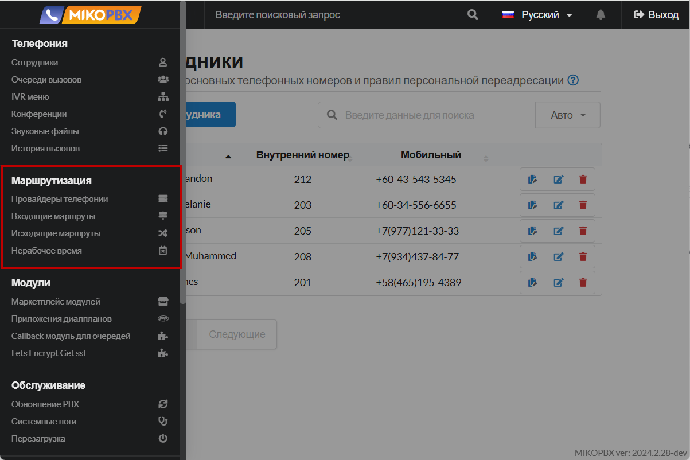

# Маршрутизация

Раздел «Маршрутизация» в MikoPBX — это интерфейс для настройки правил направления вызовов внутри телефонной системы. Здесь администраторы могут определить, как обрабатывать входящие и исходящие звонки, устанавливая условия и маршруты для эффективного распределения звонков между сотрудниками, отделами или внешними линиями.

<figure><figcaption>
Раздел "<strong>Маршрутизация</strong>" в MikoPBX
</figcaption></figure>

### Провайдеры телефонии&#x20;


[providers.md](providers.md)


**Провайдеры телефонии** в MikoPBX — это раздел системы, где настраиваются подключения к внешним операторам связи через интернет-протоколы для IP-телефонии. Здесь администраторы могут добавлять и настраивать учетные записи SIP-транков или других типов соединений, которые позволяют системе совершать и принимать звонки с городских и мобильных номеров.&#x20;

В данной статье Вы найдете подробную документацию по подключению провайдеров к станции, их настройку и особенности.

***

### Входящие маршруты (Входящая маршрутизация)


[incoming-routing.md](incoming-routing.md)


**Входящие маршруты** в MikoPBX — это набор правил, определяющих, как система обрабатывает входящие звонки от внешних провайдеров телефонии. С их помощью администраторы могут настраивать направления вызовов в зависимости от различных условий, таких как номер вызывающего абонента, время суток или конкретный номер, на который поступил звонок. Это позволяет автоматически распределять входящие звонки на определенных сотрудников, отделы, IVR-меню или очереди вызовов. Настройка входящих маршрутов способствует оптимизации обработки вызовов и повышению качества обслуживания клиентов, обеспечивая гибкое и эффективное управление телефонными коммуникациями в компании.

В данной статье Вы найдете подробную документацию по настройке входящей маршрутизации.

***

### Исходящие маршруты (Исходящая маршрутизация)


[outbound-routing.md](outbound-routing.md)


**Исходящие маршруты** в MikoPBX — это набор правил и настроек, определяющих, как система обрабатывает исходящие звонки от сотрудников к внешним номерам. С их помощью администраторы могут управлять направлением вызовов через различные провайдеры телефонии или линии связи в зависимости от определенных условий, таких как набранный номер, префиксы, время суток или права доступа пользователя. Это позволяет оптимизировать затраты на связь, распределять нагрузку между каналами и применять политики безопасности, ограничивая или разрешая определенные типы вызовов. Настройка исходящих маршрутов обеспечивает гибкость и контроль над исходящей телефонной связью, способствуя эффективной работе коммуникационной системы компании.

В данной статье Вы найдете подробную документацию по настройке исходящей маршрутизации.

***

### Нерабочее время


[out-off-work-time.md](out-off-work-time.md)


**Нерабочее время** в MikoPBX — это инструмент для настройки правил обработки вызовов в периоды, когда компания не работает, например, ночью, в выходные или праздничные дни. С его помощью администраторы могут определить, как система будет обрабатывать входящие звонки в нерабочие часы: перенаправлять на автоответчик, воспроизводить специальные голосовые сообщения или переадресовывать вызовы на мобильные номера дежурных сотрудников. Это позволяет обеспечить корректное взаимодействие с клиентами вне рабочего времени и поддерживать высокий уровень обслуживания.

В данной статье Вы найдете подробную документацию по настройке нерабочего времени для Вашей станции.
