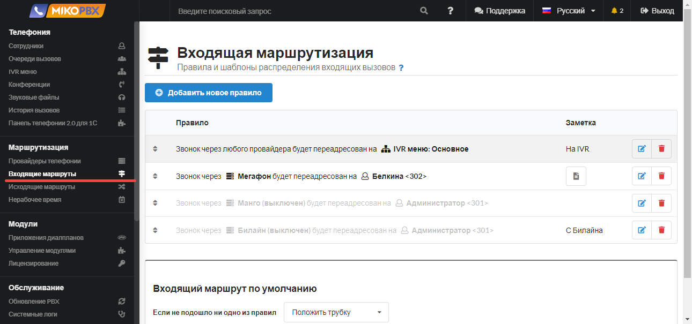
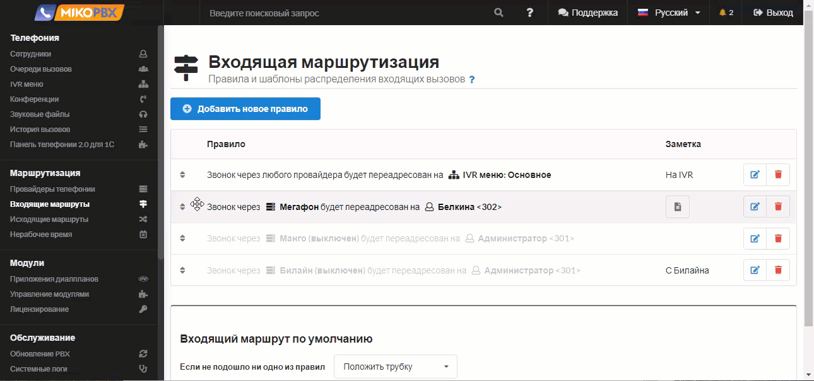
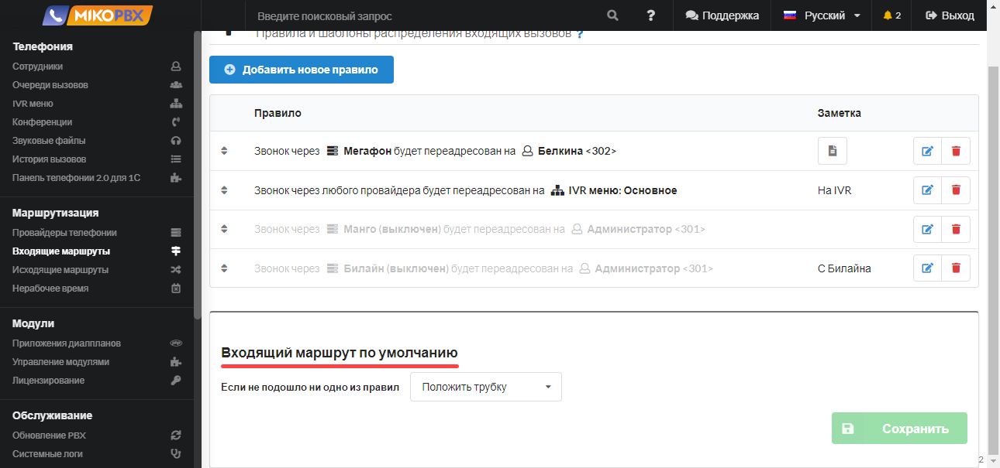
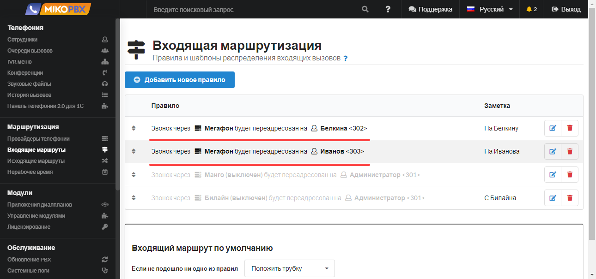
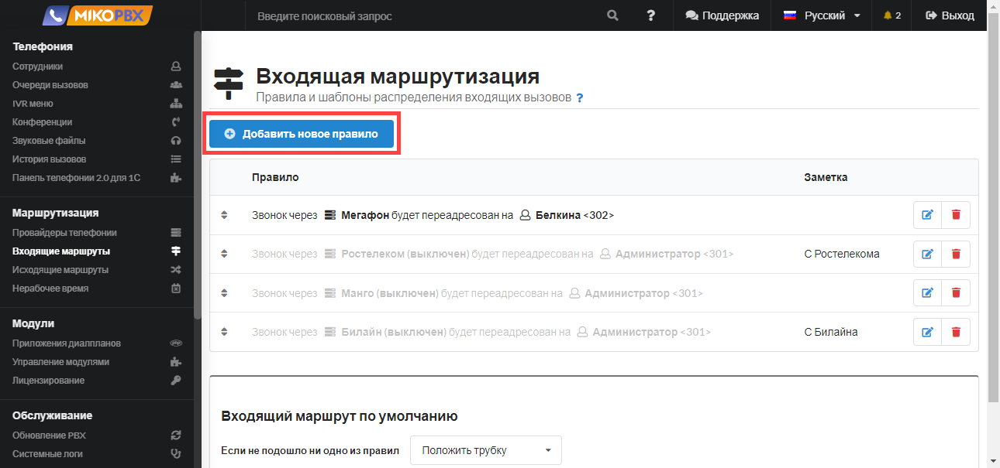
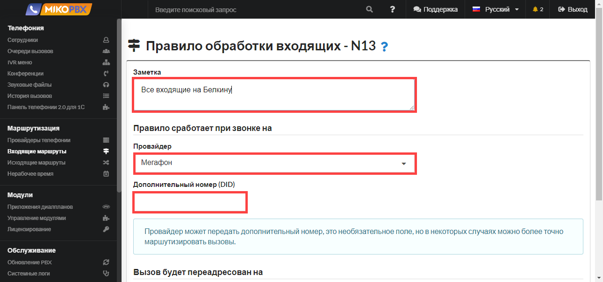
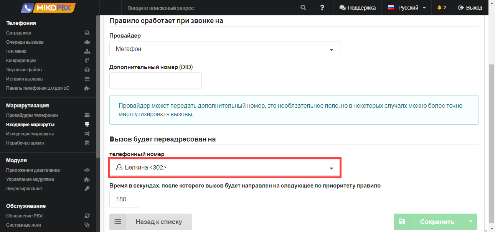

# Входящие маршруты

В данном разделе необходимо создать правила и шаблоны распределения входящих звонков для созданных в MikoPBX провайдеров. Правила входящих звонков описывают маршрут звонка с момента его поступления в АТС до момента его завершения. Вы можете создавать неограниченное количество правил входящей маршрутизации. Для одного провайдера можно создать несколько правил.

<figure><figcaption>
Раздел "<strong>Входящие маршруты</strong>" в MikoPBX
</figcaption></figure>


Дополнительные примеры настройки входящей маршрутизации доступны в [разделе FAQ](../../faq/incoming-routing/).


## Приоритет правил маршрутизации и маршрут по умолчанию

Правила располагаются в списке в порядке их приоритета. Если за указанный в правиле интервал времени никто не ответит на входящий вызов, то вызов направится на следующее по приоритету правило. Правила можно перемещать в списке вверх-вниз, то есть изменять их приоритет, перетаскивая их за стрелки.

<figure><figcaption>
Настройка приоритета правил маршрутизации
</figcaption></figure>

Если ни по одному из правил на звонок не ответили, применяется **входящий маршрут по умолчанию**.

<figure><figcaption>
Маршрут по умолчанию
</figcaption></figure>

Доступны следующие действия, которые можно указать в качестве правила по умолчанию:

* **Воспроизвести сигнал занято** - клиент будет воспроизведен сигнал занято и входящий вызов будет завершен;
* **Положить трубку;**
* **Перевести вызов** - вызов можно перевести на номер, который вы можете выбрать в поле, расположенном справа от действия. В качестве номера для перевода можно выбрать IVR-меню, очередь вызовов, конференцию, внутренний номер сотрудника.

## Несколько маршрутов для одного провайдера

Для **одного** провайдера можно описать **несколько** входящих маршрутов.

Сперва вызов идет по верхнему маршруту. Если клиент не дозвонился, то вызов идет по нижнему правилу (более низкий приоритет). Если клиент не дозвонился и по второму маршруту, то вызов идет по **маршруту по умолчанию**.

<figure><figcaption>
Несколько маршрутов для одного провайдера
</figcaption></figure>

## Создание правила маршрутизации

Чтобы добавить новое правило входящей маршрутизации нажмите на кнопку **Добавить новое правило**.

<figure><figcaption>
Элемент "<strong>Добавить новое правило</strong>"
</figcaption></figure>

В поле **Заметка** опишите маршрут, который хотите реализовать. В дальнейшем это поможет вам в отладке схемы звонка.

Выберите **Провайдера**, для которого создаете новый шаблон распределения входящих звонков.

**Дополнительный номер DID** - это номер, на который вам позвонил клиент. Это не обязательное поле и его следует заполнять, если необходимо более точно маршрутизировать вызовы.&#x20;

<figure><figcaption>
Параметры обработки входящих
</figcaption></figure>

На следующем шаге необходимо указать на какой **телефонный номер** будет направлен входящий вызов от клиента. В качестве телефонного номера могут выступать номера IVR-меню, очереди вызовов, конференции, внутренние номера сотрудников.&#x20;

<figure><figcaption>
Переадресация вызова
</figcaption></figure>

Укажите время, в течение которого вызов будет идти на указанный вами телефонный номер.

<figure><figcaption>
Время в секундах, после которого вызов будет направлен на следующее правило
</figcaption></figure>

Если спустя указанный интервал времени никто не ответит на входящий вызов, то вызов направится на следующее по приоритету правило.
