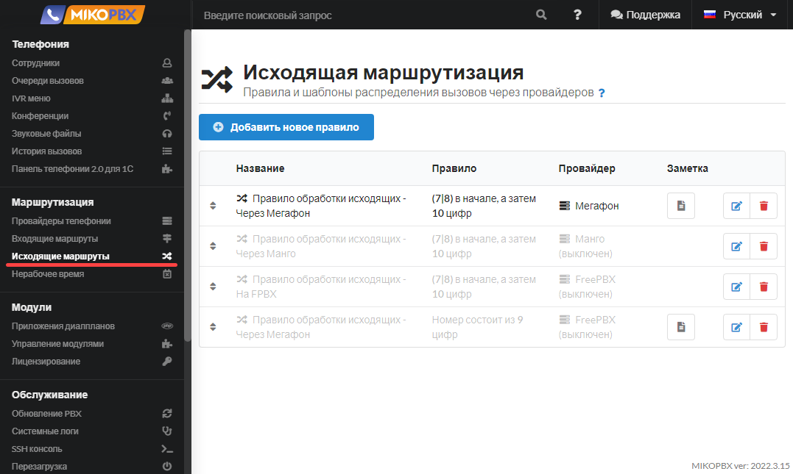
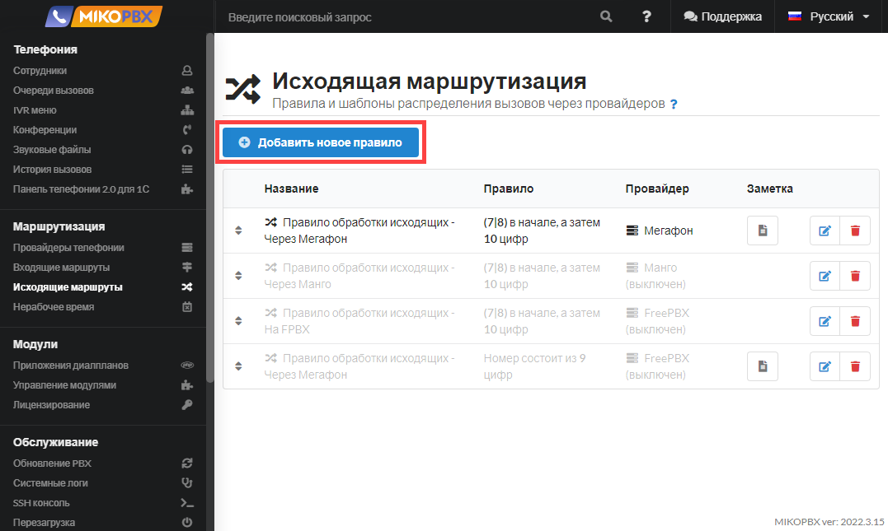
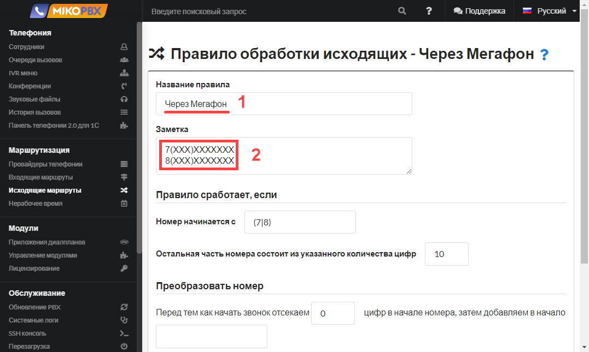
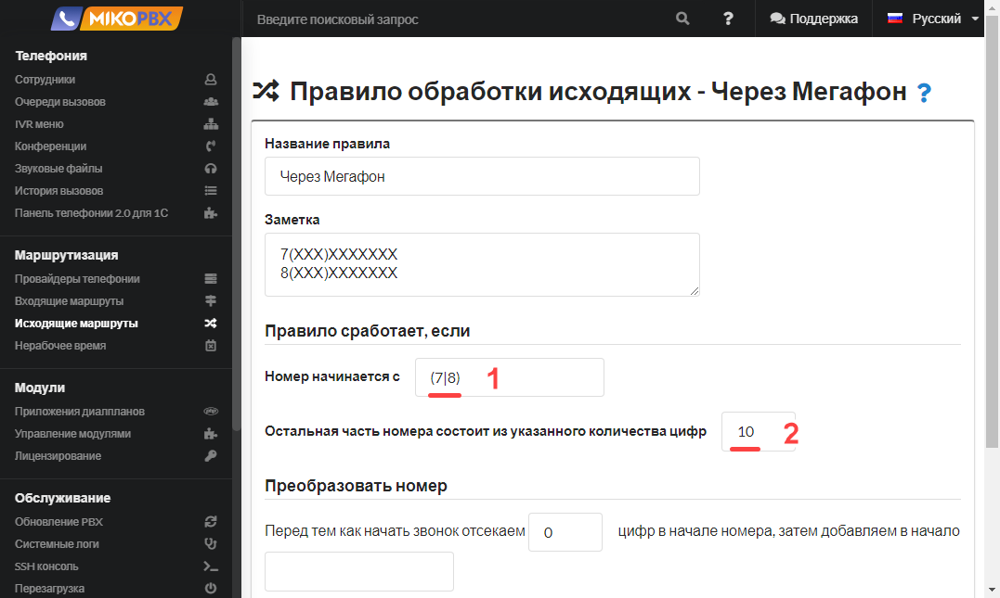
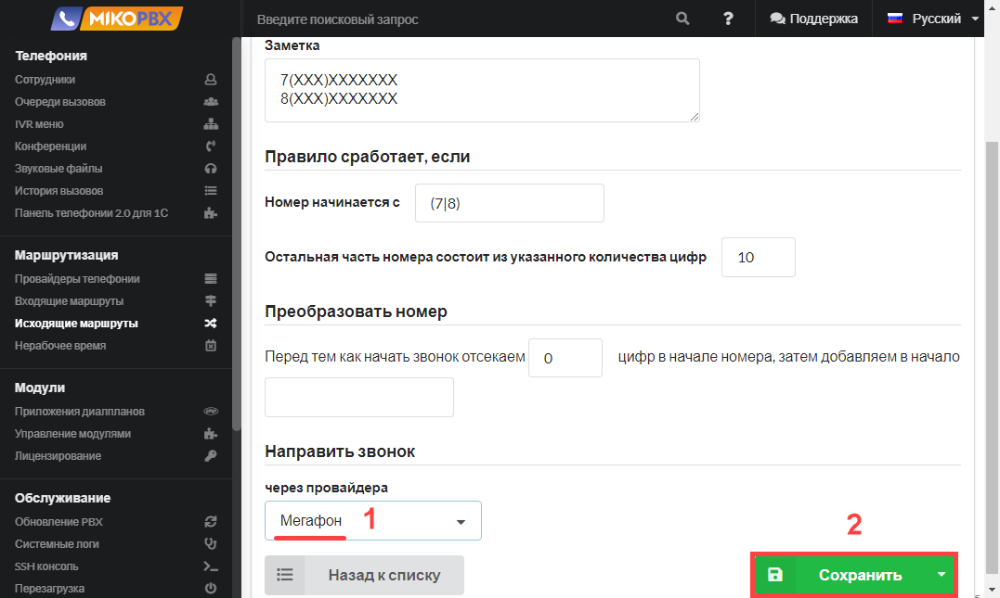
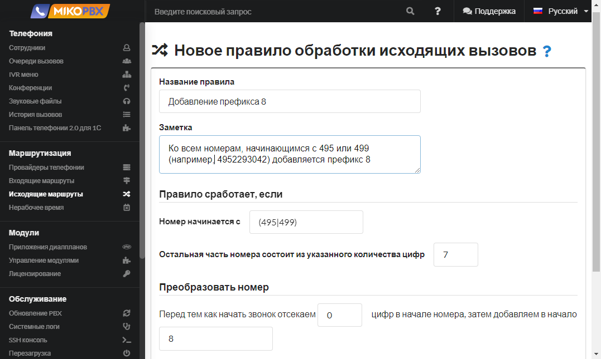
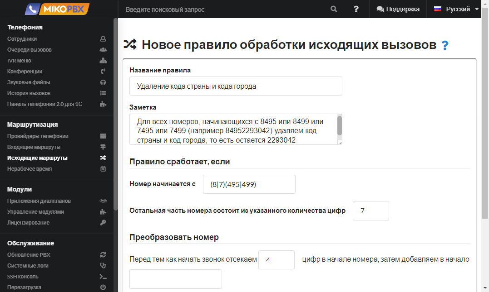

# Исходящие маршруты

Исходящие маршруты в MikoPBX — это набор правил и настроек, определяющих, как система обрабатывает исходящие звонки от сотрудников к внешним номерам. С их помощью администраторы могут управлять направлением вызовов через различные провайдеры телефонии или линии связи в зависимости от определенных условий, таких как набранный номер, префиксы, время суток или права доступа пользователя. Это позволяет оптимизировать затраты на связь, распределять нагрузку между каналами и применять политики безопасности, ограничивая или разрешая определенные типы вызовов. Настройка исходящих маршрутов обеспечивает гибкость и контроль над исходящей телефонной связью, способствуя эффективной работе коммуникационной системы компании.

В данной статье Вы найдете подробную документацию по настройке исходящей маршрутизации.

Вы можете создавать неограниченное количество правил исходящей маршрутизации. Для одного провайдера можно создать **несколько** правил.

<figure><figcaption>
Раздел "Исходящие маршруты" в MikoPBX
</figcaption></figure>

## Создание правила


Дополнительные примеры настройки исходящей маршрутизации доступны в разделе FAQ.


### Шаг 1. Добавление нового правила

Чтобы добавить новое правило исходящей маршрутизации нажмите на кнопку **Добавить новое правило.**

<figure><figcaption>
Элемент для добавления нового правила исходящей маршрутизации 
</figcaption></figure>

### Шаг 2. Название и заметка

Название правила можно задавать произвольным.&#x20;

В заметке можно описать маршрут звонка, который хотите реализовать, в дальнейшем это может помочь вам в отладке.

<figure><figcaption>
Названия правила и заметка
</figcaption></figure>

### Шаг 3. Задание шаблона номеров

Задайте шаблон для исходящих звонков. Подробнее про шаблоны номеров [в следующем параграфе](outbound-routing.md#primery-shablonov-nomerov).

<figure><figcaption>
Указания шаблона номеров, попадающих под правило
</figcaption></figure>

Приведенный на картинке выше пример означает следующее: если  набранный номер начинается с "**7" или "8",** и остальная часть номера состоит **10 цифр**.


Если набираемый номер подходит под правила нескольких маршрутов, то вызов будет производится в порядке описания маршрутов, поочередно, пока вызов не будет отвечен, или пока подходящие маршруты не закончатся.


### Шаг 4. Преобразование номера

Преобразовать номер - данная настройка предназначена для удаления префикса номера и замены его на нужный префикс.&#x20;


Примеры преобразования номеров приведены [в следующем параграфе](outbound-routing.md#primery-izmeneniya-prefiksov-nomerov), а так же [в разделе FAQ](../../faq/outbound-routing/number-templates/).


<figure><figcaption>
Настройки преобразования номера
</figcaption></figure>

В приведенном примере в начале номера **не отсекаются цифры и не добавляются цифры**.

### Шаг 5. Выбор провайдера

Выберите из списка провайдера, для которого настроили исходящую маршрутизацию и сохраните изменения.

<figure><figcaption>
Выбор провайдера для правила
</figcaption></figure>

## Примеры&#x20;

### Примеры шаблонов номеров

| Номер начинается с | Остальная часть номера состоит из указанного количества цифр | Примеры номеров                                                       |
| ------------------ | ------------------------------------------------------------ | --------------------------------------------------------------------- |
| \[7-8]{1}          | 10                                                           | 79257184255, 84952293042                                              |
| 7925               | оставьте поле пустым                                         | 79257184255, 7925, 7925718…                                           |
| 7ХХ                | 0                                                            | 700, 701, 702…                                                        |
| 74952293042        | 0                                                            | 74952293042                                                           |
| 74(95\|99)         | 7                                                            | 74952293042, 74996382584…                                             |
| (7\|8)0{1}         | 1                                                            | 700, 701, 802, 803…                                                   |
| (25\|26)           | 0                                                            | 25, 26                                                                |
| \[0-9]{1}          | 0                                                            | цифра от 0 до 9-ти, вхождение один раз                                |
| \[1-5]{2}          | 0                                                            | 12, 15, 14, 25 цифра от 1 до 5-ти, вхождение два раза                 |
| \[8-9]+            | 0                                                            | 8899, 888, 988888 цифра от 8 до 9-ти, вхождение от одного и более раз |

### Примеры изменения префиксов номеров

#### Пример 1. Необходимо **заменить** префиксы номеров "**+7"** на "**8"**.&#x20;

Например, номер **+7**4952293042 должен быть преобразован к номеру **8**4952293042.

Реализация правила выглядит следующим образом:

<figure><figcaption>
Шаблон для замены +7 -> 8
</figcaption></figure>

#### Пример 2. Необходимо **заменить** префиксы номеров "**8", "7"** на "**+7"**.&#x20;

Например, номера **8**4952293042 и **7**4952293042 должны быть преобразованы к номеру **+7**4952293042.&#x20;

Реализация правила выглядит следующим образом:

<figure><figcaption>
Шаблон для замены 7,8 -> +7
</figcaption></figure>

#### Пример 3. Необходимо **добавить** префикс "8" к номеру.

Например, номера 4952293042 и 4996382584 должны быть преобразованы к номеру **8**4952293042 и **8**4996382584 соответственно.&#x20;

Реализация правила выглядит следующим образом:

<figure><figcaption>
Шаблон для преобразования номера
</figcaption></figure>

#### Пример 4. Необходимо **удалить** код города "8495" или "7495", или "8499", или "7499" и оставлять 7-значный номер.&#x20;

Например, номера 84952293042 и 74996382584 должны быть преобразованы к номеру 2293042 и 6382584 соответственно.

Реализация правила выглядит следующим образом:

<figure><figcaption>
Шаблон для преобразования номера
</figcaption></figure>
