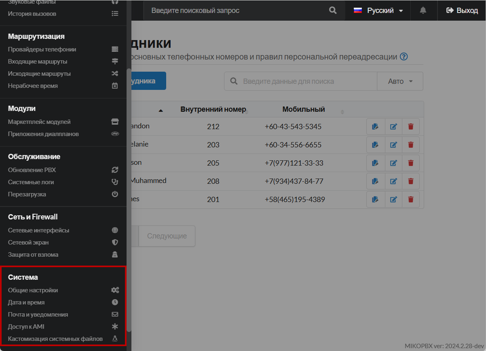

# Система

Раздел **«Система»** в MikoPBX — это интерфейс для управления общими настройками и параметрами телефонной системы. Здесь администраторы могут настраивать основные системные параметры, управлять обновлениями, датой и другими функциями, обеспечивающими стабильную и безопасную работу MikoPBX. Этот раздел позволяет контролировать и оптимизировать работу системы на уровне всей инфраструктуры.

<figure><figcaption>
Раздел "Система" в MikoPBX
</figcaption></figure>

### Общие настройки


[general-settings.md](general-settings.md)


В разделе **«Общие настройки»** в MikoPBX администраторы могут управлять основными параметрами системы, такими как настройки срока хранения записей разговоров, уведомления, параметры журналов, язык звуковых оповещений и многими другими системными опциями. Этот раздел обеспечивает контроль над общими функциями и поведением MikoPBX, позволяя оптимизировать работу системы под потребности организации.

***

### Дата и время


[time-settings.md](time-settings.md)


Раздел **«Дата и время»** в MikoPBX — это интерфейс для настройки системных параметров даты и времени. Здесь администраторы могут установить текущую дату и время, выбрать часовой пояс и настроить синхронизацию с серверами точного времени (NTP). Корректная настройка даты и времени важна для точной регистрации событий, журналов вызовов и работы функций, зависящих от расписания, обеспечивая синхронизацию системы с другими сетевыми устройствами и сервисами.

***

### Почта и уведомления


[mail-settings](mail-settings/)


Раздел **«Почта и уведомления»** в MikoPBX позволяет настроить отправку системных уведомлений через электронную почту. Здесь администраторы указывают параметры SMTP-сервера, определяют события для уведомлений, такие как голосовые сообщения или системные ошибки, и редактируют шаблоны писем. Этот раздел помогает своевременно информировать пользователей и администраторов о важных событиях, обеспечивая эффективный контроль за работой системы.

***

### Доступ к AMI


[asterisk-managers.md](asterisk-managers.md)


Раздел **«Доступ к AMI»** в MikoPBX — это интерфейс для настройки доступа к Asterisk Manager Interface (AMI). Здесь администраторы могут управлять параметрами подключения к AMI, такими как включение или отключение доступа, указание логинов и паролей для аутентификации. Настройка доступа к AMI позволяет внешним приложениям или скриптам взаимодействовать с системой MikoPBX для мониторинга и управления звонками, расширяя функциональные возможности телефонной системы.

***

### Кастомизация системных файлов


[custom-files.md](custom-files.md)


Раздел **«Кастомизация системных файлов»** в MikoPBX предоставляет администраторам возможность напрямую изменять или дополнять стандартные конфигурационные файлы системы. Здесь вы можете внести индивидуальные настройки, которые не доступны через стандартный веб-интерфейс, и адаптировать поведение системы под специфические требования вашей организации.

Этот раздел предназначен для продвинутых пользователей, которые обладают глубоким пониманием структуры и работы MikoPBX. С его помощью можно:

* **Редактировать конфигурационные файлы**: вносить изменения в существующие файлы или добавлять новые параметры.
* **Переопределять стандартные настройки**: изменять значения по умолчанию для определенных функций или модулей.
* **Добавлять собственные скрипты или модули**: расширять функциональность системы путем интеграции пользовательских решений.

Важно отметить, что неправильное изменение системных файлов может привести к нестабильной работе или сбоям системы. Поэтому рекомендуется создавать резервные копии перед внесением изменений и тщательно проверять корректность настроек.
