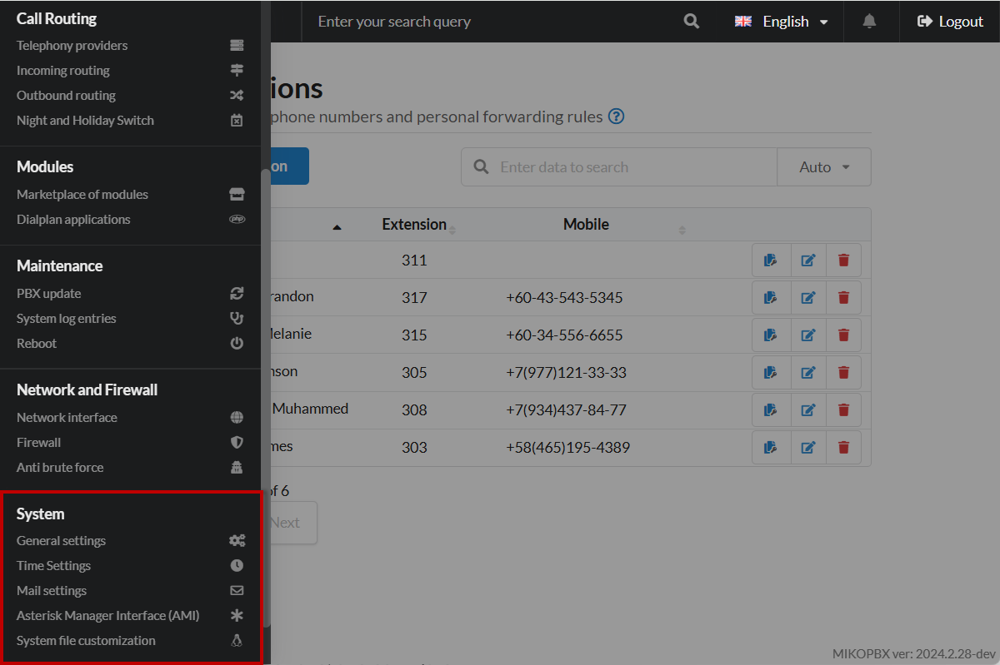

# System

The **"System"** section in MikoPBX is the interface for managing general settings and parameters of the telephone system. Here, administrators can configure core system parameters, manage updates, date, and other functions that ensure stable and secure operation of MikoPBX. This section allows you to control and optimize the system's operation at the entire infrastructure level.

<figure><figcaption>
"System" section in the MikoPBX system
</figcaption></figure>

## General settings


[general-settings.md](general-settings.md)


In the **"General settings"** section of MikoPBX, administrators can manage the main system parameters, such as call recording retention settings, notifications, log parameters, voice prompt language, and many other system options. This section provides control over general functions and behavior of MikoPBX, allowing you to optimize the system's operation according to the organization's needs.

***

## Time Settings


[time-settings.md](time-settings.md)


The **"Time Settings"** section in MikoPBX is an interface for configuring system date and time parameters. Here, administrators can set the current date and time, choose a time zone, and configure synchronization with Network Time Protocol (NTP) servers. Correct date and time settings are important for accurate event logging, call logs, and the operation of schedule-dependent functions, ensuring system synchronization with other network devices and services.

***

## Mail settings


[mail-settings](mail-settings/)


The **"Mail settings"** section in MikoPBX allows you to configure sending system notifications via email. Here, administrators specify SMTP server parameters, define events for notifications, such as voice messages or system errors, and edit email templates. This section helps to timely inform users and administrators about important events, ensuring effective control over the system's operation.

***

## Asterisk Manager Inteface (AMI)


[asterisk-managers.md](asterisk-managers.md)


The **"Asterisk Manager Inteface (AMI)"** section in MikoPBX is an interface for configuring access to the Asterisk Manager Interface (AMI). Here, administrators can manage AMI connection parameters, such as enabling or disabling access, specifying login credentials for authentication. Configuring AMI access allows external applications or scripts to interact with the MikoPBX system for monitoring and managing calls, expanding the telephone system's functional capabilities.

***

## System files customization


[custom-files.md](custom-files.md)


The **"System files customization"** section in MikoPBX provides administrators with the ability to directly modify or supplement the system's standard configuration files. Here, you can make individual settings that are not available through the standard web interface and adapt the system's behavior to the specific requirements of your organization.

This section is intended for advanced users who have a deep understanding of the structure and operation of MikoPBX. With its help, you can:

* **Edit configuration files**: Make changes to existing files or add new parameters.
* **Override standard settings**: Change default values for certain functions or modules.
* **Add your own scripts or modules**: Expand the system's functionality by integrating custom solutions.

It is important to note that incorrect modification of system files can lead to unstable operation or system failures. Therefore, it is recommended to create backups before making changes and to carefully check the correctness of the settings.
