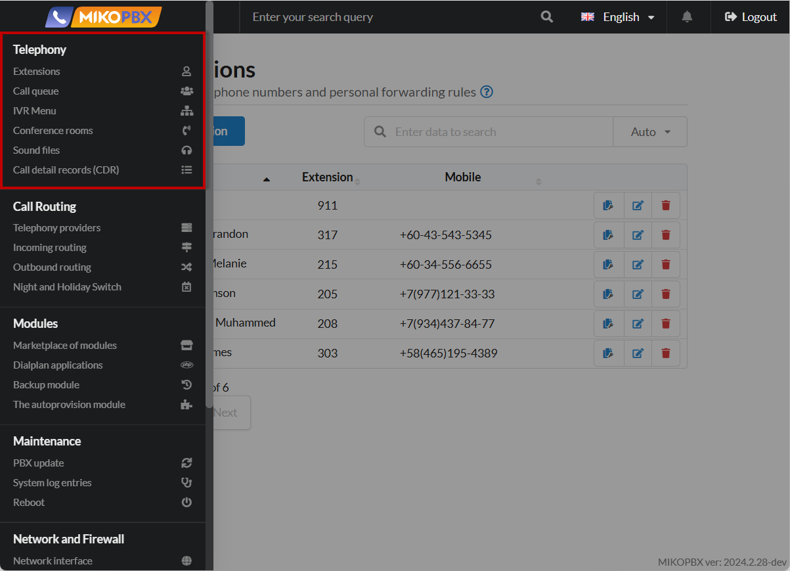

# Telephony

The "**Telephony**" chapter in the MikoPBX documentation contains detailed information and instructions related to setting up and using telephony in the system.

<figure><figcaption>
"Telephony" Section MikoPBX
</figcaption></figure>

## Extensions


[extensions.md](extensions.md)


**Extensions** in MikoPBX are individual users of the system who are assigned internal numbers for making and receiving calls. They have personal accounts that allow you to configure access rights, call forwarding and other personal settings in the system.

In this article, you will find detailed documentation on adding new employees to the station, setting up their rights and profiles. In addition, information about their additional parameters.

***

## Call queues&#x20;


[call-queues.md](call-queues.md)


**Call queues** in MikoPBX are a feature that allows you to distribute incoming calls between a group of operators, holding calls in a queue until an operator becomes available. This ensures efficient management of a large call flow and improves customer service.

In this article, you will find detailed documentation on creating and configuring such queues.

***

## IVR Menu


[ivr-menu.md](ivr-menu.md)


**IVR menu** in MikoPBX is an interactive voice menu that allows callers to interact with the phone system by pressing keys or using voice commands. It automatically routes calls to the right departments or employees, improving call handling efficiency and customer service.

In this article, you will find documentation on creating and configuring an IVR menu.

***

## Conferences&#x20;


[conference-rooms.md](conference-rooms.md)


**Conferences** in MikoPBX are a feature that allows you to organize group phone calls with multiple participants at the same time. It allows you to hold group discussions, meetings and appointments over the phone, improving communication both within the company and with external partners.

In this article, you will find documentation on creating and configuring conference rooms.

***

## Sound files


[sound-files.md](sound-files.md)


**Sound files** in MikoPBX are audio recordings that are used by the system to play various messages, such as greetings, announcements, IVR menu instructions or waiting signals. They allow you to personalize the audio content that callers hear, improving interaction with the system and providing the necessary information.

In this article, you will find detailed information about them, as well as how to add and edit them.

***

## Call detail records (CDR)


[call-detail-records.md](call-detail-records.md)


**Call detail records** in MikoPBX is a log that stores information about all incoming and outgoing calls through the system. It provides detailed data about each call, including time, duration, participant numbers and status, which allows you to analyze communications and optimize the operation of the company's telephone network. In this article, you will find information about storing call records and their filters.
