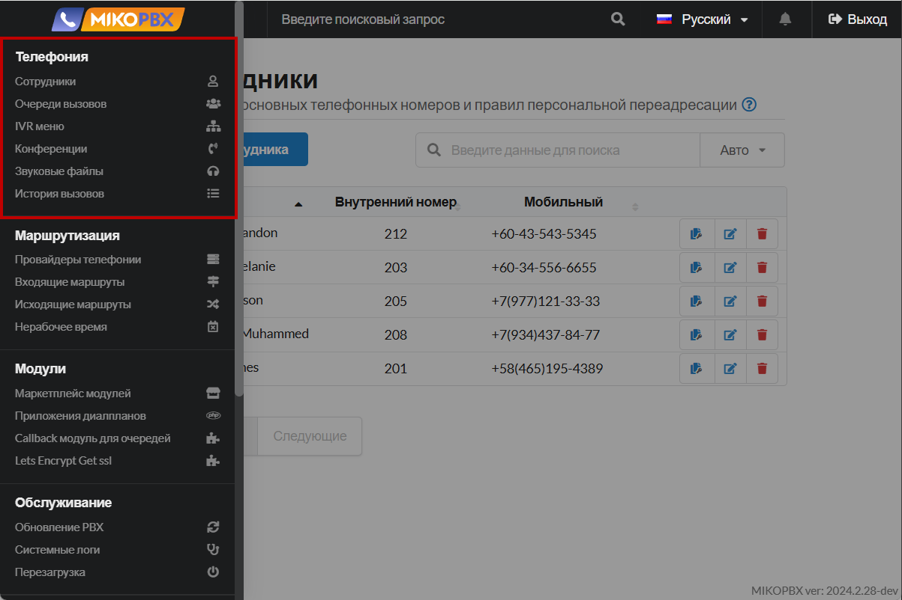

# Телефония

Глава **"Телефония"** в документации MikoPBX содержит подробную информацию и инструкции, связанные с настройкой и использованием телефонии в системе.

<figure><figcaption>
Раздел "<strong>Телефония</strong>" в MikoPBX
</figcaption></figure>

### Сотрудники


[extensions.md](extensions.md)


Сотрудники в MikoPBX — это индивидуальные пользователи системы, которым назначены внутренние номера для совершения и приема звонков. Они имеют персональные учетные записи, позволяющие настроить права доступа, переадресацию вызовов и другие персональные настройки в системе.

В данной статье Вы найдете подробную документацию по добавлению новых сотрудников в станцию, настройку их прав и профилей. Помимо этого, информацию про их дополнительные параметры.

***

### Очереди вызовов


[call-queues.md](call-queues.md)


Очереди вызовов в MikoPBX — это функция, позволяющая распределять входящие звонки между группой операторов, удерживая вызовы в очереди до момента, когда оператор станет доступен. Это обеспечивает эффективное управление большим потоком звонков и улучшает качество обслуживания клиентов.

&#x20;В данной статье Вы найдете подробную документацию по созданию и настройке таких очередей.

***

### IVR меню


[ivr-menu.md](ivr-menu.md)


IVR меню в MikoPBX — это интерактивное голосовое меню, которое позволяет звонящим взаимодействовать с телефонной системой с помощью нажатия клавиш или голосовых команд. Оно автоматически направляет вызовы к нужным отделам или сотрудникам, улучшая эффективность обработки звонков и повышая качество обслуживания клиентов.&#x20;

В данной статье вы найдете документацию по созданию и настройке IVR меню.

***

### Конференции&#x20;


[conference-rooms.md](conference-rooms.md)


Конференции в MikoPBX — это функция, позволяющая организовывать групповые телефонные звонки с участием нескольких абонентов одновременно. Она позволяет проводить коллективные обсуждения, совещания и встречи по телефону, улучшая коммуникацию как внутри компании, так и с внешними партнерами.

В данной статье вы найдете документацию по созданию и настройке комнат конференций.

***

### Звуковые файлы&#x20;


[sound-files.md](sound-files.md)


Звуковые файлы в MikoPBX — это аудиозаписи, которые используются системой для воспроизведения различных сообщений, таких как приветствия, объявления, инструкции в IVR-меню или сигналы ожидания. Они позволяют персонализировать аудиоконтент, который слышат звонящие, улучшая взаимодействие с системой и предоставляя необходимую информацию.

В данной статье вы найдете подробную информацию про них, а так же способы добавления и их редактирования.

***

### История вызовов


[call-detail-records.md](call-detail-records.md)


История вызовов в MikoPBX — это журнал, который сохраняет информацию о всех входящих и исходящих звонках через систему. Она предоставляет детальные данные о каждом вызове, включая время, длительность, номера участников и статус, что позволяет анализировать коммуникации и оптимизировать работу телефонной сети компании.\
В данной статье Вы найдете информацию про хранение записей разговоров и их фильтров.
