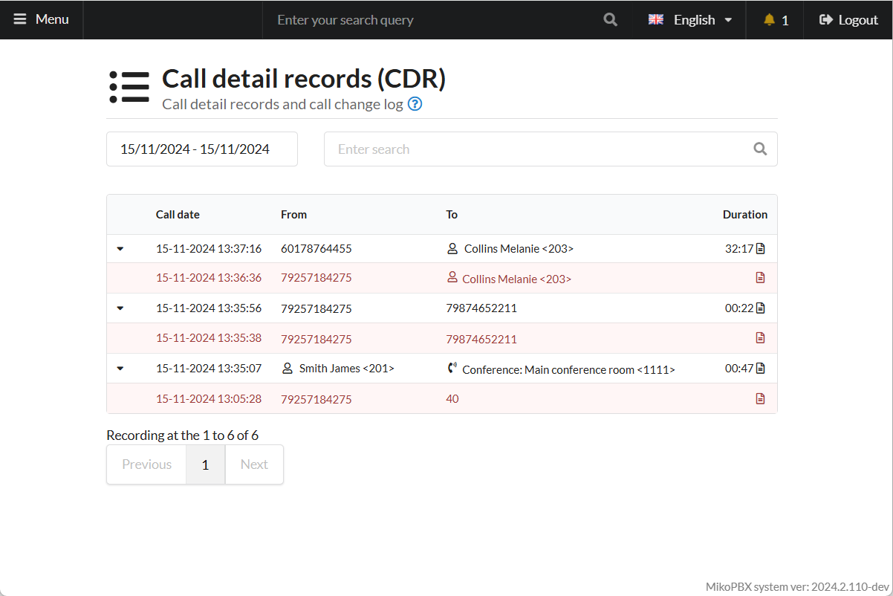
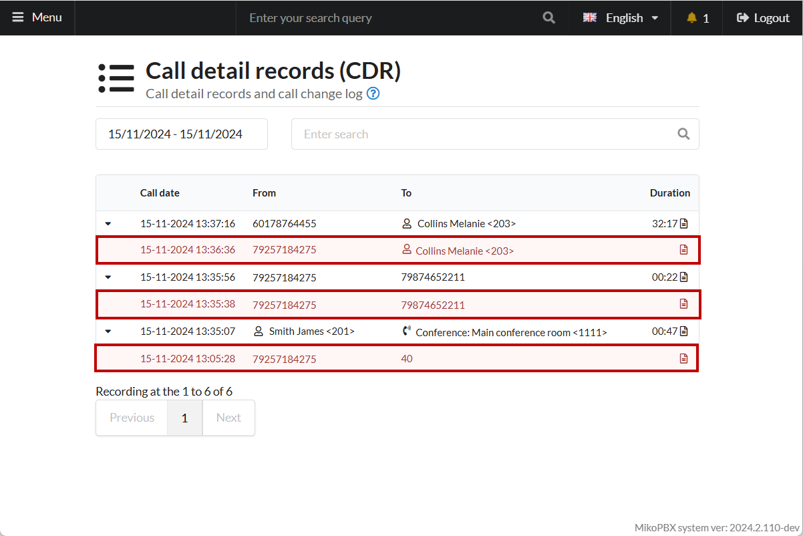
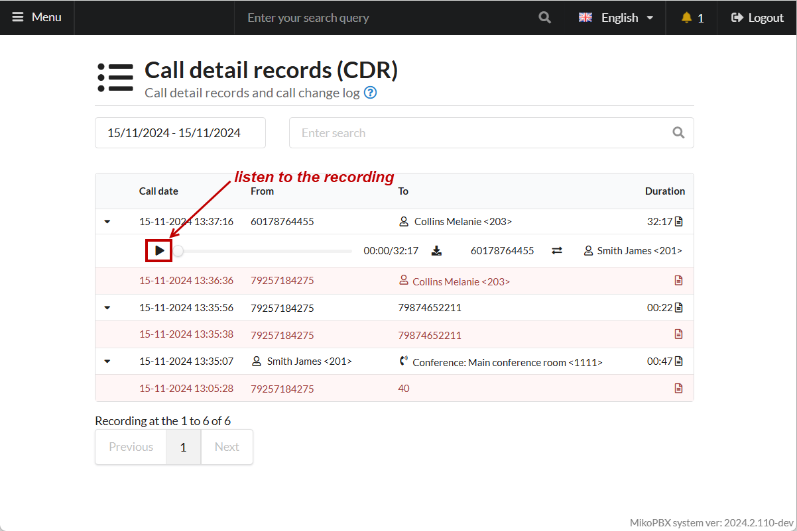
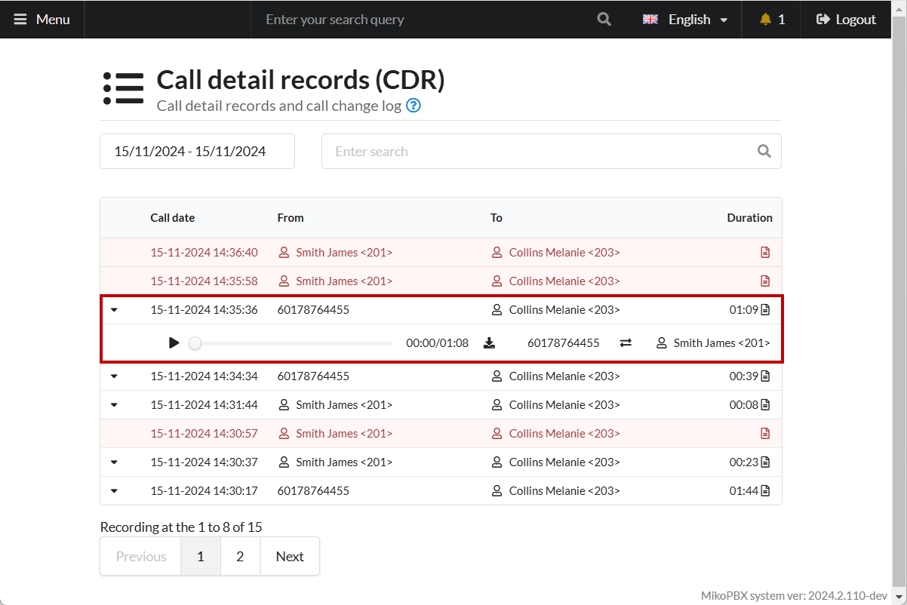
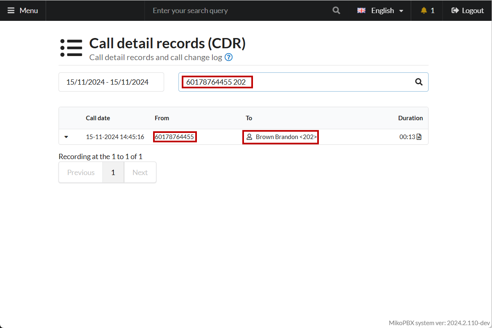
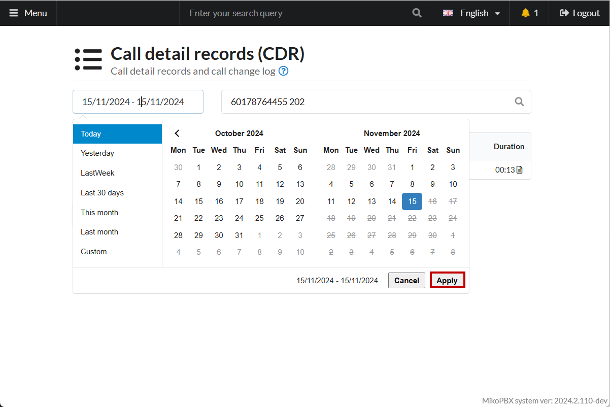

# Call detail records (CDR)

**Call History** provides a log of all incoming, outgoing, and internal calls. It is located under "**Telephony" -> "Call History"**.

<figure><figcaption>
Call detail records (CDR)
</figcaption></figure>

## Benefits

The Call History feature in MikoPBX enables users to:

* Display **all** calls;
* Filter calls **based on criteria**;
* Visually identify **missed calls** from the call log;
* Download or listen to call recordings.

Each entry in the call log contains information about:

* The caller’s phone number (**Who**);
* The recipient’s phone number (**To Whom**);
* The date and time of the call (**Call Date**);
* The duration of the call (**Duration**) – this excludes time spent on greetings or announcements.

Calls marked in <mark style="color:red;">red</mark> are **missed calls**. Their duration is logged as zero, and these calls cannot be played back:

<figure><figcaption>
Missed calls
</figcaption></figure>

For answered calls, users can listen to or download the recording. Call recordings are downloaded locally to your PC in **.mp3** format.

<figure><figcaption>
Listen to the recording function
</figcaption></figure>

Each call log entry provides detailed information about the participants involved.

<figure><figcaption>
Detailed information
</figcaption></figure>

## Filters


To apply a filter, press **Enter** after entering the search criteria.


The search bar in the Call History page supports the following filters:

1. **Phone Number** Filter

You can search using either an internal staff number or an external client number.

<figure><figcaption>
Filter by Phone number
</figcaption></figure>

2. **Two Phone Numbers** Filter

Enter two phone numbers separated by a space. For example, entering "74952293042 302" will display all **answered** calls between these numbers. Answered calls are those with a duration greater than **0** seconds, excluding greeting time.

<figure><figcaption>
Filter by 2 numbers
</figcaption></figure>

3. **Date** Filter

When opening the Call History, the log defaults to the current date. To filter for a specific period, select the date range and click **Apply**.

<figure><figcaption>
Filter by date
</figcaption></figure>
