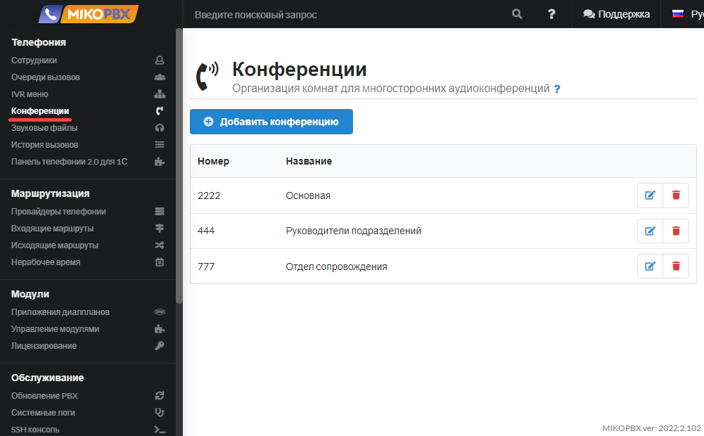
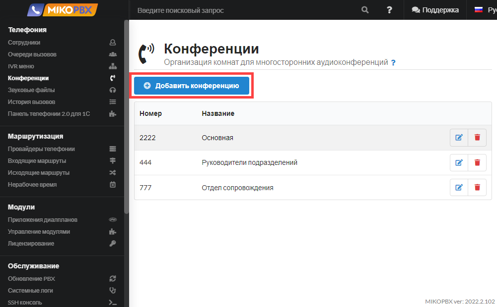
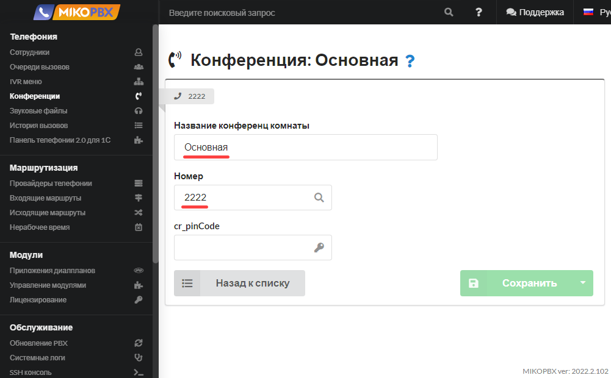
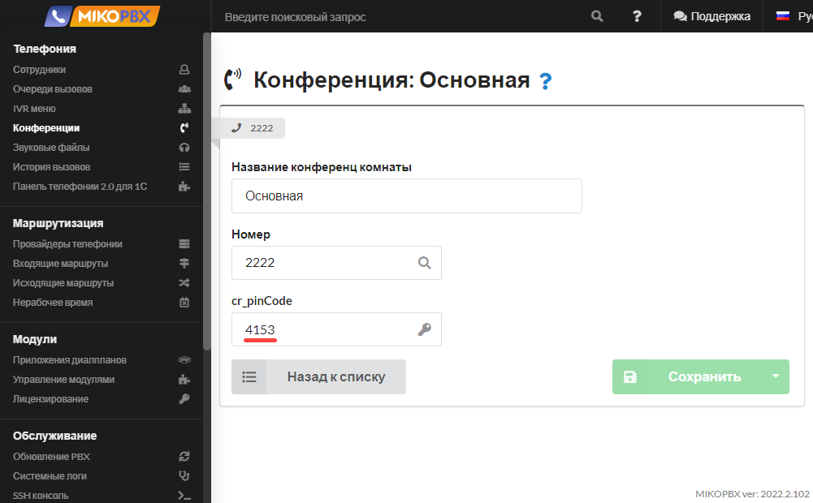

# Конференции

Конференции в MikoPBX — это функция, позволяющая организовывать групповые телефонные звонки с участием нескольких абонентов одновременно. Она позволяет проводить коллективные обсуждения, совещания и встречи по телефону, улучшая коммуникацию как внутри компании, так и с внешними партнерами.

## Создание конференц-комнат

Список конференц-комнат располагается в разделе "**Телефония"** -> "**Конференции".**

<figure><figcaption>
Раздел "<strong>Телефония</strong>" -> "<strong>Конференции</strong>"
</figcaption></figure>

Для создания новой конференц-комнаты нажмите  кнопку **Добавить конференцию**.

<figure><figcaption>
Кнопка "<strong>Добавить конференцию</strong>"
</figcaption></figure>

Необходимо указать название конференции и ее внутренний номер, позвонив на который можно в эту конференцию зайти.

<figure><figcaption>
Название и внутренний номер конференции
</figcaption></figure>

Для того чтобы в конференцию не могли зайти сотрудники, для которых это обсуждение не предназначено, можно защитить конференц-комнату паролем. Для этого заполните поле **cr\_pinCode.** \
В это поле можно вводить только цифры, минимум одна цифра.

<figure><figcaption>
Установка пин-кода для входа в конференцию 
</figcaption></figure>

В этом случае для того чтобы попасть в данную конференцию сотруднику после набора номера конференции необходимо будет ввести пин-код.

## Характерные особенности конференц-связи

* Все собеседники общаются только голосом (никаких других способов передачи информации, кроме речевого, не предоставляется);
* все собеседники могут говорить и слышать друг друга одновременно (то есть обеспечивается дуплексная связь);
* участники используют для общения телефоны (аппаратные или программные).

## Использование

* Каждый участник конференции звонит на номер конференции. Первый участник слышит музыку на удержании до тех пор, пока к конференции не присоединится хотя бы еще один участник.
* Сотрудник может перевести своего собеседника в конференцию, реализовав перевод с помощью комбинации стар-кодов на своем телефоне. Перевести в конференцию можно как внутренний номер, так и внешний. Комбинация для переводов задается в разделе "**Система" -> "Общие настройки" -> "Переводы вызовов"**. \
  Пример:\
  Сотрудник набирает комбинацию **\*\*1111** (комбинация для безусловного перевода) и его собеседник попадает в конференцию и становится её первым участником. У переводившего сотрудника вызов завершается, и, чтобы попасть в конференцию он звонит на номер конференции **1111**.


Максимальное количество участников конференции не ограничено.

