# Сотрудники

Сотрудники в MikoPBX — это индивидуальные пользователи системы, которым назначены внутренние номера для совершения и приема звонков. Они имеют персональные учетные записи, позволяющие настроить права доступа, переадресацию вызовов и другие персональные настройки в системе.

## Список сотрудников <a href="#spisok_sotrudnikov" id="spisok_sotrudnikov"></a>

В разделе **Сотрудники** представлен список внутренних учетных записей сотрудников. Слева от сотрудника отображается статус авторизованного устройства. Если устройство успешно авторизовано под данной внутренней учетной записью, то кружок отображается зеленым цветом, иначе серым.

<figure>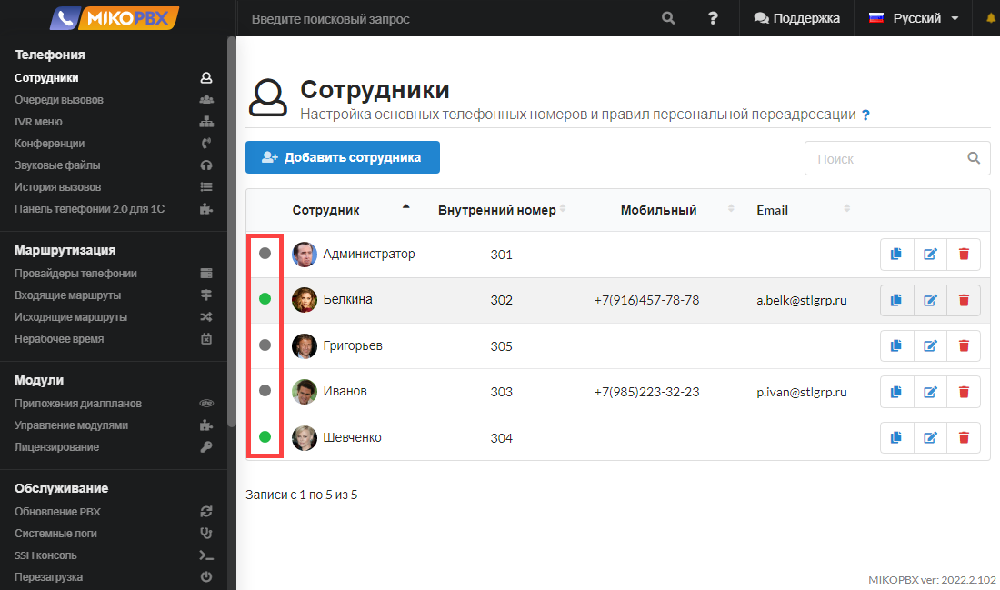<figcaption><p>Статусы сотрудников</p></figcaption></figure>

В строке поиска можно найти необходимый контакт. Поиск можно осуществлять по имени сотрудника, внутреннему номеру, мобильному номеру, адресу электронной почты.

<figure>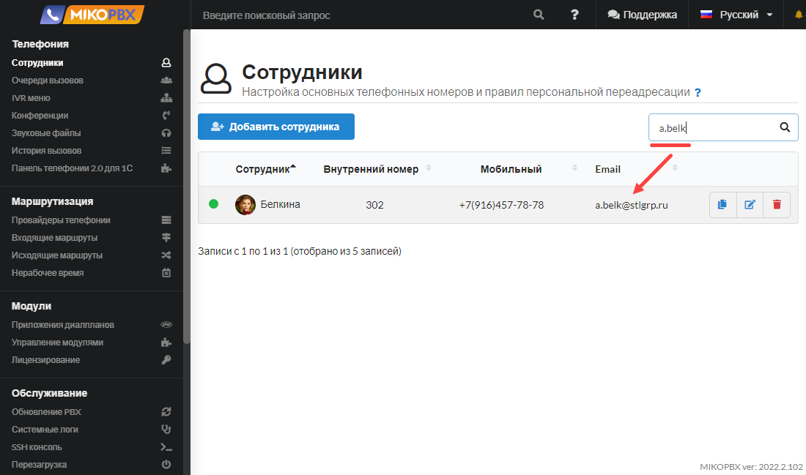<figcaption><p>Поиск сотрудника по электронной почте</p></figcaption></figure>

На форме также есть возможность сортировки списка сотрудников по имени, внутреннему номеру, мобильному номеру, адресу электронной почты. Имеются кнопки копирования пароля для SIP учетной записи в буфер обмена, редактирования учетной записи и её удаления.

<figure>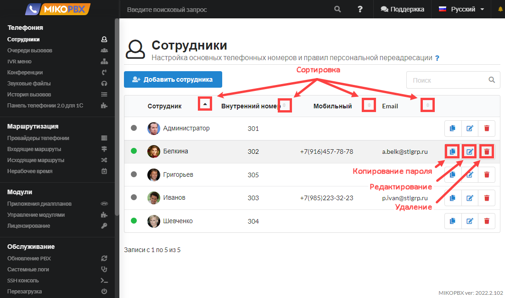<figcaption><p>Сортировка сотрудников и функции в главном меню</p></figcaption></figure>

## Добавление сотрудника <a href="#dobavlenie_sotrudnika" id="dobavlenie_sotrudnika"></a>

Для добавления нового сотрудника необходимо нажать кнопку **Добавить сотрудника**.

<figure>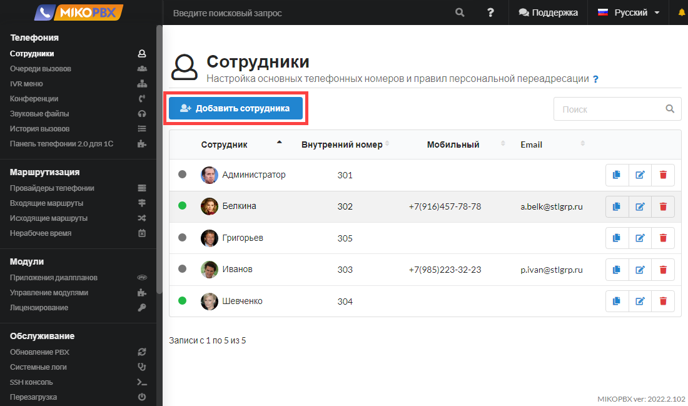<figcaption><p>Элемент "<strong>Добавить сотрудника</strong>"</p></figcaption></figure>

## Основные параметры учетной записи <a href="#osnovnye_parametry" id="osnovnye_parametry"></a>

<figure><figcaption><p>Вкладка параметров учетной записи сотрудника</p></figcaption></figure>

На вкладке **Основные параметры** задаются общие настройки внутренней учетной записи сотрудника:

* **ФИО пользователя** - допускается использование кириллицы. Это значение будет использоваться при подстановке CALLERID(name) абонента, будет отображаться в соответствующем поле экрана телефона.
* **Внутренний номер** - он же используется в качестве **Логин** при подключении телефона.
* **Мобильный номер** - используется для дополнительной маршрутизации.
* **Адрес электронной почты** - используется для email оповещений.
* **Пароль для SIP**&#x20;


Установите **сложные пароли** на учетные записи (**пароль для SIP**)! Пароль должен удовлетворять следующим требованиям:

* длина пароля должна быть длиннее восьми символов;
* пароль должен содержать буквы ВЕРХНЕГО и нижнего регистра;
* пароль должен содержать цифры и специальные знаки: «**-**», «**\_**», «**\[]**», «**{}**», «**@**», «**;**».


## Расширенные параметры учетной записи <a href="#rasshirennye_nastrojki" id="rasshirennye_nastrojki"></a>

Открываются путем нажатия на раскрывающийся список **Расширенные настройки**.

<figure>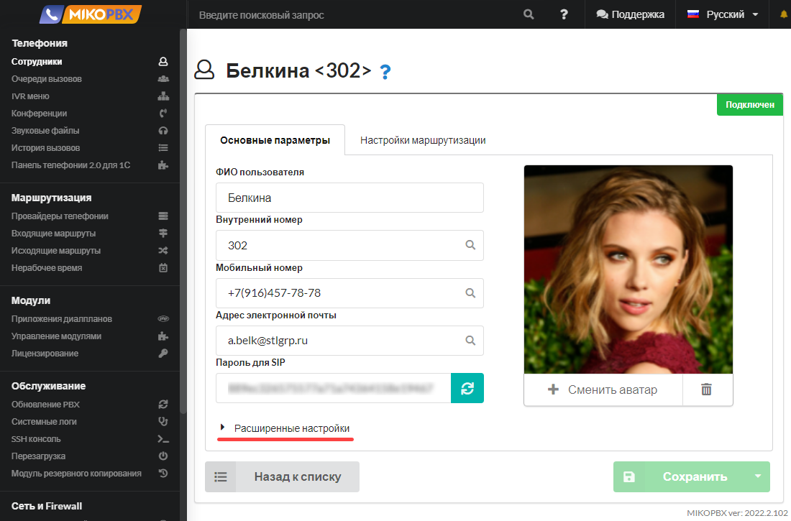<figcaption><p>Вкладка расширенных настроек учетной записи</p></figcaption></figure>

#### **Переопределение строки набора**

<figure>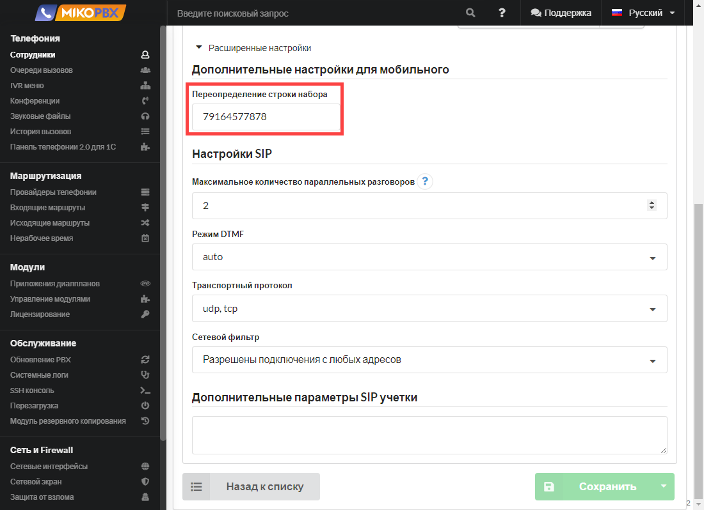<figcaption></figcaption></figure>

В поле **Переопределение строки набора** введите правило набора мобильного номера для Вашего провайдера.\
Например, в основных настройках номер мобильного телефона указан в формате _**8**_&#x39;164577878, согласно правилам исходящей маршрутизации для провайдера звонок возможен только на номера, начинающиеся с **7**.\
Следовательно в поле **Переопределение строки набора** следует указать номер **7**9164577878.

#### **Максимальное количество параллельных звонков**

<figure>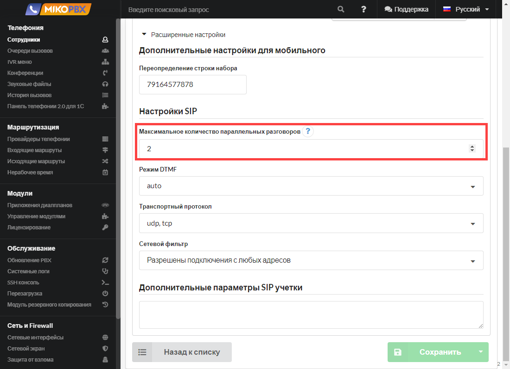<figcaption></figcaption></figure>

Количество вызовов, при котором номер считается «занятым». В таком статусе начинают работать правила маршрутизации. Это описание не распространяется на очередь вызовов.

#### **Режим DTMF**

<figure>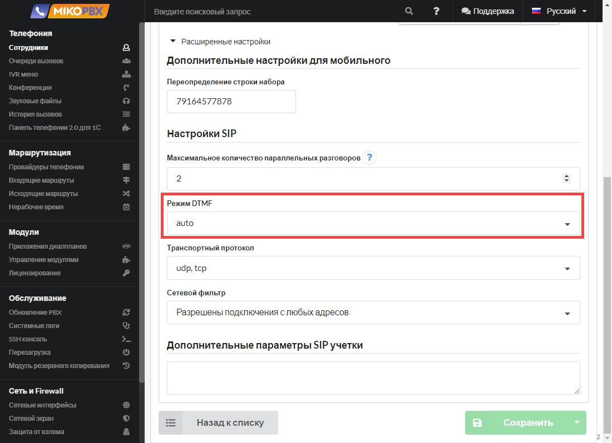<figcaption></figcaption></figure>

Настройка определяет, как DTMF-сигналы передаются через SIP.

#### Транспортный протокол

<figure>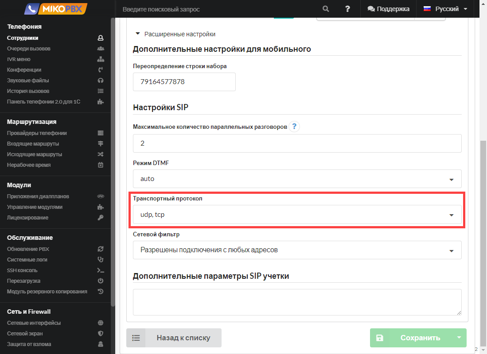<figcaption></figcaption></figure>

Позволяет указать используемый транспортный протокол для данной учетной записи.

#### **Сетевой фильтр**

<figure>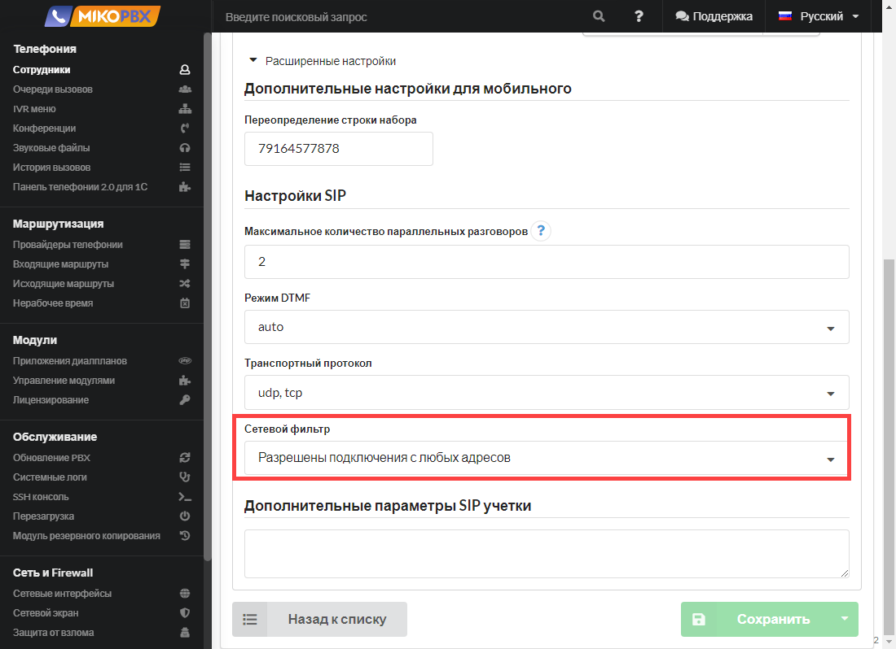<figcaption></figcaption></figure>

Подсеть, которая описана в разделе **Cетевой экран.** Указывает на разрешенную подсеть для этой учетной записи. Подключение из прочих подсетей будет вызывать ошибку авторизации.

**Дополнительные параметры SIP учетки**

<figure>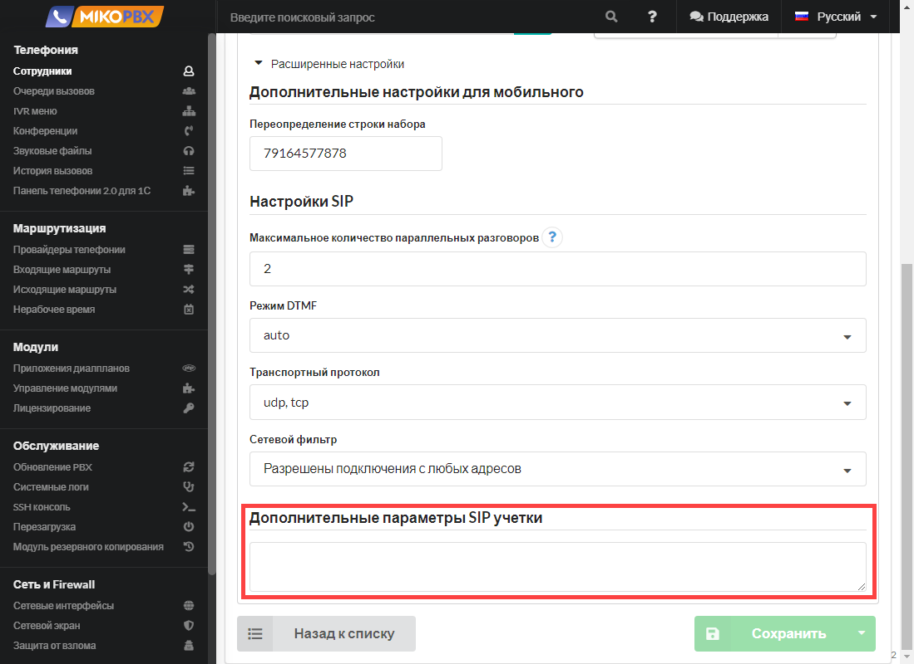<figcaption></figcaption></figure>

Данное поле служит для изменения/переопределения конфигурационных файлов asterisk.

Переопределять можно практически все параметры. К примеру при использовании **chan\_pjsip** SIP аккаунт сотрудника описывается следующими секциями:


```
[***]
type = aor
max_contacts = 10
; ----

[***]
type = auth
; ----

[***]
type = endpoint
context = all_peers
; ----

[acl_***] 
deny = 0.0.0.0/0.0.0.0
permit = 0.0.0.0/0.0.0.0
; ----
```


Для переопределения полей в секциях следует заполнить поле **Дополнительные параметры** следующим образом:


```
[acl]
; описываем параметры доступа из различных подсетей [acl_***]

[auth]
; описываем параметры авторизации для исходящих звонков

[aor]
; Правка секции AOR для endpoint

[endpoint]
; Правка параметров endpoint
```


## Настройки маршрутизации

<figure>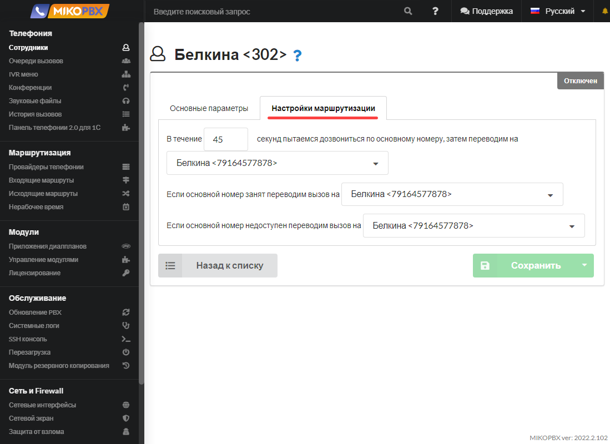<figcaption><p>Раздел "<strong>Настройки маршрутизации</strong>"</p></figcaption></figure>

На данной вкладке вы можете настроить правила переадресации вызовов в случае, если сотрудник не может ответить на звонок, занят или недоступен.

**Период времени** в секундах определяет, сколько времени будет продолжаться попытка вызова на **внутреннюю** учетную запись сотрудника. Если в течение этого времени сотрудник не сможет ответить на вызов, вы можете указать на какой номер следует направить вызов дальше. По умолчанию, вызов будет переадресован на мобильный номер сотрудника.

Кроме того, вы можете указать номера, на которые следует направить вызов в случае занятости и недоступности сотрудника. Таким образом, если сотрудник занят или недоступен, вызов будет переадресован на указанные номера.

Вы можете настроить эти параметры в соответствии с вашими предпочтениями и требованиями.

## **Документации по подключению софтфонов**

* [MicroSIP](../../faq/softphones/microsip.md)
* [Groundwire](../../faq/softphones/groundwire.md)
* [Zoiper](../../faq/softphones/zoiper.md)
* [Jitsi](../../faq/softphones/jitsi.md)
* [PhonerLite](../../faq/softphones/phonerlite.md)
* [Linphone(MacOS)](../../faq/softphones/linphone-macos.md)
* [Telephone(MacOS)](../../faq/softphones/telephone-macos.md)
* [WebRTC с помощью SIPML5](../../faq/softphones/configuring-webrtc-client-sipml5.md)
* <mark style="color:red;">Настройка телеграмм как SIP софтфон</mark>
* [Softphone.pro](../../faq/softphones/softphone.pro.md)
* [Bria Solo](../../faq/softphones/bria-solo.md)

## **Документации по подключению телефонов**

* <mark style="color:red;">Yealink T19</mark>
* <mark style="color:red;">Yealink T21</mark>
* <mark style="color:red;">Yealink T28</mark>
* <mark style="color:red;">Snom D120</mark>
