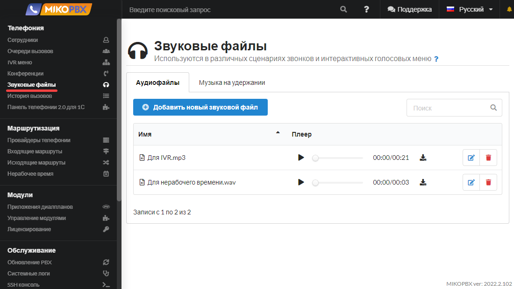
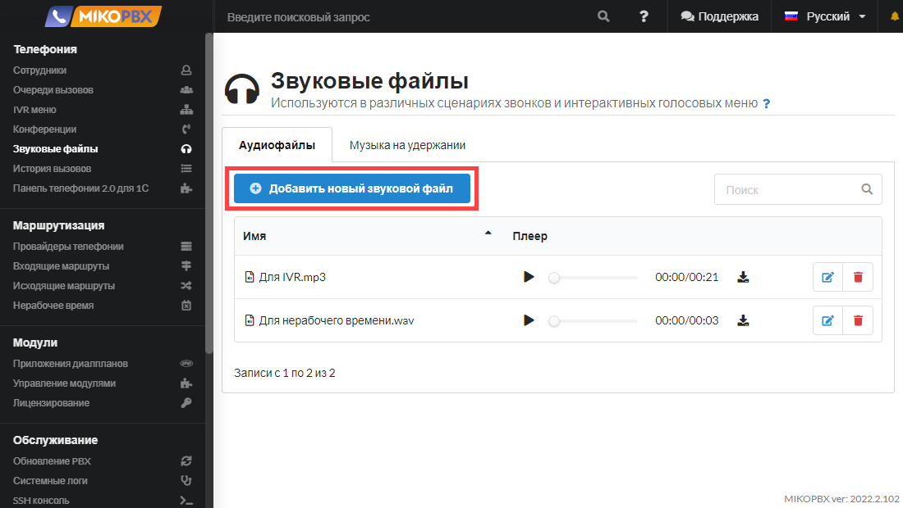
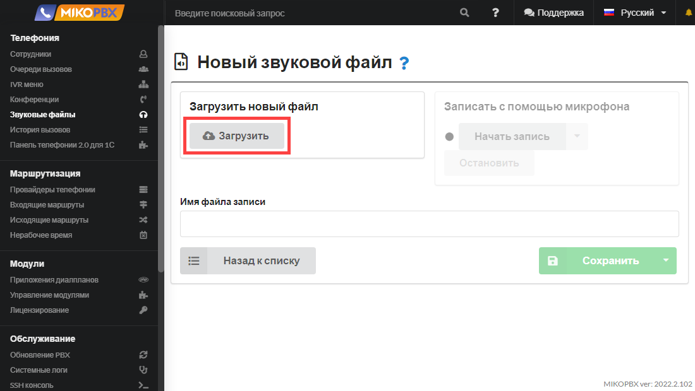
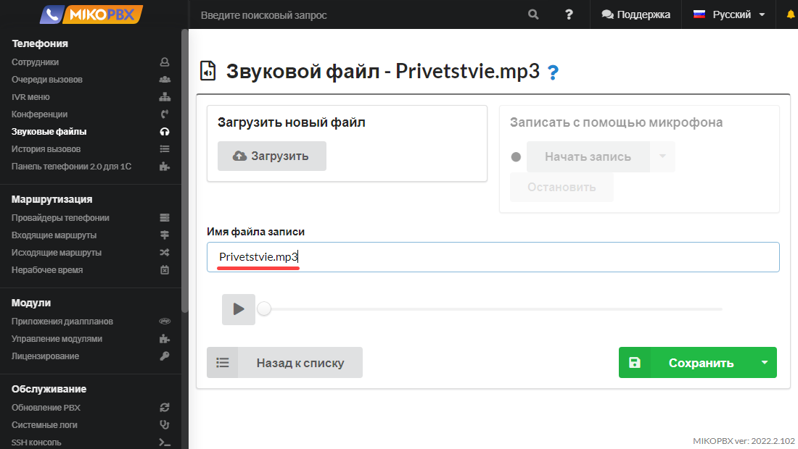
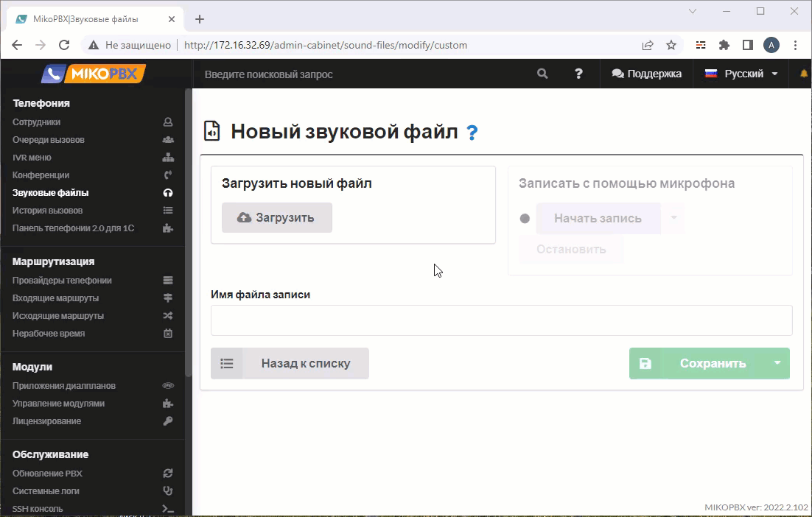
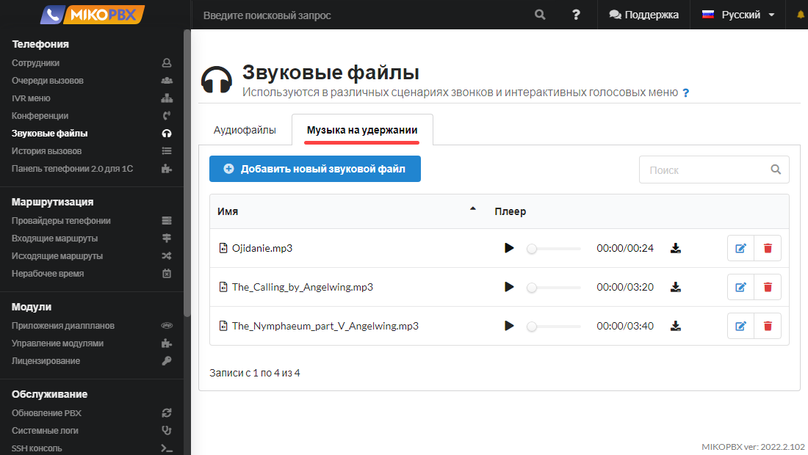

# Звуковые файлы

Звуковые файлы в MikoPBX — это аудиозаписи, которые используются системой для воспроизведения различных сообщений, таких как приветствия, объявления, инструкции в IVR-меню или сигналы ожидания. Они позволяют персонализировать аудиоконтент, который слышат звонящие, улучшая взаимодействие с системой и предоставляя необходимую информацию.

## Загрузка звукового файла на АТС


Поддерживаемый формат файлов **mp3** и **wav**


Звуковые файлы в MikoPBX используются в различных сценариях звонков и интерактивных голосовых меню (в **IVR меню**, в **Нерабочем времени,** в **Очередях вызовов** и для разных системных оповещений, а также **В музыке на удержании**) для воспроизведения голосового приветствия или оповещения клиента.

Список доступных звуковых файлов отображается в разделе "**Телефония"** -> "**Звуковые файлы"**.

<figure><figcaption>
Раздел "<strong>Звуковые файлы</strong>"
</figcaption></figure>

Для добавления нового звукового файла нажмите "**Добавить звуковой файл".**

<figure><figcaption>
Элемент "<strong>Добавить новый звуковой файл</strong>"
</figcaption></figure>

Нажмите **Загрузить** и выберите звуковой файл.&#x20;

<figure><figcaption>
Кнопка для загрузки новых файлов
</figcaption></figure>

Откорректируйте наименование файла при необходимости.

<figure><figcaption>
Имя файла записи
</figcaption></figure>

Сохраните изменения.

<figure><figcaption></figcaption></figure>


При работе по протоколу **https** есть возможность записать звуковой файл с использованием микрофона. При работе по **https** должен использоваться доверенный сертификат.


<figure><figcaption>
Запись файла с помощью микрофона, используя протокол https
</figcaption></figure>

Звуковые файлы хранятся на АТС по пути **/storage/usbdisk1/mikopbx/media/custom**

## Музыка на удержании 


Функция доступна начиная с версии **2020.2.XXX**


Если клиент при звонке попадает в очередь или ожидает переадресацию, АТС проигрывает для него мелодию. Есть возможность загрузить свои мелодии для прослушивания во время ожидания. \
Это можно сделать на вкладке **Музыка на удержании** описанным выше способом.

<figure><figcaption>
Вкладка "<strong>Музыка на удержании</strong>"
</figcaption></figure>
