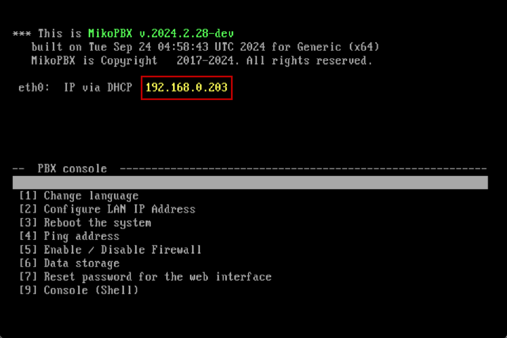
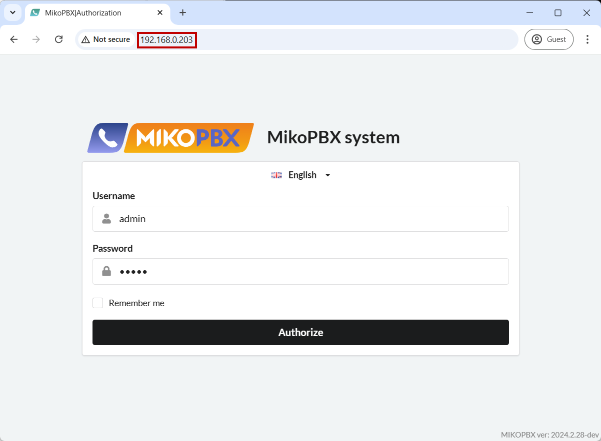

# Quick start

Follow the **step-by-step** instructions in the order presented for a quick and successful system setup.

## Installing MikoPBX

**MikoPBX** is a full-fledged **operating system** for your hardware; it is **not a standalone application**. It is provided as an image file (\*.iso, \*.img, \*.raw).

It supports various installation methods:

* Installation [on a standalone computer](../setup/bare-metal.md).
* Installation [in a virtual machine](../setup/hypervisor/).
* Installation [using cloud services](../setup/cloud/).
* Installation in a [Docker container](../setup/docker/).

Follow the link for your preferred installation method and proceed according to the provided instructions.

## First Login to the Web Interface

After installation, you need to access the MikoPBX web interface for further system configuration. To do this, find the PBX's IP address in the MikoPBX console:

<figure><figcaption>
Example of MikoPBX Console
</figcaption></figure>

In this example, the IP address is **192.168.0.203**. To access the web interface, enter this IP address into your browser's address bar:

<figure><figcaption>
MikoPBX login window
</figcaption></figure>


If the logs do not provide a username and password, use the default credentials:

Username: admin

Password: admin


After the first login, the system will prompt you to change your password.

## Settings Within the Web Interface:

### Network and Firewall Settings

For stable PBX operation, you need to configure the **network** through the **Network and Firewall** → **Network Interface** section. Detailed instructions for these settings can be found [here](../manual/connectivity/network.md).

In MikoPBX, all local subnets can be defined in the **Network and Firewall** → **Firewall** section. The firewall is intended to restrict access to the PBX based on traffic type and subnets. Follow the setup instructions [here](../manual/connectivity/firewall.md).

***

#### Configuring Protection Against Hacking (Fail2Ban)

Fail2Ban blocks IP addresses exhibiting unusual activity; it can reduce the rate of failed authentication attempts and helps protect your PBX from hacking. Instructions to help with the setup can be found [here](../manual/connectivity/fail2-ban.md).

***

#### Adding and Configuring Employee Accounts

After completing the initial PBX setup, you can proceed to create accounts for your employees. This [instruction](../manual/telephony/extensions.md) will assist you.

***

#### Connecting Providers

After adding employees, you need to connect providers to your PBX. Instructions for this section can be found [here](../manual/routing/providers.md). Instructions with examples of configuring real providers can be found [here](https://chatgpt.com/faq/providers/).

***

#### Setting Up Incoming and Outgoing Routing

At this stage, you need to set routing rules for incoming and outgoing calls: how calls passing through a specific provider will be handled:

* [Incoming Call Routing](../manual/routing/incoming-routing.md)
* [Outbound Call Routing](../manual/routing/outbound-routing.md)

To create routing rules, you may also need the following features:

* [Call Queues](../manual/telephony/call-queues.md)
* [IVR Menu](../manual/telephony/ivr-menu.md)
* [Conferences](../manual/telephony/conference-rooms.md)

***

#### Marketplace and Modules

The Marketplace allows you to extend the system's standard functionality using modules:

* You can read more about Modules in MikoPBX in [this article](../manual/modules/).
* Information on registering in the MikoPBX Marketplace can be found [here](../manual/modules/licensing.md).


This completes the basic setup of MikoPBX! For a deeper exploration of MikoPBX's capabilities, we recommend referring to the comprehensive documentation.

