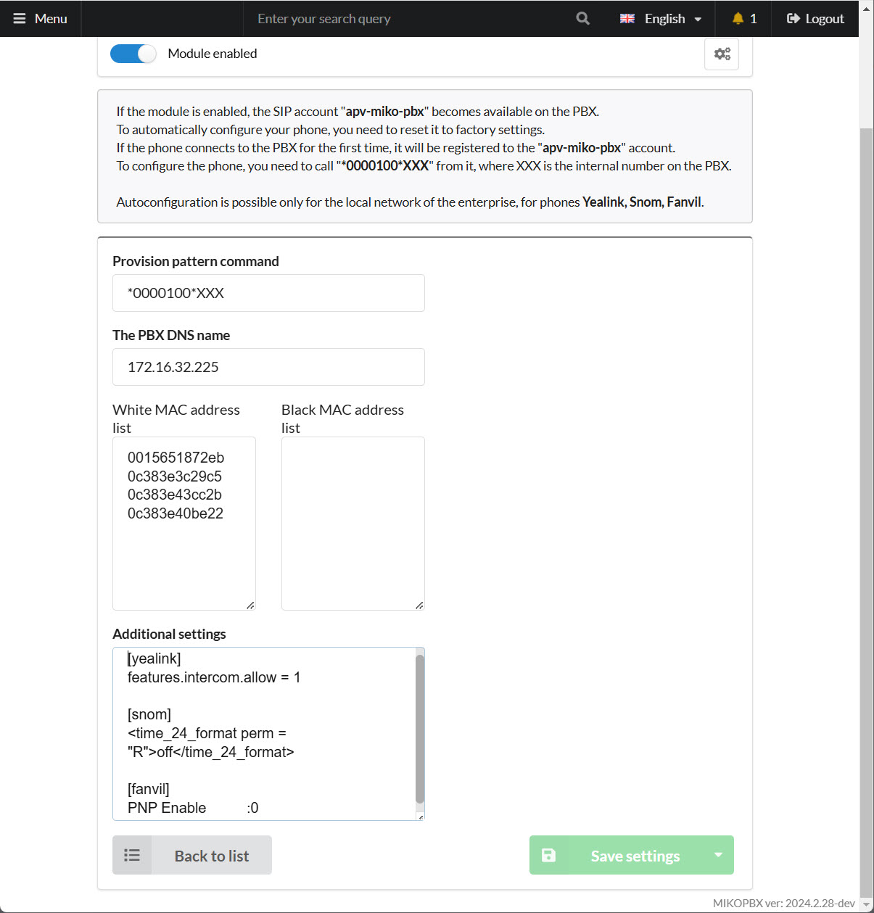

# Autoprovision


## Introduction

The **Autoprovisioning Plug & Play (PnP)** technology is supported by many well-known phone manufacturers, such as **Yealink** and **Snom**. With the MikoPBX automatic phone setup module, you can quickly configure compatible phones, making them ready for use in the system. This greatly simplifies both the initial configuration and the ongoing support of phones in the office.

#### Key Benefits of Automatic Phone Setup

* **Simplifies initial setup** – no need to connect to each phone's web interface for configuration. Instead, simply enter the device’s MAC address and assign it an account on the auto-setup server.
* **Eases support** – centralized management of device settings makes it easy to adjust configurations for multiple phones from a single location.
* **Convenience for end users** – in some cases, phones can be set up by dialing a short code, like `*911*<SIP_ACC>`. This is especially helpful for non-technical users who can configure the device themselves with a simple number combination.

#### Network Requirements for the Auto-Setup Module

* The auto-setup module operates **only within a local network**.
* **Multicast requests to IP 224.0.1.75** must be allowed on the network.
* Currently, only a single general registration address can be set for all devices.
* Ports for the MikoPBX web interface (**HTTP**) and **SIP** (80 and 5060) must be open.
* **HTTPS is not supported** in this version.
* No other PnP servers should be running on the network since devices will accept settings from the first responding server.

## Supported Phone Models

#### Yealink Models

* Yealink T19(P)
* Yealink T28(P)
* Yealink W52
* Yealink WP530

#### Snom Models

* Snom D120
* Snom D785
* Snom D735
* Snom D715
* Snom D385
* Snom D335

#### Fanvil Models

* Fanvil X5U
* Fanvil X3SP
* Fanvil X1SP

> We are working to expand the range of supported phone models.

## Setting Up the Auto-Setup Module

#### Installing the Auto-Setup Module

1. Open the **Modules** -> **Module Marketplace** section.
2. Install the **Automatic Phone Setup Module**.

> **Note**: Start the module only after completing all necessary settings.

#### Configuring Module Parameters

After installing the module, open the settings page.

<figure><figcaption></figcaption></figure>

* **Extension Template** – enter the extension number to use for quick phone setup via star code.
* **Server Registration Address** – enter the IP address or domain of your MikoPBX server. Phones will connect to MikoPBX using this address.
* **Blacklist of MAC Addresses** – enter MAC addresses of phones **not to be set up**. This allows you to exclude certain devices from auto-setup. The blacklist takes priority over the whitelist.
* **Whitelist of MAC Addresses** – enter MAC addresses of phones that are authorized for auto-setup. If neither the blacklist nor the whitelist is specified, the module will attempt to configure all connected phones.

## Additional Configuration Parameters for Phones

In the **Additional Parameters** field, you can enter custom settings that will be added to phone configuration files. Here are examples for each supported model.

### Configuration Example for Yealink Phones

By default, the server generates the following basic configuration file for Yealink phones:

```php
#!version:1.0.0.1
account.1.enable = 1
account.1.label = Askozia (204)
account.1.display_name = 204
account.1.auth_name = 204
account.1.user_name = 204
account.1.password = 1c9709222690713dd
account.1.sip_server_host = 172.16.156.223
account.1.sip_server_port = 5060
account.1.transport = 0
account.1.codec.1.enable = 1
account.1.codec.1.payload_type = PCMU
account.1.codec.1.priority = 1
account.1.codec.1.rtpmap = 0
account.1.cid_source = 4
voice_mail.number.1 = *001
phone_setting.lcd_logo.mode=0
auto_provision.dhcp_option.enable = 0
features.intercom.allow = 1
features.intercom.mute = 0
features.intercom.tone = 1
features.intercom.barge = 1
features.dtmf.transfer = ##
features.dtmf.replace_tran = 1
features.headset_prior = 1
features.intercom.allow = 1
```

To add extra parameters, use the **\[yealink]** section in the **Additional Parameters** field. For example:

```php
[yealink]
features.headset_prior = 1
features.intercom.allow = 1
```

Each new parameter should be specified on a separate line.

### Configuration Example for Snom Phones

The configuration file for Snom phones has a more complex XML structure. For example:

```xml
<?xml version="1.0" encoding="utf-8"?>
<settings>
    <time_24_format perm="R">off</time_24_format>
    <phone-settings>
        <user_pname idx="1" perm="RW">203</user_pname>
        <user_name idx="1" perm="RW">203</user_name>
        <user_realname idx="1" perm="RW">Irina Smirnova</user_realname>
        <user_pass idx="1" perm="RW">3256157a99f176eb959ef9c1fdd947f0</user_pass>
        <user_host idx="1" perm="RW">172.16.32.225</user_host>
        <user_srtp idx="1" perm="RW">off</user_srtp>
        <user_mailbox idx="1" perm="RW">*001</user_mailbox>
    </phone-settings>
</settings>
```

To add data in the `<settings>` node, use the **\[snom]** section, and for the `<phone-settings>` node, use **\[snom-phone-settings]**.

### Configuration Example for Fanvil Phones

Fanvil configuration files consist of separate modules. Here is an example of a basic configuration:

```xml
<<VOIP CONFIG FILE>>Version:2.0002
PNP Enable         :0
<SIP CONFIG MODULE>
SIP1 Enable Reg    :1
SIP1 Phone Number  :203
SIP1 Display Name  :Irina Smirnova
SIP1 Register Addr :172.16.156.223
SIP1 Register Port :5060
SIP1 Register User :203
SIP1 Register Pswd :3256157a99f176eb959ef9c1fdd947f0
```

You can add extra parameters using the sections **\[fanvil]**, **\[fanvil-sip]**, **\[fanvil-tele]**, and **\[fanvil-autoupdate]**.

## Troubleshooting

### Troubleshooting Yealink Phones

The first thing to check is whether your firmware version is up-to-date. Update the firmware if necessary from the [Yealink support site](http://support.yealink.com).

1. Access the device’s web interface and navigate to **Settings** → **Configuration**.
2. Set the log level to the maximum value of 6.
3. Reboot the device and export the log.

In the downloaded log file, pay attention to errors, for instance:

```xml
LIBD[528]: HTTP<5+notice> URL : 
LIBD[528]: HTTP<3+error > Connect Error
AUTP[528]: AUTP<3+error > http to file failed, code = -3, msg = Connect Failed, cout = 0
```

If you see `Connect Error`, it means the phone was unable to download the configuration file from the server.
