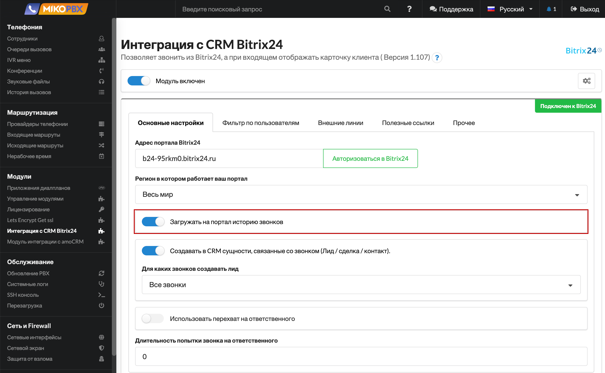

# Описание функционала CRM Bitrix24

## Отображение карточки клиента 


Функция будет активна, если в настройках модуля на АТС включена опция «**Загружать на портал историю звонков**».\
В противном случае будет доступна только функция click2call.


При звонке отображается карточка телефонного звонка, в которой:

* Выводится информация по клиенту, по активным сделкам.
* Есть возможность добавить комментарий к телефонному звонку.
* Есть возможность выставить новый счет или зарегистрировать новую сделку.

<figure><figcaption>
Карточка телефонного звонка
</figcaption></figure>

Модуль автоматически регистрирует звонок в Bitrix24, для чего ищет в CRM соответствующий номеру контакт. Если контакт найден, то звонок будет привязан к найденному объекту.

## Создание сущностей 

При работе с телефонией, интеграция может создавать следующие сущности:

* **Контакт** - по умолчанию создается с именем «Без имени».
* **Сделка** - использует созданный контакт, в заголовке указывается номер телефона.
* **Лид** -  использует созданный контакт.

Если в настройках модуля включена опция «**Создавать в CRM сущности, связанные со звонком (Лид / сделка / контакт)**» и контакт не был найден по номеру телефона, то модуль создаст в CRM необходимые сущности.


**Тип создаваемой сущности определяется режимом в настройках CRM**. Существует:

* **Простой режим** - при котором будет создаваться сделка, а не лид.
* **Режим повторных продаж** - будет создана Сделка или Лид даже если сущность в CRM найдена. (Но не будет создаваться если есть активная сделка/лид или номер внесен в черный список crm).


### **Порядок назначения ответственных для новых контактов**:

* «**Пропущенный**» - ответственным за сущность будет назначен «**Ответственный за пропущенные звонки**» (настройка выполняет в модуле, на стороне MikoPBX). Если настройка не заполнена, то ответственным будет назначен один из участников звонка (первый, у кого зазвонил телефон).
* «**Вызов отвечен**» - ответственным будет назначен тот, кто ответил на вызов.


Если вызов поступает на очередь (группу сотрудников), то ответственный в сущности по умолчанию будет установлен тот, на кого вызов был направлен первее. После поднятия трубки или завершения звонка ответственный будет скорректирован. Это поведение связано с особенности работы API Bitrix 24


## История звонков 

История звонков доступна в разделе «**Телефония**» - «**Детализация звонков**»

<figure><figcaption>
Раздел "Телефония" -> "Детализация звонков"
</figcaption></figure>

История отображается в карте сделки:

<figure><figcaption>
Карта сделки
</figcaption></figure>

Также, она отображается в карточке клиента и в списке "Мои дела":

<figure><figcaption>
Карточка клиента
</figcaption></figure>

## Записи разговоров 

Запись разговоров - это в первую очередь функция телефонной станции.

Если есть необходимость загружать телефонные разговоры на портал Bitrix24, то необходимо в настройках модуля MikoPBX включить соответствующий флаг:

<figure><figcaption>
Флаг "Загружать на портал историю звонков"
</figcaption></figure>

Портал Bitrix24 позволяет прослушать телефонный разговор непосредственно в браузере или скачать файл записи разговора на ПК сотрудника.

<figure><figcaption></figcaption></figure>

## Исходящие из Bitrix24 

После настройки портала появится возможность совершать звонки из карточки клиента:

<figure><figcaption>
Возможность совершать звонки из карточки клиента
</figcaption></figure>

Всюду, где имеется гиперссылка-телефон или «кнопка с трубкой» будет возможность совершить исходящий звонок средствами АТС MikoPBX.

## Перехват на ответственного 

Для настройки функции необходимо в интерфейсе модуля активировать опцию «**Использовать перехват на ответственного**», а так же настроить параметр «**Длительность попытки звонка на ответственного**».

<figure><figcaption>
Параметры внутри настройки модуля в интерфейсе MikoPBX
</figcaption></figure>

Обязательно опишите [входящий маршрут](../../../manual/routing/incoming-routing.md). При поступлении входящего звонка система проверит наличие ответственного в Bitrix24:

* Если ответственный определен, то вызов будет направлен на него.
* Если ответственный не определен, или дозвониться до него не вышло, то вызов будет направлен по описанному входящему маршруту.

## Отчеты 


Подробную информацию по отчетам вы можете найти [здесь](https://helpdesk.bitrix24.ru/open/19342270/). Это официальный блог Bitrix24.


В разделе CRM доступен ряд стандартных отчетов.

* «**Отчет по делам**» - «**Выполнено менеджерами**»:

<figure><figcaption></figcaption></figure>

* Есть возможность добавить свой произвольный отчет по делам. Звонки сотрудника «**CRM**» - «**Еще**» - «**Мои дела**»:

<figure><figcaption></figcaption></figure>

* Есть возможность **прослушать и скачать запись** разговора из карточки «Дела»:

<figure><figcaption></figcaption></figure>

* «**CRM**» - «**Еще**» - «**Мои дела**» - «**Сводный отчет по делам**»:

<figure><figcaption></figcaption></figure>

