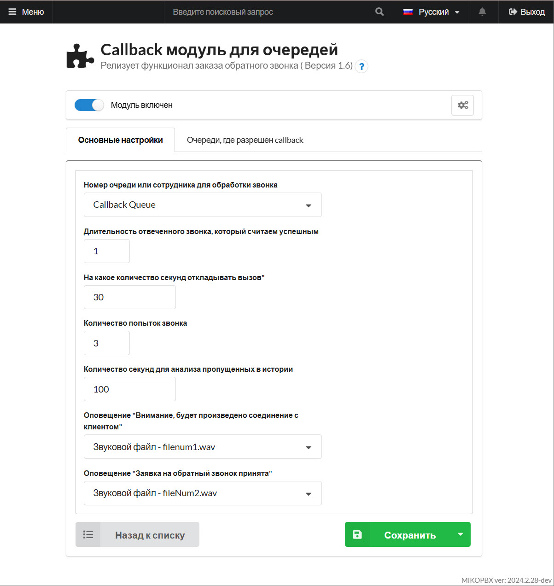
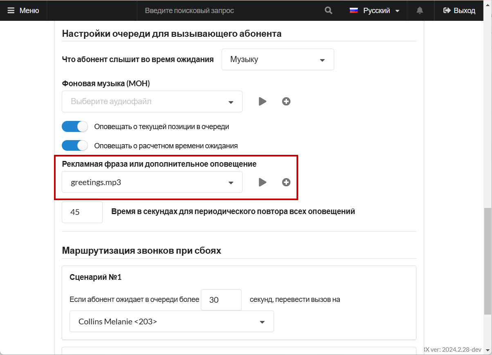

# Автообработка пропущенных

Данный модуль предназначен для обработки пропущенных звонков.\
При обнаружении пропущенного будет сформирована задача. Как только появляется свободный сотрудник, ему поступит телефонный звонок. Как только он поднимет трубку, будет выполнена попытка звонка клиенту.

Давайте рассмотрим работу модуля на конкретных примерах:

## Пропущенный 

Клиент пытался дозвониться в компанию, однако ему никто не ответил. Причины могут быть разные, например такие как:

* Вызов оборвался
* Клиент положил трубку

Модуль сформирует задачу callback. Как только освободится сотрудник, ему будет направлен вызов.&#x20;

<figure><figcaption>
Общий вид модуля
</figcaption></figure>

Есть возможность воспроизвести сотруднику уведомление, звуковой файл можно указать в настройках модуля **Оповещение "Внимание, будет произведено соединение с клиентом"**. После уведомления сотрудника, будет выполнен звонок клиенту.

Сотрудников, которые будут обрабатывать звонки по пропущенным следует добавить в единую «[Очередь вызовов](../../manual/telephony/call-queues.md)» и указать ее в настройках модуля в поле **Номер очереди или сотрудника для обработки звонка.**

Не каждый вызов, на который ответил клиент, можно считать успешным. В модуле предусмотрена настройка критерия «**Длительность отвеченного звонка, который считаем успешным**»:

Если вызов был неудачным, то есть возможность настроить количество повторных звонков:

* «**На какое количество секунд откладывать вызов**» - время между попытками
* «**Количество попыток звонка**»

Слишком старые вызовы, могут быть уже не актуальными, есть возможность настройки «времени жизни» для пропущенного. Вызовы и задачи, старше, чем «**Количество секунд для анализа пропущенных в истории**», не будут обработаны.

## Клиент просит перезвонить 

Вариант, когда клиент устал ждать и «ставит задачу на callback» также возможен. В настройках модуля укажите звуковой файл в поле **Оповещение "Заявка на обратный звонок принята".**

Как только клиент нажмет «**1**» и задача callback будет сформирована, клиенту будет воспроизведено оповещение. Возможность «**нажать 1**» будет доступна для очередей, перечисленных на вкладке «**Очереди, где разрешен callback**».

<figure><figcaption>
Раздел "Очереди, где разрешен callback"
</figcaption></figure>

Так же в «**Расширенных**» настройках конкретной **очереди** можно настроить дополнительное оповещение.


У настройки очереди «**Рекламная фраза или дополнительное оповещение**» есть важная особенность, она отрабатывает **только** в том случае, если все сотрудники **заняты**.


<figure><figcaption>
Расширенные настройки очереди вызовов
</figcaption></figure>

Это может быть использовано например для того, чтобы предложить клиенту нажать "1" для постановки задачи на обратный звонок.
